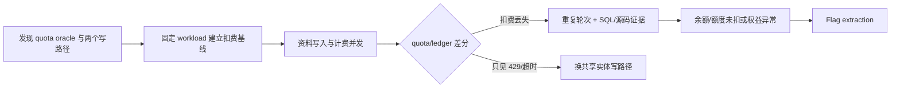

# Payment Race / Lost Update — 余额扣减丢失更新

> 适用信号：余额、quota、积分或库存采用“读取 → 计算 → 写回”，同时存在可更新同一用户/钱包记录的第二个 API。重点不是堆并发，而是用**同工作量差分实验**证明扣费写入被另一条合法写路径覆盖或静默丢弃。

## 1. 漏洞模型

### 1.1 开发者视角：敏感状态在哪一层

客户端只能观察请求结果和余额快照；真实扣费状态位于服务端数据库。最有价值的攻击面不是前端余额显示，而是两条同时写同一行的后端路径：

```text
计费路径 A: GET/SELECT quota → 计算 cost → UPDATE quota
资料路径 B: GET/SELECT user  → 修改 language/sidebar → UPDATE user
```

如果路径 B 用旧快照保存整行，或路径 A 的乐观锁失败后未重试、未检查 `RowsAffected`，就可能出现：

```text
T0  A 读取 quota=100, version=7
T1  B 读取 user(quota=100, version=7)
T2  A 写 quota=90, version=8
T3  B 用旧实体写回 quota=100              # snapshot overwrite

最终 quota=100；一次已成功提供服务的扣费消失。
```

另一种实现是：B 先改变 `version`，A 的
`UPDATE ... WHERE version=7` 影响 0 行；上层仍返回成功，形成静默扣费失败。**仅凭黑盒 POC 无法判定具体是哪一种，必须用源码、SQL 日志或 `RowsAffected` 证据区分。**

### 1.2 必要条件

1. 两个请求最终写入同一用户、钱包、订单或库存记录。
2. 至少一条路径执行非原子的 read-modify-write，或保存包含敏感字段的旧实体快照。
3. 冲突没有被事务、原子 SQL、正确乐观锁重试或串行化队列消除。
4. 攻击者能同时调用计费动作与第二条写路径。
5. 存在可靠状态 oracle：`quota/balance/credits/stock`、账单流水或权益数量。

Cloudflare、nginx、Caddy、SQLite、MySQL 等只能改变窗口和限流行为，不能单独证明“可利用”或“不可利用”。

## 2. 参考 POC 提炼出的可复用链路

参考实现使用以下组合：

| 角色 | 请求 | 作用 |
|---|---|---|
| 状态 oracle | `GET /api/user/self` | 读取 `data.quota` |
| 干扰写入 | `PUT /api/user/self` + `{"language":"en"}` | 高频写用户记录 |
| 计费触发 | `POST /v1/chat/completions` | 产生真实 quota 扣减 |
| 身份绑定 | `Cookie` + `New-Api-User` | 访问当前用户资料 API |
| 计费身份 | `Authorization: Bearer <key>` | 调用模型 API |

代码层能直接确认的是“请求如何构造”和“如何比较 quota”；以下说法不能仅靠该 POC 确认：具体受影响版本、ORM 是否保存整行、是否存在 `version` 字段、某种数据库必然可利用，以及 HTTP 200 是否代表写入真正提交。

## 3. 先证明窄链路

### 3.1 单请求基线

按顺序记录：

1. `Q0 = GET quota`。
2. 单独执行一次计费请求，确认服务确实成功并记录 usage。
3. 等待异步结算完成，读取 `Q1`。
4. 得到基线成本 `C = Q0 - Q1`。
5. 单独执行一次资料更新，再次 GET，确认字段真的持久化；不能只看 HTTP 200。

若一次调用的成本不稳定，至少重复 3 轮，固定 model、prompt、`max_tokens`，用流水或 usage 对齐实际工作量。

### 3.2 对照实验

| 组 | 计费请求 | 干扰写入 | 观察值 |
|---|---:|---:|---|
| Control | N 个 | 0 | `Δcontrol = Qafter - Qbefore` |
| Race | 同样 N 个 | 并发 PUT | `Δrace = Qafter - Qbefore` |

只有在成功计费请求数和 usage 可比，且 `abs(Δrace) < abs(Δcontrol)` 可重复出现时，才有 lost update 证据。`PUT 200` 数量多、响应变慢或出现 429 都不是漏洞证明。

## 4. 可运行差分探针

仓库脚本：`scripts/ctf-website/payment_lost_update_probe.py`

```powershell
python scripts/ctf-website/payment_lost_update_probe.py `
  --base https://target `
  --cookie 'session=REDACTED' `
  --uid 21 `
  --key 'sk-REDACTED' `
  --model supported-model `
  --baseline `
  --trigger-count 2 `
  --trigger-workers 2 `
  --shield-workers 8 `
  --out exports/ctf-website/case/lost-update/evidence.json
```

脚本包含：

- target、Cookie/UID/API key 配置；
- `PUT` 干扰 payload 与计费 payload 构造；
- 多线程发送、状态码/延迟/响应摘要收集；
- control/race 两组 quota 前后差分；
- `flag{}`, `CTF{}`, `DASCTF{}` 自动提取；
- 默认验证 TLS，默认不伪造 XFF，默认只执行 2 个计费请求。

如更新字段不同，替换 JSON：

```powershell
--update-json '{"sidebar_modules":"chat,console"}'
```

先用低并发确认链路，再逐步测试 `2, 4, 8, 12, 16` workers。每次只改变一个变量，并保留完整 evidence JSON。

## 5. 同步窗口与调优

### 5.1 推荐顺序

1. 固定计费 payload，建立无竞争成本分布。
2. 干扰端从 2 workers 起步，确认没有 401/403/422。
3. 逐级增加并发，记录成功 PUT、429、error、平均延迟和 quota 差分。
4. 若接口支持，换一个**确实持久化但影响最小**的资料字段。
5. 只有证据表明 body 大小会延长数据库写窗口时，才测试较大 payload；不要把网络上传时间误当数据库事务时间。
6. 若 2–3 组参数都只有 429/超时且差分正常，转向其他共享写路径。

### 5.2 更精确的同步

普通线程池会受到连接建立和调度抖动影响。需要压缩到单个数据包窗口时，可用 Burp Turbo Intruder 的 gate：

```python
def queueRequests(target, wordlists):
    engine = RequestEngine(endpoint=target.endpoint,
                           concurrentConnections=20,
                           requestsPerConnection=1,
                           pipeline=False)
    for _ in range(20):
        engine.queue(target.req, gate='race')
    engine.openGate('race')

def handleResponse(req, interesting):
    table.add(req)
```

Turbo Intruder 适合同一请求的 last-byte sync；“计费请求 + 资料更新”两种不同报文可分别建模板，或用 HTTP/2 multiplexing/自定义 asyncio 客户端统一 gate。

## 6. 替代共享写路径

从开发者角度找“会保存 User/Wallet/Order 实体”的接口，而不是盲扫所有 GET：

```text
PUT/PATCH /api/user/self
PUT/PATCH /api/profile
POST      /api/settings
POST      /api/preferences
POST      /api/token/*/update
POST      /api/order/{id}/cancel
POST      /api/wallet/refresh
POST      /api/coupon/redeem
```

优先检查请求后会改变 `updated_at/version` 的路径。若资料更新只执行
`UPDATE users SET language=? WHERE id=?`，数据库不会覆盖 quota；这条路径在架构上应立即降级，不要反复加并发。

## 7. 证据判定与排除误报

### 7.1 确认标准

至少满足：

- Control 与 Race 成功服务请求数量、模型、usage 基本一致；
- Race 组 quota 扣减显著小于 Control，且可在重置后的独立轮次复现；
- 用户资料更新确实持久化；
- 等待结算窗口后差异仍存在；
- 最好再有一项白盒证据：整行 `Save(user)`、无条件 UPDATE、乐观锁 0 行未处理、事务边界错误或 SQL 日志交错。

### 7.2 常见误报

| 现象 | 更可能的解释 | 验证 |
|---|---|---|
| quota 暂时不变 | 异步结算 | 延长 settle，查账单/流水 |
| 请求 200 但无扣费 | 免费模型、缓存、失败未透传 | 检查 usage、模型价格、provider 响应 |
| Race 扣费更少 | 成功计费请求也更少 | 对齐成功数和 token usage |
| 大 body 更有效 | 只拖慢网络，未延长事务 | 对比服务端 SQL/handler 时序 |
| PUT 200 很多 | handler 返回成功但无状态变化 | GET 回读更新字段和 `updated_at` |
| XFF 后 429 减少 | 代理错误信任客户端头 | 单独记录为 rate-limit trust flaw，不等于 lost update |

## 8. 白盒审计点

搜索：

```powershell
rg -n "UpdateSelf|Save\(&?user|Updates\(&?user|quota|balance|version|RowsAffected|FOR UPDATE|transaction" .
```

危险模式：

```go
// 旧实体携带 quota；Save 可能把未修改字段一并写回。
db.First(&user, id)
user.Language = req.Language
db.Save(&user)

// 乐观锁冲突被忽略。
tx := db.Model(&User{}).
    Where("id = ? AND version = ?", id, oldVersion).
    Updates(map[string]any{"quota": newQuota, "version": oldVersion + 1})
return nil // 未检查 tx.Error / tx.RowsAffected
```

安全实现应只更新允许字段，并让扣减成为数据库原子操作：

```sql
UPDATE users
SET quota = quota - :cost
WHERE id = :id AND quota >= :cost;
```

随后严格检查影响行数。需要乐观锁时，冲突必须有限次重读重算；订单、账单和 quota 变更应放在同一事务，并通过唯一约束/幂等键阻止重复结算。

## 9. 修复与回归测试

1. Profile API 使用字段白名单更新，禁止把 quota、balance、role、version 从客户端对象带入。
2. 扣减使用原子 SQL，或 `SELECT ... FOR UPDATE` 后在同一事务计算和提交。
3. 检查 `RowsAffected == 1`；冲突重试耗尽必须让业务请求失败，不能“服务成功但未扣费”。
4. 账单事件使用唯一 idempotency key，并将流水与余额更新原子提交。
5. 不信任客户端提供的 `X-Forwarded-For`；仅由受信反代重写。
6. 加入并发回归：同一用户 N 次成功服务后，余额变化必须等于账单流水之和。

回归不变量：

```text
initial_quota - final_quota == SUM(committed_ledger.cost)
successful_billable_requests == committed_ledger.count
profile_update 不能改变 quota/balance/version 的业务语义
```

## 10. 攻击网



横向分叉：

```text
Lost Update → 余额不扣 → 高价 API/商品权益 → Flag
Profile Update → Mass Assignment → 直接改 quota/role → Admin/Flag
XFF 信任错误 → 绕过限流 → 扩大 race 窗口
扣费/退款竞态 → 退款成功且权益保留 → Flag
```

## 11. MCP 工具映射

| 步骤 | MCP/本地工具 | 用途 |
|---|---|---|
| 信号路由 | `kb_router` | 检索 lost update、payment race、quota、TOCTOU |
| 端点基线 | `http_probe` | 验证 self、计费、余额 oracle |
| 浏览器会话/网络 | `jshook` | 从授权浏览器会话观察 API、Cookie、响应时序 |
| 精确并发 | Burp Turbo Intruder | gate/last-byte synchronization |
| 差分复现 | `scripts/ctf-website/payment_lost_update_probe.py` | control/race、证据 JSON、flag regex |

## 12. Tried / Ruled-out 记录模板

```md
| 路径 | 参数 | 结果 | 判定/原因 |
|---|---|---|---|
| PUT self vs billing | workers=2/4/8 | Δ 与基线相同 | 可能是字段级 UPDATE，暂时排除 |
| 大 body | 64KB | 413 | body limit，停止加大 |
| XFF | on/off | 限流无差异 | 反代覆盖，停止尝试 |
| profile PATCH | workers=8 | quota 丢失可复现 | confirmed，转白盒定位 |
```
