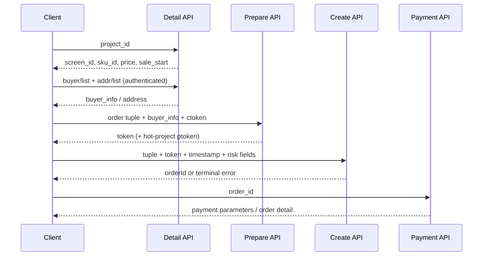

# Ticket Rush API Reversing — 票务抢购状态机、Token 与风控参数

> 白盒知识源：`mikumifa/biliTickerBuy`。本篇用于 CTF/授权票务系统逆向，重点是从公开前端与参考实现恢复 `detail → prepare → create → pay` 状态机，而不是把 UI 的“未开售”当作安全边界。

## 0. 适用场景

### 输入信号

- 页面出现 `project_id / screen_id / sku_id`、实名购票人、开售倒计时。
- 接口包含 `order/prepare`、`order/create`、`getPayParam`。
- 请求含 `token / ptoken / ctoken / clickPosition / newRisk`。
- 前端按钮不可点，但详情接口已返回场次与 SKU。

### 目标产物

1. 项目、场次、SKU 和购票人字段映射。
2. prepare/create 两阶段请求与响应依赖。
3. token 的结构、时效和服务端校验边界。
4. ctoken 等风控字段的采集时刻与阶段差异。
5. 可重放的只读探针；确认漏洞后再构造最小利用。

## 1. 开发者视角：真正的信任边界

客户端必须持有商品目录、场次和价格展示数据，但最终库存、开售时间、限购、实名绑定、金额与订单状态应由服务端决定。因此优先级是：

```text
服务端 create/prepare 校验
  > token/ptoken 的绑定与时效
  > buyer 与 SKU 的服务端关联
  > detail 页按钮、clickable、倒计时
```

不要只 patch `clickable=false`。这只能进入前端流程，不能证明后端接受订单。

## 2. 已恢复的端到端状态机



### 关键接口

```text
GET  /api/ticket/project/getV2?id=<project_id>&project_id=<project_id>
POST /mall-search-items/items_detail/info
GET  /api/ticket/buyer/list?is_default&projectId=<project_id>
GET  /api/ticket/addr/list
POST /api/ticket/order/prepare?project_id=<project_id>
POST /api/ticket/order/createV2?project_id=<project_id>[&ptoken=<ptoken>]
GET  /api/ticket/order/getPayParam?order_id=<order_id>
```

## 3. 核心业务元组

订单不可只按 `sku_id` 建模。参考实现表明最小元组为：

```json
{
  "project_id": 1001653,
  "screen_id": 1009930,
  "sku_id": 893361,
  "order_type": 1,
  "count": 1,
  "buyer_info": [],
  "pay_money": 130800
}
```

验证矩阵：

| 变量 | 单独改变 | 观察点 |
|---|---|---|
| `project_id` | 保持 screen/SKU | 是否检查父项目绑定 |
| `screen_id` | 跨日期替换 | 是否检查场次与 SKU 绑定 |
| `sku_id` | 高低价互换 | 金额是否服务端重算 |
| `count` | 0、负数、超限 | 限购与 buyer 数量是否一致 |
| `buyer_info` | 空、重复、跨账号 | 实名与账号绑定 |
| `pay_money` | 客户端改价 | 服务端是否忽略并重算 |

一次只改变一个字段，并记录完整响应中的 `errno/code/msg`。

## 4. order token：结构编码，不是加密签名

参考实现中的普通订单 token 布局：

```text
0xC0 (1 byte)
timestamp  (4 bytes, big-endian)
project_id (4 bytes, big-endian)
screen_id  (4 bytes, big-endian)
order_type (1 byte)
count      (2 bytes, big-endian)
sku_id     (4 bytes, big-endian)
```

随后 Base64，并映射 `/+=` → `_-.`。它没有 secret，因此安全性只能来自服务端对时间、元组、会话和 prepare 状态的校验。

```python
#!/usr/bin/env python3
import base64, struct, time

TRANS_ENC = str.maketrans('/+=', '_-.')
TRANS_DEC = str.maketrans('_-.', '/+=')

def make_token(project_id, screen_id, sku_id, count=1, order_type=1, ts=None):
    ts = int(time.time()) if ts is None else int(ts)
    raw = struct.pack('>BIIIBHI', 0xC0, ts, int(project_id), int(screen_id),
                      int(order_type), int(count), int(sku_id))
    return base64.b64encode(raw).decode().translate(TRANS_ENC)

def parse_token(token):
    raw = base64.b64decode(token.translate(TRANS_DEC))
    h, ts, project, screen, order_type, count, sku = struct.unpack('>BIIIBHI', raw)
    return dict(header=h, timestamp=ts, project_id=project, screen_id=screen,
                order_type=order_type, count=count, sku_id=sku)

if __name__ == '__main__':
    t = make_token(1001653, 1009930, 893361)
    print(t)
    print(parse_token(t))
```

### 验证重点

- token 是否必须由 prepare 返回，还是本地结构 token 也被接受。
- timestamp 窗口、未来时间、旧 token、跨会话重放。
- token 中元组与 JSON body 不一致时，服务端采用哪一份。
- token 是否绑定 cookie、设备 ID、buyer_info 或 IP。

## 5. ctoken：浏览器行为压缩字段

参考实现把多组浏览器/行为值按 `byte, 0x00` 交错排列，再 Base64：

```text
m1, touchend, m2, visibilitychange, m3, m4,
beforeunload/openWindow, m5, timer(2B), timediff(2B), m6..m9
```

阶段差异：

- `prepare ctoken` 保留 `openWindow/beforeunload` 语义。
- `create ctoken` 会移除这两个字段后重新编码。
- `timer/timediff` 从详情页采集时刻递增。
- `touchend/visibilitychange/openWindow` 在 create 前可小幅变化。

因此固定复制一次 ctoken 可能因时间或状态不一致失败。逆向时应 hook 生成函数的输入，而不是只保存最终 Base64。

## 6. hot project 分支

热门项目 create 请求额外依赖：

```json
{
  "ptoken": "<prepare response; remove '='>",
  "ctoken": "<create-stage behavior token>",
  "clickPosition": {},
  "orderCreateUrl": "https://show.bilibili.com/api/ticket/order/createV2",
  "newRisk": true,
  "requestSource": "neul-next"
}
```

`ptoken` 是 prepare → create 的服务端状态桥。若它绑定元组/会话/时效，直接跳过 prepare 的路径应失败；若未绑定，则重点测试跨账号、跨 SKU、跨场次重放。

## 7. JSHook 运行时定位

先在导航前开启网络监控，然后定位详情与下单 bundle：

```text
network_enable
page_navigate(target, enableNetworkMonitoring=true)
network_get_requests(url="ticket", limit=50)
search_in_scripts(keyword="order/createV2", contextLines=8)
search_in_scripts(keyword="ctoken", contextLines=8)
search_in_scripts(keyword="ptoken", contextLines=8)
```

在真实点击下单前设置 XHR breakpoint：

```text
xhr_breakpoint_set("*order/prepare*")
xhr_breakpoint_set("*order/createV2*")
```

暂停后记录 request body、调用栈、token 生成前输入与响应，不要把第三方 vendor bundle 当业务逻辑。

## 8. 只读枚举脚本

```python
#!/usr/bin/env python3
import requests

BASE = 'https://show.bilibili.com'
PROJECT_ID = 1001653

r = requests.get(
    f'{BASE}/api/ticket/project/getV2',
    params={'version': 134, 'id': PROJECT_ID, 'project_id': PROJECT_ID,
            'requestSource': 'pc-new'},
    timeout=10,
)
r.raise_for_status()
d = r.json()['data']
print(d['id'], d['name'], d['sale_flag'], d['sale_begin'])
for screen in d.get('screen_list', []):
    for sku in screen.get('ticket_list', []):
        print(screen['id'], sku['id'], sku['price'], sku['sale_start'], sku['desc'])
```

输出原始 JSON 到 `exports/ctf-website/<case>/`，不要只保留终端摘要。

## 9. 常见误判与排除

- **误判：** `clickable=false` 表示接口不可利用。  
  **事实：** 它只是客户端状态；需要直接验证 prepare/create 的服务端错误码。
- **误判：** 可本地生成 token 等于可提前下单。  
  **事实：** 服务端仍可校验 sale_start、库存、会话和 prepare 状态。
- **误判：** ctoken 是加密签名。  
  **事实：** 当前知识源显示它更接近行为指纹压缩；真实性来自后端关联校验。
- **误判：** 商品价格由 body 的 `pay_money` 决定。  
  **事实：** 正确实现应按 SKU 服务端重算；必须用差分请求验证。
- **误判：** 新旧详情 API 字段完全一致。  
  **事实：** `mall-search-items/items_detail/info` 需要归一化为旧模型后再使用。

## 10. 当前题面验证（2026-06-18）

JSHook 运行时证据：

- 页面标题：`上海·BilibiliWorld 2026-bilibili会员购漫展票务`。
- 项目：`project_id=1001653`，状态 `未开售`。
- 项目开售时间：Unix `1781841600`（页面数据）。
- 详情 API：`/api/ticket/project/getV2?version=134&id=1001653&project_id=1001653&requestSource=pc-new`。
- 已返回 `screen_list`、SKU、价格、每 SKU `saleStart/saleEnd`；说明商品目录在客户端层可见，但订单授权仍在 prepare/create 层。

这组数据只证明枚举链成立，不证明提前创建订单漏洞。

## 11. 来源与可复查证据

- 固定源码快照：`kb/ctf-website/sources/mikumifa-biliTickerBuy/`
- 上游 commit：`dd71cd0ae4708a39f45ed5bded877263d1a740c6`
- token 布局：`util/TokenUtil.py`
- prepare/create 状态机：`task/buy.py`
- ctoken 编码与状态：`cptoken/__init__.py`
- 详情、购票人、地址接口：`interface/project.py`
- HTTP 会话与 header/cookie：`util/BiliRequest.py`

## 攻击链

```text
详情枚举
  → 恢复 project/screen/SKU 元组
  → 获取 buyer schema
  → Hook prepare/create
  → 解析 token/ptoken/ctoken 依赖
  → 单变量差分验证服务端绑定
  → 若发现未绑定/仅客户端校验
  → 构造最小可回放 PoC
  → 提取订单/Flag 响应
```

## MCP 工具映射

| 步骤 | MCP 工具 | 说明 |
|---|---|---|
| 浏览器协议观察 | `jshook` | 拦截 prepare/create、token 与 WebSocket 时序 |
| API 基线 | `http_probe` | 验证票务端点、方法和认证边界 |
| 知识路由 | `kb_router` | 按抢票、库存、竞态和签名信号检索 |
