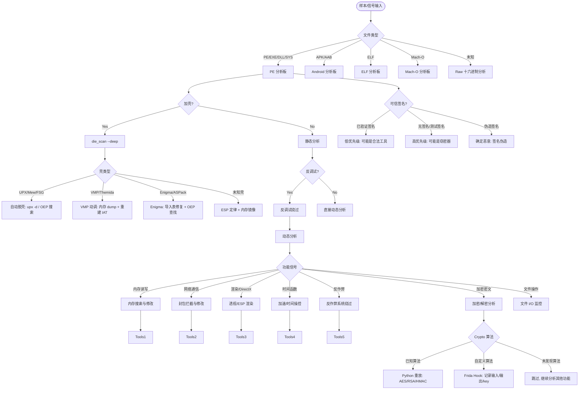

# 按信号选工具决策树

## 场景

面对一个未知样本或逆向任务时，需要根据观察到的信号（文件类型、保护特征、行为线索）快速选择最合适的分析工具和知识库板。

## 输入信号

- 拿到了文件但不知道从何开始
- 观察到特定行为但不知道用什么工具分析
- 需要从多个反作弊/加密/混淆方案中选择应对策略

## 信号 → 板 → KB → 工具映射流程

```
输入信号
  │
  ▼
[信号分类]
  ├── 文件格式 → 选择板 (PE/APK/General)
  ├── 保护类型 → 选择技术路线 (脱壳/反调试绕过/解混淆)
  ├── 加密/网络 → 选择动态分析策略 (Frida/API Monitor/Procmon)
  └── 功能特征 → 选择分析深度 (静态/动态/全自动)
        │
        ▼
[决策输出]
  ├── 需要使用的知识库技术文件
  ├── MCP 工具调用参数
  └── 下一步操作序列
```

## Mermaid 决策流程图



## 文件类型决策

### PE (Windows)

```cpp
// 信号: MZ header (4D 5A), PE header (50 45 00 00)
// 工具路径:
// 1. triage_pe + die_scan → 初筛 + 壳检测
// 2. rizin_sections + rizin_imports + rizin_strings → 结构概览
// 3. ghidra_headless_analyze → 完整静态分析
// 4. ghidra_summary_call_focus → 按行为定位关键函数
// 5. 根据行为选择: make_x64dbg_breakpoint_script / make_pe_crypto_unpack_plan

// 特殊 PE 类型:
// DLL → 注入/辅助模块, 需要注入到游戏进程才能分析
// SYS → 内核驱动, 需要 VM 或 test signing 环境
// EXE → 独立可执行, 直接启动
```

### APK (Android)

```cpp
// 信号: ZIP header (50 4B 03 04) + AndroidManifest.xml
// 工具路径:
// 1. jadx/jadx-gui → DEX → Java 伪代码
// 2. 检查 lib/ 目录:
//    - libil2cpp.so → Unity IL2CPP
//    - libUE4.so → Unreal Engine
//    - 自定义 .so → native code
// 3. ghidra_headless_analyze → 分析 .so
// 4. android_frida_run_script → 动态分析

// 特殊 APK 类型:
// 加固: 360加固 / 腾讯加固 / Ali加固 → 先脱壳
// Unity: 需要 il2cpp dumper + global-metadata.dat
// Flutter: libapp.so 打包 Dart 代码 → snapshot 逆向
```

### ELF (Linux)

```cpp
// 信号: ELF header (7F 45 4C 46)
// 工具路径:
// 1. readelf -h / -S / -l → 结构
// 2. strings → 快速字符串
// 3. Ghidra/rizin → 静态分析
// 4. LD_PRELOAD → socket/ssl hook
// 5. strace → 系统调用跟踪
// 6. GDB + GEF → 调试

// 特殊 ELF 类型:
// 游戏 cheat: 通常是 .so (LD_PRELOAD 注入)
// 服务端工具: 独立可执行
// eBPF: 内核跟踪程序
// UPX/加壳: 同 PE 处理逻辑
```

## Obfuscation 信号决策

### Packer 检测

```
信号: die_scan 返回 packer 匹配
  │
  ▼
Packer 类型:
  ├── UPX         → upx -d 脱壳
  ├── MPRESS      → 特定脱壳工具或用内存 dump
  ├── ASPack      → 手动 ESP 定律
  ├── Enigma      → EnigmaVBUnpacker / 手动修复
  ├── VMProtect   → 不能静态脱壳, 使用动态分析 + 内存 dump
  │   └── 工具: toolbox_launch("x64dbg") + dump at OEP
  ├── Themida     → 同 VMP, 额外 anti-debug
  └── 未知/私有壳 → 自动 OEP 查找 + API tracer
```

### Obfuscation 类型

```
信号: Ghidra 反编译代码不可读 (大量 jmp/jz/垃圾代码)
  │
  ▼
Obfuscation 类型:
  ├── 控制流平坦化 (OLLVM) → deobfuscator: d810/tigress
  ├── 虚假控制流          → 追踪真实路径, 跳过死代码
  ├── 字符串加密           → search_pattern 找到解密循环
  ├── 调用混淆 (IAT hide) → API tracer 恢复调用
  └── 反反编译             → 使用其他反编译器或动态分析
```

## Encryption 信号决策

### 已知算法识别

```
信号: Ghidra 中有 AES S-box 或固定魔术数
  │
  ▼
提取:
  ├── 算法类型 (AES-256-CBC / RSA-2048 / HMAC-SHA256)
  ├── Key / IV 位置 (硬编码 / 动态派生 / 协商)
  ├── 加密数据位置 (自身数据 / 网络包 / 配置)
  └── 输出: Python 重放脚本 → solve_crypto_from_evidence
```

### 自定义算法

```
信号: 未找到已知算法常量, 但数据流有 XOR/shift/rotate
  │
  ▼
分析:
  ├── Frida: Hook 可疑函数入口/出口
  ├── 记录 input/output buffer
  ├── 模式分析: 单字节 XOR / 多字节 / 流密码
  ├── key 推测: 固定 key / 时间相关 / 会话相关
  └── 输出: Frida 脚本 + python 验证
```

## Network 信号决策

```
信号: 样本使用网络通信 (socket/connect 调用)
  │
  ▼
通信类型:
  ├── HTTP/HTTPS:
  │   ├── HTTP → http_probe + 抓包解析明文
  │   └── HTTPS → Frida SSL unpin → 中间人证书
  │
  ├── TCP/UDP 原始 socket:
  │   ├── 明文 → Wireshark 直接分析协议
  │   └── 加密 → Frida hook 加密函数定位 key
  │
  ├── WebSocket:
  │   └── 集成到浏览器的 DevTools 或 Frida
  │
  └── DNS/ICMP 隧道:
      └── 特定域格式分析 → base64/punycode 解码
```

## Anti-Debug 信号决策

```
信号: 附加调试器后样本退出/异常/行为改变
  │
  ▼
反调试类型:
  ├── PEB.BeingDebugged → Frida 直接 patch 或 kernel 修改
  ├── NtQueryInformationProcess → Hook 返回值
  ├── RDTSC 时间差 → 避免在检测间暂停
  ├── Int3/陷阱 → x64dbg 跳过异常处理
  ├── TLS 回调 → 切换断点到 TLS 初始化
  └── VMP 内置 → 使用 VMP 专用动调器

绕过优先级:
  1. 先 bypass → 再分析 (推荐)
  2. attach 后即时 patch → 继续分析
  3. 使用非入侵式追踪 (ETW/Intel PT)
```

## 集成 MCP 工具图

```
                          ┌──────────────────┐
                          │  输入样本       │
                          └───────┬──────────┘
                                  │
                                  ▼
                    ┌─────────────────────────┐
                    │  triage_pe              │── 哈希 + DiE + 基础结构
                    │  die_scan               │── 深度壳检测
                    │  hash_file              │── 样本指纹
                    │  rizin_bin_info         │── 二进制结构概览
                    └─────────────────────────┘
                                  │
                                  ▼
                    ┌─────────────────────────┐
                    │  结构分析               │
                    │  rizin_sections         │── 节区/段分析
                    │  rizin_imports          │── 导入表/动态链接
                    │  rizin_strings          │── 字符串提取
                    └─────────────────────────┘
                                  │
                                  ▼
                    ┌─────────────────────────┐
                    │  静态反编译             │
                    │  ghidra_headless_analyze│── 全自动 Ghidra 分析
                    │  ghidra_summary_functions│── 函数过滤
                    │  ghidra_summary_imports │── 导入过滤
                    │  ghidra_summary_strings │── 字符串过滤
                    └─────────────────────────┘
                                  │
                                  ▼
                    ┌─────────────────────────┐
                    │  KB 知识库查询          │
                    │  kb_router              │── 信号匹配技术文档
                    │  kb_read_file           │── 阅读具体技术
                    │  kb_catalog             │── 浏览全部分类
                    └─────────────────────────┘
                                  │
                                  ▼
           ┌──────────────────────┼──────────────────────┐
           │                      │                      │
           ▼                      ▼                      ▼
┌───────────────────┐ ┌───────────────────┐ ┌───────────────────┐
│ 动态分析 (PE)     │ │ 动态分析 (APK)    │ │ 工具生成         │
│ ───────────────── │ │ ───────────────── │ │ ───────────────── │
│ make_x64dbg_*     │ │ android_frida_*   │ │ patch_bytes       │
│ pe_address_to_*   │ │ android_crypto_*  │ │ patch_pe_bytes    │
│ search_pattern    │ │ android_package_* │ │ rizin_assemble_*  │
│                   │ │ android_http_*    │ │ search_pattern    │
│                   │ │ android_runtime_* │ │                   │
└───────────────────┘ └───────────────────┘ └───────────────────┘
                                  │
                                  ▼
                    ┌─────────────────────────┐
                    │  产物生成               │
                    │  solve_crypto_*         │── 解密推断
                    │  extract_frida_*        │── Frida buffer 提取
                    │  workspace_write_text   │── 笔记/报告写入
                    │  workspace_copy_artifact │── 产物整理
                    └─────────────────────────┘
```

## 常见分析路径模板

### 快速分析路径 (已知样本类型)

```
已知: 这是一个未加壳的 PE 游戏作弊 DLL

1. triage_pe                            → hash + 基础结构
2. rizin_imports --limit 200            → 功能 API 一览
3. ghidra_headless_analyze              → 完整静态分析
4. ghidra_summary_call_focus            → 推荐重点关注函数
5. ghidra_summary_function_detail --addr → 查看具体函数反编译
6. rizin_strings --limit 100            → 搜索作弊特征字符串
7. kb_router "anti-cheat bypass"        → 查找绕过方案
8. 产出 notes → workspace_write_text
```

### 未知样本分析路径

```
未知: 不知道文件类型和保护

1. hash_file                            → 样本 ID
2. triage_pe (尝试 PE)                  → 如果失败可能是非 PE
3. die_scan --deep --heuristic          → 深度指纹识别
4. rizin_bin_info                       → 确认文件结构
5. 根据文件类型选择板:
   PE  → 继续 PE 路径
   APK → APK 路径
   ELF → ELF 路径
6. 全面静态分析 → 动态计划 → 执行
```

### 加密 Bootkit/Stub 分析路径

```
样本极小 (< 50KB), 高熵, 导入表只有 LoadLibrary+GetProcAddress

1. die_scan --deep                      → 确认壳类型
2. rizin_strings                        → 找 URL/IP/文件名
3. search_pattern "E8 ?? ?? ?? ??"     → 找 CALL 指令 (函数边界)
4. x64dbg: 在 LoadLibrary 下断点
   → 逐步跟踪 → 找到解压缩/解密循环
5. 内存 dump OEP → dump 后分析
```

## MCP 工具映射

| 决策节点 | MCP 工具 | 说明 |
|---------|---------|------|
| 文件类型识别 | `triage_pe` | PE 初筛, 非 PE 会提示错误 |
| 壳/保护检测 | `die_scan` | 深度扫描 packer/编译器/保护 |
| 哈希/样本 ID | `hash_file` | SHA256 不可逆 ID |
| 节区分析 | `rizin_sections` | 所有节区名/权限/大小/熵 |
| 导入表 | `rizin_imports` | 按 DLL 过滤, 排序 |
| 字符串 | `rizin_strings` | 原始字符串列表 |
| 全自动反编译 | `ghidra_headless_analyze` | 导入+分析+JSON 导出 |
| 函数阅读焦点 | `ghidra_summary_call_focus` | 按行为推荐阅读优先级 |
| 函数详情 | `ghidra_summary_function_detail` | 含反编译 |
| 函数列表 | `ghidra_summary_functions` | 按名/签名字符过滤 |
| 导入过滤 | `ghidra_summary_imports` | 按库/名/引用数过滤 |
| 字符串过滤 | `ghidra_summary_strings` | 按内容/长度过滤 |
| 知识库搜索 | `kb_router` | 信号匹配技术文档 |
| 知识库目录 | `kb_catalog` | 浏览所有分类 |
| 特征码定位 | `search_pattern` | 十六进制 pattern 搜索 |
| 地址转换 | `pe_address_to_offset` | VA/RVA/file offset 互转 |
| 字节补丁 | `patch_bytes` / `patch_pe_bytes` | 修改 PE 文件字节 |
| 汇编验证 | `rizin_assemble_bytes` | 汇编到机器码 |
| 汇编补丁 | `rizin_assemble_patch` | 汇编后直接 patch 副本 |
| 工具安装 | `python_re_tool_install` | 按 allowlist 安装逆向库 |

## 证据与验证闭环

- 固定输入样本、SHA256、工具版本和全部参数，先保存未处理 baseline。
- 每个假设至少绑定一个可观察量：已知明密文对、协议字段、状态转移、时间分布、偏移或重放输出。
- 用独立脚本重放核心变换，并以断言、输出哈希或逐字段 diff 验证，不以“看起来合理”作为结论。
- 原始抓包/样本进入 `exports/general/`，派生文件与原件分离并记录转换链。
